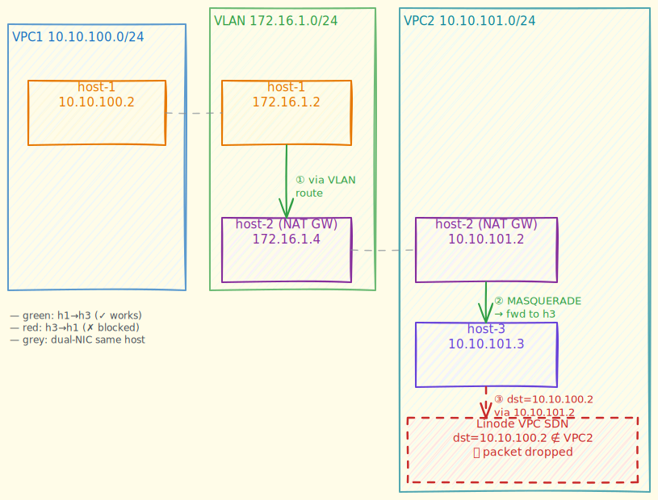
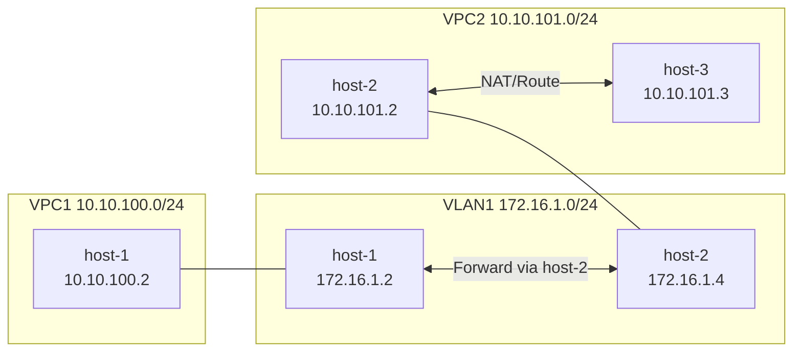
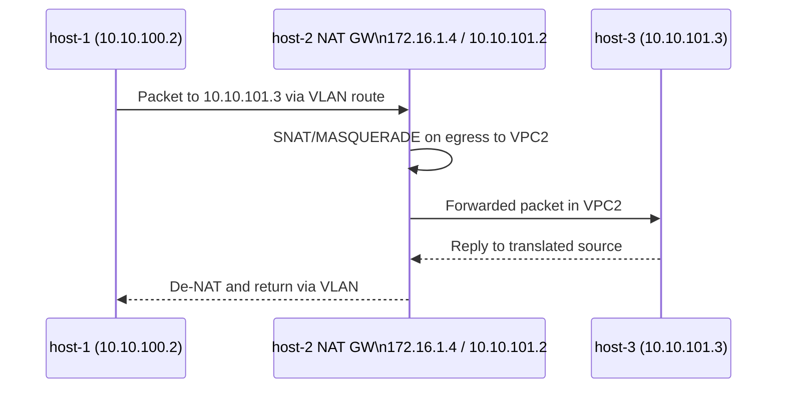

# Dual Stack VLAN + Dual VPC NAT Gateway Demo

## Overview

This deploys three Linode VMs with one VLAN and two VPCs.

Requested layout:

- VLAN `vlan1`: `172.16.1.0/24`
- VPC `vpc1`: `10.10.100.0/24`
- VPC `vpc2`: `10.10.101.0/24`

VM mapping:

- `host-1`
  - VPC IP: `10.10.100.2`
  - VLAN IP: `172.16.1.2`
- `host-2` (NAT gateway)
  - VPC IP: `10.10.101.2`
  - VLAN IP: `172.16.1.4`
- `host-3`
  - VPC IP: `10.10.101.3`

Each VM uses cloud-init metadata to set the hostname at first boot.

## Topology Diagram





## Packet Flow Diagram



## Prerequisites

- `LINODE_TOKEN` exported
- `tofu` installed

## Deploy

Run in this folder:

```bash
./start.sh
```

Or run manually:

```bash
tofu init
tofu apply -auto-approve
```

## Configure NAT and Routes (host-1 <-> host-3 via host-2)

Get generated command bundle:

```bash
tofu output -raw nat_gateway_commands
```

Copy/paste and execute those commands from your laptop.

What those commands do:

1. Enable IP forwarding on `host-2` and configure `iptables` NAT/forward rules.
2. Add route on `host-1` to `10.10.101.3/32` via VLAN next-hop `172.16.1.4`.
3. Add return route on `host-3` to `10.10.100.2/32` via next-hop `10.10.101.2`.
4. Validate bidirectional ping.
5. Optionally run tcpdump on `host-2` to observe traffic.

Manual command examples:

```bash
# host-1 -> host-3 route via VLAN next hop on host-2
ssh -i /tmp/id_rsa root@$(tofu output -raw host_1_public_ip) \
  'ip route replace 10.10.101.3/32 via 172.16.1.4'

# host-3 -> host-1 return route via host-2 in vpc2
ssh -i /tmp/id_rsa root@$(tofu output -raw host_3_public_ip) \
  'ip route replace 10.10.100.2/32 via 10.10.101.2'

# connectivity tests from both directions
ssh -i /tmp/id_rsa root@$(tofu output -raw host_1_public_ip) 'ping -c 4 10.10.101.3'
ssh -i /tmp/id_rsa root@$(tofu output -raw host_3_public_ip) 'ping -c 4 10.10.100.2'
```

## Useful Outputs

```bash
tofu output -raw topology_summary
tofu output -raw ssh_command
tofu output -raw nat_gateway_commands
```

## Limitations

- **Source IP is not preserved.** `host-2` uses `MASQUERADE` (SNAT) on the VLAN→VPC2 direction, so `host-3` always sees traffic sourced from `10.10.101.2` (host-2's VPC IP), never from `10.10.100.2` (host-1's real IP). This is an inherent trade-off of NAT-based cross-VPC routing: without VPC peering or a shared L2 segment between `vpc1` and `vpc2`, preserving the original source IP end-to-end is not possible.

- **host-3 → host-1 direction does not work.** Linode VPC enforces destination IP validation at the hypervisor/SDN level: a packet delivered to a VM must have a destination IP matching one of that VM's assigned VPC IPs. When host-3 sends `dst=10.10.100.2` via next-hop `10.10.101.2`, the frame is addressed to host-2's MAC correctly at L2, but the Linode SDN drops it before it reaches host-2's kernel because `10.10.100.2` is not host-2's VPC IP. This is equivalent to AWS's source/destination check, but Linode VPC does not expose a toggle to disable it. As a result, only the **host-1 → host-3** direction works with this design.

## Teardown

```bash
./shutdown.sh
```
