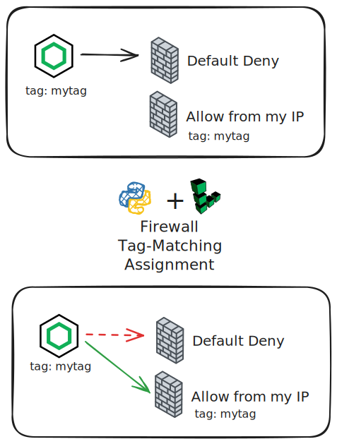

# Linode Firewall Management by Tags

This demo showcases an automated approach to managing Linode firewall rules using tag-based assignment. It demonstrates how to dynamically apply firewall rules to Linode instances based on matching tags, replacing manual firewall configuration with an automated workflow.

## Goal

The primary goal of this demo is to:
1. **Demonstrate tag-based firewall management** - Automatically apply firewall rules to Linode instances based on shared tags
2. **Show firewall rule propagation** - Illustrate the time required for firewall rules to take effect
3. **Automate infrastructure workflow** - Combine OpenTofu for infrastructure provisioning and Python for dynamic firewall management

## How It Works



### Infrastructure Components

1. **OpenTofu Configuration** (`main.tf`, `variables.tf`, `outputs.tf`)
   - Provisions a Linode instance with cloud-init for web server setup
   - Creates initial firewall rules
   - Tags the instance for firewall assignment

2. **Python Firewall Management** (`apply_linode_firewalls/apply_firewalls_optimized.py`)
   - Queries all Linode instances and firewalls via the Linode API
   - Matches instances to firewalls based on shared tags
   - Removes existing firewall attachments
   - Applies new firewall rules to matching instances

3. **Automation Scripts**
   - `start.sh` - End-to-end demo workflow
   - `shutdown.sh` - Clean up all resources

### Demo Workflow

The `start.sh` script executes the following steps:

1. **Initialize & Apply OpenTofu** - Provisions the Linode instance with initial firewall
2. **First Connectivity Test** - Attempts to connect to the web server (expected to fail/timeout)
3. **Apply Tag-based Firewall** - Runs the Python script to match and apply firewall rules by tags
4. **Wait for Propagation** - 60-second wait for firewall rules to take effect
5. **Second Connectivity Test** - Verifies web server is now accessible

## Prerequisites

- OpenTofu installed (v1.8.0 or later)
- Python 3 with `linode_api4` package
- A Linode API token with read/write permissions
- Virtual environment set up in `~/.virtualenvs/apply_linode_firewalls-whft` (or local `venv`/`.venv`)

## Getting Started

1. **Set your Linode API token:**
   ```bash
   export LINODE_TOKEN='your-token-here'
   ```

2. **Run the demo:**
   ```bash
   ./start.sh
   ```

3. **Clean up resources:**
   ```bash
   ./shutdown.sh
   ```

## Development Notes

- **Tag Matching Logic**: Firewalls with tags are matched against instance tags using set intersection
- **Firewall Limit**: Linode instances have a maximum number of firewall attachments; existing firewalls are removed before applying new ones
- **Error Handling**: The Python script gracefully handles API errors and continues processing
- **Optimization**: Pre-filters firewalls and instances, caches API responses, and exits early when no matches are found

## Project Structure

```
.
├── main.tf                          # Linode instance and firewall resources
├── variables.tf                     # OpenTofu variables
├── outputs.tf                       # OpenTofu outputs (IP, test commands)
├── providers.tf                     # OpenTofu provider configuration
├── cloud_init_web_server.yaml      # Cloud-init config for web server
├── start.sh                         # Automated demo workflow
├── shutdown.sh                      # Cleanup script
└── apply_linode_firewalls/
    ├── apply_firewalls_optimized.py # Tag-based firewall management script
    └── apply_linode_firewalls.py    # Original implementation
```

## Cleanup

The `shutdown.sh` script will:
- Destroy all OpenTofu-managed resources
- Remove all OpenTofu state files and directories
- Prompt for confirmation before proceeding
