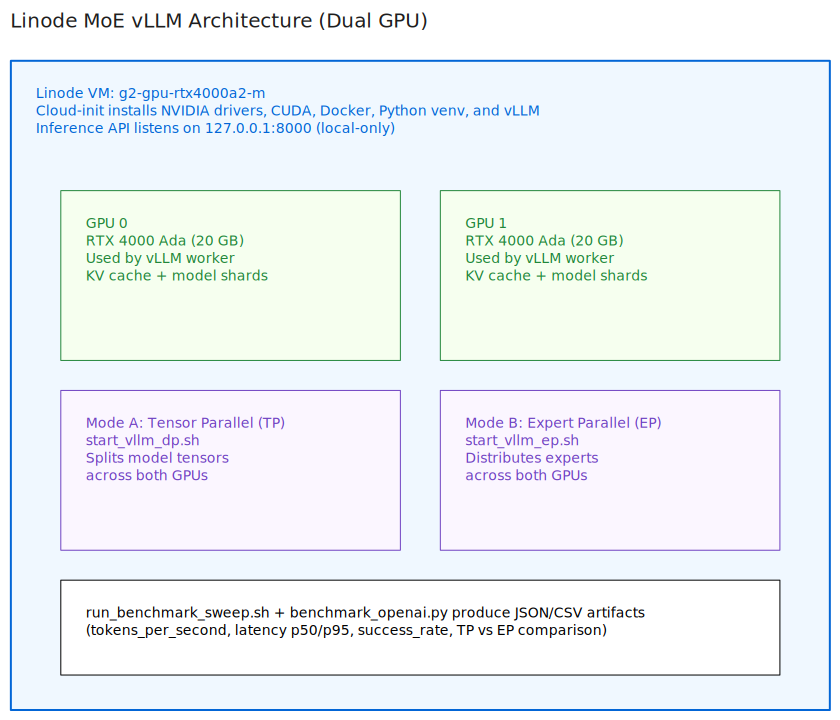

# Linode Dual-GPU MoE Inference with vLLM

Deploy one Linode dual-GPU instance (`g2-gpu-rtx4000a2-m`) and benchmark local-only vLLM inference for a Mixture-of-Experts model in two modes:

- Data Parallel (DP)
- Expert Parallel (EP)

Default model:

- `Qwen/Qwen1.5-MoE-A2.7B-Chat`

## Architecture



## Quick Start

1. Export token.

```bash
export LINODE_TOKEN="your-token"
```

2. Provision resources.

```bash
bash start.sh
```

3. Continue with manual benchmark runbook.

- `MANUAL_DEPLOYMENT.md`

4. Destroy resources when finished.

```bash
bash shutdown.sh
```

## Notes

- Inference endpoint is local-only (`127.0.0.1`) and not exposed publicly.
- Cloud-init installs NVIDIA drivers, CUDA, Docker, NVIDIA container runtime, Python, and vLLM.
- For production, add stronger hardening, monitoring, backup/DR, and change controls.
