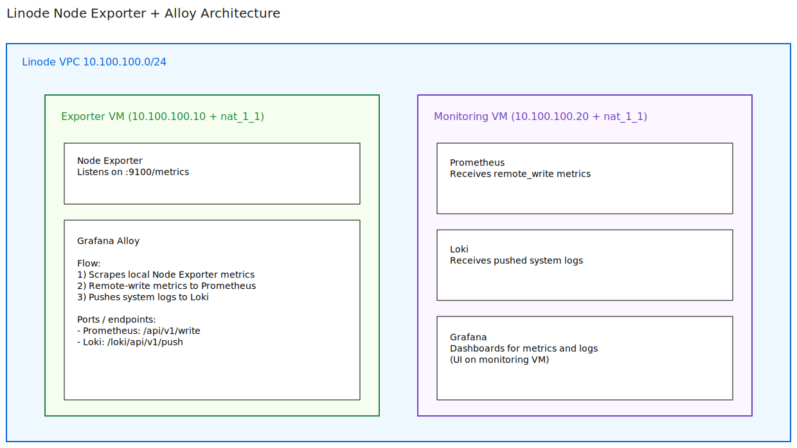

# Linode Node Exporter + Alloy to Grafana/Prometheus Demo

This demo provisions two Linode VMs with OpenTofu or Terraform and configures them through cloud-init:

- **Exporter VM**: Node Exporter + Grafana Alloy
- **Monitoring VM**: Prometheus + Loki + Grafana

Telemetry flow:

- Alloy scrapes node metrics from Node Exporter on the exporter VM.
- Alloy remote-writes metrics to Prometheus on the monitoring VM.
- Alloy pushes system logs to Loki on the monitoring VM.

Both VMs are attached to a VPC subnet (`10.100.100.0/24`) and use `nat_1_1 = any` for public reachability.

## Architecture



## Prerequisites

- Linode API token exported as an environment variable.
- `tofu` or `terraform` installed locally.

```bash
export LINODE_TOKEN="your-token-here"
```

## Deploy

```bash
chmod +x start.sh shutdown.sh
./start.sh
```

After apply, the script prints:

- SSH command for exporter VM
- SSH command for monitoring VM
- Grafana URL
- Prometheus URL

## Destroy

```bash
./shutdown.sh
```

## Validation

1. SSH to exporter and check services:

```bash
systemctl status node_exporter --no-pager
systemctl status alloy --no-pager
```

2. SSH to monitoring and check services:

```bash
systemctl status prometheus --no-pager
systemctl status loki --no-pager
systemctl status grafana-server --no-pager
```

3. Open Prometheus and verify pushed series:

- Visit the `prometheus_url` output.
- Query `up{job="node-exporter"}` or `node_cpu_seconds_total`.

4. Open Grafana and verify data sources:

- Visit the `grafana_url` output.
- Default user and password are Grafana package defaults unless changed.
- Verify both Prometheus and Loki data sources exist.

## Key implementation notes

- Cloud-init is the only bootstrap mechanism used for package install and service configuration.
- SSH access is key-based root access. Keys are generated locally and written to `/tmp/id_rsa` and `/tmp/id_rsa.pub`.
- Firewall inbound policy is default deny, with explicit allow rules for your current public IP and VPC traffic.
- Prometheus and Node Exporter are pinned to upstream releases (defaults: Prometheus v3.11.3 and Node Exporter v1.11.1).

## Alloy recovery for existing VM

If the exporter VM was already deployed before these changes and Alloy fails with a missing environment file, run:

```bash
cat >/etc/default/alloy <<'EOF'
CONFIG_FILE=/etc/alloy/config.alloy
CUSTOM_ARGS=""
EOF

systemctl daemon-reload
systemctl reset-failed alloy
systemctl restart alloy
systemctl status alloy --no-pager
```

## Demo scope and production gaps

This is intentionally a learning/demo example. It is **not** production-ready.

Important production follow-ups:

- Add authentication and TLS in front of Loki and Grafana.
- Replace generated local SSH keys with managed key lifecycle and access controls.
- Add retention tuning, persistent storage strategy, backups, and alerting.
- Restrict inbound access further and add explicit egress policy controls.
