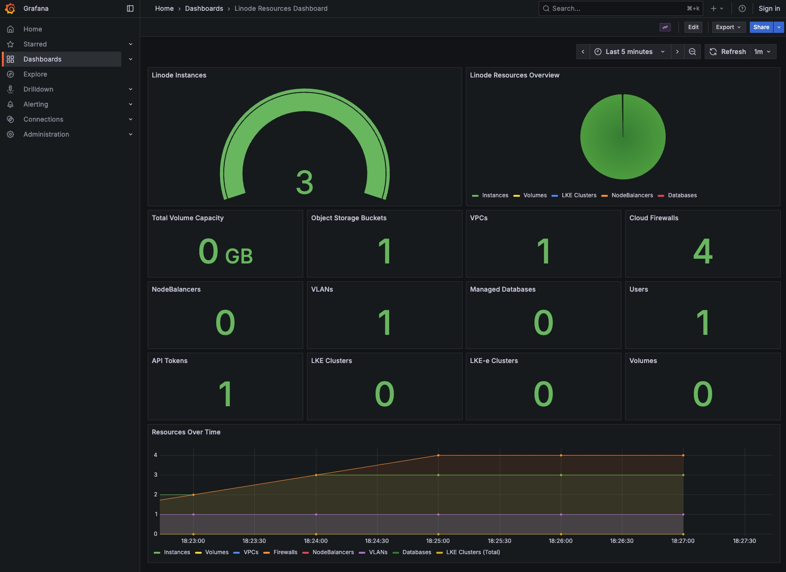

# Linode Prometheus Exporter

A Python-based Prometheus exporter that exposes Linode resource metrics for monitoring and alerting.

## Metrics Exposed

The exporter provides the following metrics:

- `linode_instances_total` - Total number of Linode instances
- `linode_buckets_total` - Total number of Object Storage buckets
- `linode_vpcs_total` - Total number of VPCs
- `linode_lke_clusters_total` - Total number of standard LKE clusters
- `linode_lke_e_clusters_total` - Total number of LKE-e (High Availability) clusters
- `linode_tokens_total` - Total number of API tokens
- `linode_firewalls_total` - Total number of Cloud Firewalls
- `linode_nodebalancers_total` - Total number of NodeBalancers
- `linode_databases_total` - Total number of Managed Databases
- `linode_users_total` - Total number of users on the account
- `linode_vlans_total` - Total number of VLANs
- `linode_volumes_total` - Total number of Block Storage volumes
- `linode_volumes_capacity_gb` - Total provisioned Block Storage capacity in GB

All metrics include an `account_name` label with the Linode account company name (or email prefix if company name is not set).

**Note:** Volume capacity represents the total provisioned storage. Actual usage within volumes is not available through the Linode API and would require monitoring agents on the instances.

## Prerequisites

- Python 3.11 or higher
- Linode API Token with read permissions
- `pip` for installing dependencies

## Installation

1. Install the required dependencies:

```bash
pip install -r requirements.txt
```

Or use a virtual environment (recommended):

```bash
python3 -m venv venv
source venv/bin/activate
pip install -r requirements.txt
```

## Usage

### Using the Start Script (Recommended)

The start script automatically sets up a virtual environment and installs dependencies:

```bash
export LINODE_TOKEN='your-token-here'
./start.sh
```

This will:
- Create a virtual environment if it doesn't exist
- Install all dependencies
- Start the exporter

### Basic Usage

Set your Linode API token and run the exporter manually:

```bash
export LINODE_TOKEN='your-token-here'
source venv/bin/activate  # If using venv
python exporter.py
```

The exporter will start on port 9100 by default and scrape metrics every 60 seconds.

### Custom Configuration

You can customize the behavior using environment variables:

```bash
export LINODE_TOKEN='your-token-here'
export EXPORTER_PORT=9100          # Port to expose metrics (default: 9100)
export SCRAPE_INTERVAL=60          # Seconds between metric updates (default: 60)
source venv/bin/activate           # If using venv
python exporter.py
```

### Using the Start Script

For convenience, use the provided start script (automatically manages venv):

```bash
./start.sh
```

### Accessing Metrics

Once running, metrics are available at:

```
http://localhost:9100/metrics
```

Example output:
```
# HELP linode_instances_total Total number of Linode instances
# TYPE linode_instances_total gauge
linode_instances_total{account_name="MyCompany"} 5.0
# HELP linode_buckets_total Total number of Object Storage buckets
# TYPE linode_buckets_total gauge
linode_buckets_total{account_name="MyCompany"} 2.0
# HELP linode_vpcs_total Total number of VPCs
# TYPE linode_vpcs_total gauge
linode_vpcs_total{account_name="MyCompany"} 1.0
# HELP linode_lke_clusters_total Total number of LKE clusters
# TYPE linode_lke_clusters_total gauge
linode_lke_clusters_total{account_name="MyCompany"} 1.0
# HELP linode_lke_e_clusters_total Total number of LKE-e clusters
# TYPE linode_lke_e_clusters_total gauge
linode_lke_e_clusters_total{account_name="MyCompany"} 0.0
# HELP linode_tokens_total Total number of API tokens
# TYPE linode_tokens_total gauge
linode_tokens_total{account_name="MyCompany"} 3.0
# HELP linode_firewalls_total Total number of Cloud Firewalls
# TYPE linode_firewalls_total gauge
linode_firewalls_total{account_name="MyCompany"} 2.0
# HELP linode_nodebalancers_total Total number of NodeBalancers
# TYPE linode_nodebalancers_total gauge
linode_nodebalancers_total{account_name="MyCompany"} 1.0
# HELP linode_databases_total Total number of Managed Databases
# TYPE linode_databases_total gauge
linode_databases_total{account_name="MyCompany"} 0.0
# HELP linode_users_total Total number of users on the account
# TYPE linode_users_total gauge
linode_users_total{account_name="MyCompany"} 2.0
# HELP linode_vlans_total Total number of VLANs
# TYPE linode_vlans_total gauge
linode_vlans_total{account_name="MyCompany"} 1.0
# HELP linode_volumes_total Total number of Block Storage volumes
# TYPE linode_volumes_total gauge
linode_volumes_total{account_name="MyCompany"} 3.0
# HELP linode_volumes_capacity_gb Total provisioned Block Storage capacity in GB
# TYPE linode_volumes_capacity_gb gauge
linode_volumes_capacity_gb{account_name="MyCompany"} 150.0
```

## Prometheus Configuration

Add this job to your `prometheus.yml`:

```yaml
scrape_configs:
  - job_name: 'linode'
    static_configs:
      - targets: ['localhost:9100']
    scrape_interval: 60s
```

## Docker Support

Build and run using Docker:

```bash
docker build -t linode-exporter .
docker run -e LINODE_TOKEN='your-token-here' -p 9100:9100 linode-exporter
```

### Docker Compose with Prometheus and Grafana



For a complete monitoring stack with Prometheus and Grafana:

```bash
export LINODE_TOKEN='your-token-here'
./docker-start.sh
```

This will start:
- **Linode Exporter** on port 9100
- **Prometheus** on port 9090
- **Grafana** on port 3000 (admin/admin)

Grafana comes pre-configured with:
- Prometheus datasource
- Linode Resources dashboard

To stop the stack:
```bash
docker-compose down
```

To remove all data:
```bash
docker-compose down -v
```

## Notes

- The exporter requires a valid Linode API token with read permissions
- Metrics are updated at the configured scrape interval
- The LKE-e (Enterprise) clusters are identified by their high availability control plane setting
- Rate limiting: Be mindful of Linode API rate limits when setting short scrape intervals

## Stopping the Exporter

Press `Ctrl+C` to stop the exporter gracefully.

To clean up the virtual environment:

```bash
rm -rf venv
```
