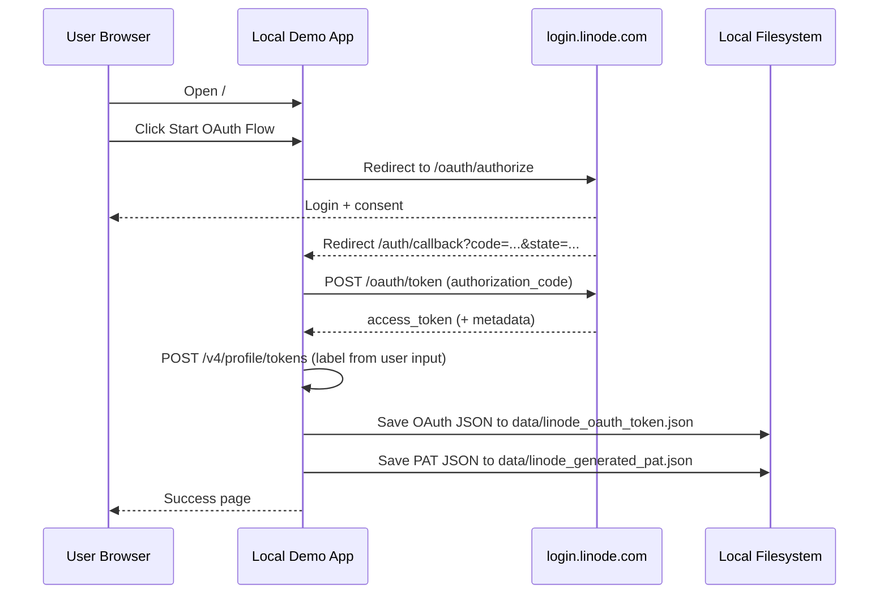

# Linode Third-Party OAuth Flow Demo

This demo is a minimal local application that showcases the OAuth Authorization Code flow and then creates a Personal Access Token (PAT) for the authenticated user using:

- Authorization endpoint: https://login.linode.com/oauth/authorize
- Token endpoint: https://login.linode.com/oauth/token

## Architecture



## Create OAuth App (before running demo)

1. In Linode Cloud Manager, create a new OAuth app/client.
2. Configure redirect URI to exactly match your local callback, for example:
    - http://127.0.0.1:3000/auth/callback
3. Save the app and copy:
    - Client ID
    - Client Secret
4. Put those values in `.env`:

```bash
LINODE_OAUTH_CLIENT_ID=<your-client-id>
LINODE_OAUTH_CLIENT_SECRET=<your-client-secret>
LINODE_OAUTH_REDIRECT_URI=http://127.0.0.1:3000/auth/callback
LINODE_OAUTH_SCOPES=account:read_write linodes:read_only
LINODE_PAT_SCOPES=linodes:read_only
# optional
LINODE_PAT_EXPIRY=
```

Important:
- Redirect URI must match exactly between Linode app config and `.env`.
- If you run on `localhost` instead of `127.0.0.1`, configure both sides consistently.
- `LINODE_OAUTH_SCOPES` must include `account:read_write` to create a PAT.
- PAT scopes cannot exceed scopes on the OAuth token.

## Run

```bash
cp .env.example .env
# edit .env with your OAuth app credentials

chmod +x start.sh shutdown.sh
./start.sh
```

Open http://127.0.0.1:3000, enter a PAT label, and start the OAuth flow.

## What Happens on Callback

1. App exchanges authorization code for OAuth token.
2. App creates PAT with your provided label via `POST /v4/profile/tokens`.
3. App saves outputs:
    - OAuth response: `data/linode_oauth_token.json`
    - PAT response: `data/linode_generated_pat.json`

Note:
- The full PAT value is returned only at creation time by the API.

## Test Generated Token

After successful callback:
- OAuth token is saved in `data/linode_oauth_token.json`.
- Generated PAT is saved in `data/linode_generated_pat.json`.

1. Extract token:

```bash
ACCESS_TOKEN=$(jq -r '.response.access_token' data/linode_oauth_token.json)
echo "Token prefix: ${ACCESS_TOKEN:0:10}..."
```

2. Test with Linode API profile endpoint:

```bash
curl -sS https://api.linode.com/v4/profile \
    -H "Authorization: Bearer ${ACCESS_TOKEN}" | jq
```

3. Test a scope-protected endpoint (works when `linodes:read_only` is granted):

```bash
curl -sS https://api.linode.com/v4/linode/instances \
    -H "Authorization: Bearer ${ACCESS_TOKEN}" | jq '.data | length'
```

Expected results:
- Valid token: JSON response with your profile or instance data.
- Invalid/expired token: HTTP 401-style response with auth error.

### Denied Request Examples

1. Invalid token (always denied):

```bash
curl -i -sS https://api.linode.com/v4/profile \
        -H "Authorization: Bearer not-a-real-token"
```

Expected: `401 Unauthorized`.

2. Missing token (always denied):

```bash
curl -i -sS https://api.linode.com/v4/profile
```

Expected: `401 Unauthorized`.

3. Same token, missing permission (example: list VPCs without `vpcs:read_only`):

```bash
curl -i -sS https://api.linode.com/v4/vpcs \
        -H "Authorization: Bearer ${ACCESS_TOKEN}"
```

Expected: permission/scope error (typically `403 Forbidden`) when your token scope is only `linodes:read_only` and does not include `vpcs:read_only`.

## Troubleshooting

If Linode shows Invalid client ID:

1. Confirm your .env is not using placeholders.
2. Set LINODE_OAUTH_CLIENT_ID and LINODE_OAUTH_CLIENT_SECRET to real values from your Linode OAuth app.
3. Ensure LINODE_OAUTH_REDIRECT_URI in .env exactly matches the redirect URI configured in that OAuth app (including scheme, host, port, and path).
4. Restart the app with ./shutdown.sh and ./start.sh.

If Linode shows Invalid scopes:

1. Use Linode scope format like read_only/read_write.
2. Example for PAT creation: set LINODE_OAUTH_SCOPES=account:read_write linodes:read_only in .env.
3. For multiple scopes, separate with spaces, for example: linodes:read_only account:read_only.
4. Restart the app with ./shutdown.sh and ./start.sh.

If PAT creation fails with permission/scope errors:

1. Confirm OAuth scope includes `account:read_write`.
2. Confirm the user role has permission `create_profile_pat`.
3. Ensure `LINODE_PAT_SCOPES` is not broader than OAuth scopes.
4. Retry the flow with a new PAT label.

## Stop

```bash
./shutdown.sh
```

## Token Storage

The OAuth token response is persisted to:

- data/linode_oauth_token.json

The generated PAT response is persisted to:

- data/linode_generated_pat.json
