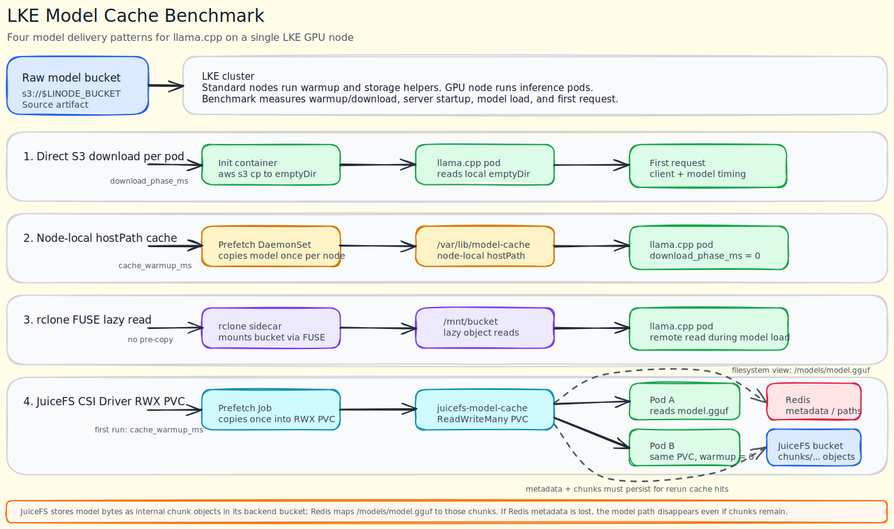

# LKE Model Cache Benchmark

Benchmark model-serving cold start on LKE GPU nodes when a GGUF model is loaded from:

- a direct Linode Object Storage download during pod startup
- a node-local hostPath cache populated by a DaemonSet
- a JuiceFS CSI Driver RWX PVC backed by Linode Object Storage

Default region is `de-fra-2` for LKE and Object Storage. Akamai documents the Object Storage S3 hostname for `de-fra-2` as `de-fra-1.linodeobjects.com`; this demo uses the bucket's computed `s3_endpoint` output instead of deriving the endpoint hostname from the region string. The default model is `bartowski/Qwen2.5-14B-Instruct-GGUF` with `Qwen2.5-14B-Instruct-Q4_K_M.gguf`, which remains suitable for testing on a single `g2-gpu-rtx4000a1-m` node with 24 GB VRAM.

## Architecture



## Quick Start

```bash
export LINODE_TOKEN="..."
export HF_TOKEN="..."

cd lke-model-cache-benchmark
bash start.sh
source .runtime.env
bash scripts/run-benchmark.sh
bash scripts/run-juicefs-benchmark.sh
```

The benchmark writes logs and summaries under `benchmark-results/`.

## What Is Measured

`llama-s3-download` measures pod startup with an init container that downloads the model from Object Storage into `emptyDir`, then starts `llama.cpp` and serves one request.

`model-prefetch` measures node-local cache warmup by downloading the same object to `/var/lib/model-cache-benchmark/model.gguf` on each worker.

`llama-hostpath-cache` measures startup when the GPU pod mounts the warmed host cache and starts `llama.cpp` without downloading the model again. The inference pod's download phase is reported as `0 ms`; the node-cache population cost is reported separately as cache warmup.

`llama-rclone-sidecar` measures startup when a privileged rclone sidecar mounts the Object Storage bucket directly as a FUSE filesystem and `llama.cpp` loads the model by reading it through the mount. There is no separate pre-download phase; `download_phase_ms` is reported from the llama.cpp model-load window because that is when rclone performs the lazy Object Storage read.

`llama-juicefs-rwx` measures startup when the model is preloaded into a JuiceFS CSI Driver RWX PVC. The JuiceFS benchmark is isolated in `scripts/run-juicefs-benchmark.sh` so the main benchmark script remains focused on the direct-download, hostPath, and rclone cases.

## JuiceFS RWX Pattern

The JuiceFS use case uses two backends:

- Metadata backend: single in-cluster Redis deployment for this PoC.
- Data backend: a separate Terraform-managed Linode Object Storage bucket dedicated to JuiceFS.

The raw model bucket remains separate from the JuiceFS backend bucket. The prefetch Job copies the raw model from `s3://$LINODE_BUCKET/$MODEL_OBJECT_KEY` into the JuiceFS RWX PVC, and JuiceFS stores the resulting data blocks in the dedicated JuiceFS bucket.

JuiceFS does not store `/models/model.gguf` as a visible object named `model.gguf` in the backend bucket. The bucket contains JuiceFS-managed internal objects such as `model-cache-benchmark/chunks/...`. File names, directories, inode metadata, and chunk mappings live in Redis.

The setup created by `scripts/run-juicefs-benchmark.sh` is:

```text
raw model bucket
  -> juicefs-prefetch Job
  -> /models/model.gguf on JuiceFS RWX PVC
  -> JuiceFS data chunks in dedicated JuiceFS bucket

Redis metadata
  -> maps /models/model.gguf to JuiceFS chunk objects
```

The Terraform-managed buckets are:

- `object_storage_bucket_name`: raw model source bucket.
- `juicefs_object_storage_bucket_name`: JuiceFS backend bucket for internal chunk objects.

The JuiceFS bucket URL is rendered as `JUICEFS_BUCKET_URL`, for example `https://de-fra-1.linodeobjects.com/<juicefs-bucket>`.

The JuiceFS script creates and tests:

- JuiceFS CSI Driver installation via Helm.
- Redis metadata service.
- JuiceFS Secret, StorageClass, and `ReadWriteMany` PVC.
- RWX verification Jobs that write and read a marker through the same PVC.
- A model prefetch Job that records `cache_warmup_ms`.
- `llama-juicefs-rwx-initial-pod`, which starts after the model is copied into the shared PVC.
- `llama-juicefs-rwx-reuse-pod`, which recreates the inference pod and mounts the same PVC again.

The reuse row is the key RWX behavior: the second pod does not copy or download the model again. The script reruns the prefetch check before the second pod, receives a cache-hit result, and reports `cache_warmup_ms=0` because `/models/model.gguf` is already present in the shared JuiceFS PVC.

On a later rerun of `scripts/run-juicefs-benchmark.sh`, the first prefetch should also report `cache_warmup_ms=0` if all of the following are true:

- The `juicefs-model-cache` PVC still exists.
- The Redis pod has not been recreated or lost its `emptyDir` metadata.
- `MODEL_OBJECT_KEY` has not changed.
- `/models/.ready`, `/models/.model_object_key`, and `/models/model.gguf` still exist in the JuiceFS mount.

If the script downloads again, check `Initial PVC model cache hit` in `juicefs-summary.md`. A value of `false` means the PVC mount did not currently expose the model. The most common cause in this PoC is Redis metadata loss: the JuiceFS object bucket may still contain `chunks/...`, but without Redis metadata JuiceFS cannot reconstruct the filesystem path `/models/model.gguf`.

To inspect the mounted filesystem view, use the PVC rather than the Object Storage browser:

```bash
kubectl -n model-cache-benchmark delete job juicefs-cache-check --ignore-not-found=true
kubectl apply -f configs/67-juicefs-cache-check.yaml
kubectl -n model-cache-benchmark wait --for=condition=complete job/juicefs-cache-check --timeout=10m
kubectl -n model-cache-benchmark logs job/juicefs-cache-check
```

For production, replace the single Redis pod with an HA metadata backend such as managed Redis with persistence, PostgreSQL/MySQL with backups, or TiKV. JuiceFS metadata is critical; losing it can make object data unusable.

## Security Context Alignment

The benchmark workloads use aligned pod security context settings so file ownership and permissions are consistent across the prefetch and inference paths:

- Pods run with `runAsUser: 1000`, `runAsGroup: 2000`, and `fsGroup: 2000`.
- Containers run as non-root with `allowPrivilegeEscalation: false` and dropped Linux capabilities.
- The prefetch DaemonSet includes an init container that prepares hostPath ownership (`/var/lib/model-cache-benchmark`) so the non-root runtime container can write cache files safely.

This reduces permission mismatches between the prefetch DaemonSet and LLM worker pods when sharing the node-local cache.

## Cache Garbage Collection

The prefetch DaemonSet now performs model-key-aware cache management using `MODEL_OBJECT_KEY`:

- The active model is stored as `/var/lib/model-cache-benchmark/<basename(MODEL_OBJECT_KEY)>`.
- A symlink at `/var/lib/model-cache-benchmark/model.gguf` is maintained for inference compatibility.
- A key marker file (`.model_object_key`) tracks the currently cached object key.
- On mismatch, the DaemonSet re-downloads the requested model and updates the marker.
- Stale `*.gguf` files that do not match the current `MODEL_OBJECT_KEY` basename are deleted automatically.

This keeps node-local storage clean and prevents serving stale model artifacts after model switches.

## KServe And KubeRay Cache Note

KServe `LocalModelCache` is the managed/operator version of this node-level cache pattern: it provides `LocalModelCache`, `LocalModelNodeGroup`, and `LocalModelNode` resources, creates download jobs, tracks per-node cache status, and integrates with `InferenceService` by matching the model `storageUri`.

KubeRay does not provide an equivalent native node-level model artifact cache. Ray `runtime_env` has caching for Python dependencies, code packages, and working directories, but it is not a lifecycle manager for large model weights. For KubeRay/Ray Serve, use Kubernetes primitives such as a prefetch DaemonSet, hostPath/local PV mounts, PVCs, or init containers.

This demo intentionally uses the generic Kubernetes DaemonSet plus hostPath approach so the pattern can be reused with KubeRay, Ray Serve, `llama.cpp`, vLLM, or other inference engines.

## rclone Sidecar Pattern

The `llama-rclone-sidecar` deployment uses a two-container pod:

- **rclone-sidecar**: runs `rclone mount` (foreground, `privileged: true`) and exposes the bucket at `/mnt/bucket` via FUSE. `mountPropagation: Bidirectional` propagates the mount to the host so the other container can see it.
- **llama-server**: waits for the model path to appear under `/mnt/bucket/$MODEL_OBJECT_KEY`, then starts inference. `mountPropagation: HostToContainer` receives the FUSE mount from the sidecar.

This is the simplest "zero-copy-to-disk" pattern: the model is streamed from Object Storage on first access using rclone's VFS full-cache mode (`--vfs-cache-mode full`). Subsequent requests hit the in-memory VFS cache.

> **Trade-off:** `ready_seconds` will be longer than `llama-hostpath-cache` because `llama.cpp` reads the model from a FUSE mount backed by Object Storage rather than a local disk file. But it requires no pre-warm DaemonSet and no persistent node storage.

## Summary Columns

Each benchmark run writes `summary.csv` and `summary.md` under `benchmark-results/<timestamp>/`.

- `model_delivery`: how the model is made visible to `llama.cpp`
- `download_phase_ms`: time spent making model bytes available to `llama.cpp`; for direct download this is init-container download time, for hostPath cache hits this is `0`, and for rclone this is the lazy remote-read time observed during model load
- `cache_warmup_ms`: node-cache population time from the prefetch DaemonSet, when applicable
- `server_startup_ms`: llama.cpp process start to `model loaded`, parsed from llama.cpp logs
- `model_load_ms`: `llama_server: loading model` to `llama_server: model loaded`, parsed from llama.cpp logs
- `ready_seconds`: deployment apply to Kubernetes rollout-ready
- `first_response_seconds`: deployment apply to first successful inference response
- `first_request_client_ms`: client-observed `curl` latency for the first `/completion` request
- `first_request_prompt_eval_ms`: llama.cpp prompt evaluation time for the first request
- `first_request_generation_ms`: llama.cpp generation time for the first request
- `first_request_model_ms`: llama.cpp total model time for the first request
- `notes`: short interpretation note for the case

## Troubleshooting

If rollout is stuck at `0 of 1 updated replicas are available`, check whether another inference deployment is still using the single GPU:

```bash
kubectl -n model-cache-benchmark get pods -o wide
kubectl -n model-cache-benchmark describe pod -l app=llama-s3-download
```

This demo uses one GPU node, so `llama-s3-download` and `llama-hostpath-cache` cannot run at the same time. `scripts/run-benchmark.sh` deletes both inference deployments before each benchmark case to avoid `Insufficient nvidia.com/gpu` scheduling failures.

The JuiceFS benchmark uses a separate script:

```bash
source .runtime.env
bash scripts/run-juicefs-benchmark.sh
```

It installs cluster-level JuiceFS CSI components and may create JuiceFS mount pods on worker nodes.

To validate cache GC behavior after changing `MODEL_OBJECT_KEY`, inspect the prefetch pod logs:

```bash
kubectl -n model-cache-benchmark logs -l app=model-prefetch --all-containers=true --prefix=true
```

## Configuration

Override defaults before running `start.sh`:

```bash
export HF_MODEL_REPO="bartowski/Qwen2.5-14B-Instruct-GGUF"
export HF_MODEL_FILE="Qwen2.5-14B-Instruct-Q4_K_M.gguf"
export MODEL_OBJECT_KEY="models/qwen2.5-14b-instruct-q4_k_m.gguf"
```

GPU and cluster sizing are controlled in `variables.tf` or `terraform.tfvars`.

## Cleanup

```bash
bash shutdown.sh
```

This deletes the Kubernetes namespace, empties the Object Storage bucket, and destroys the LKE cluster and bucket.
