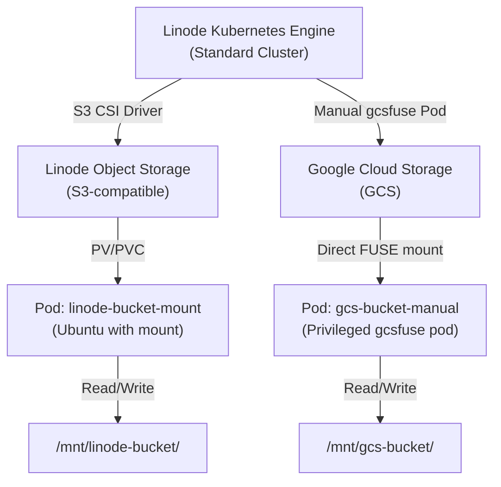

# LKE with Bucket Mount

Multi-cloud object storage demonstration: mount both **Linode Object Storage** and **Google Cloud Storage** buckets on a single Linode Kubernetes Engine (LKE) cluster.

## Architecture



## Prerequisites

### Local Machine

- **tofu** (OpenTofu) or **terraform**: IaC orchestration
- **kubectl**: Kubernetes client
- **helm**: Kubernetes package manager
- **envsubst**: Template variable substitution
- **gcloud**: Google Cloud CLI (for GCS setup)

### Cloud Accounts

- **Linode**: API token with compute, object storage, and LKE permissions
- **Google Cloud Project**: With billing enabled and service account creation permissions

## Quick Start

### Phase 1: Provision LKE Cluster & Linode Object Storage

```bash
# Set your Linode API token
export LINODE_TOKEN="your-linode-token-here"

# Provision infrastructure
bash start.sh
```

This will:
1. Create a 3-node standard LKE cluster
2. Provision a Linode Object Storage bucket
3. Generate an access key for the bucket

### Phase 2: Deploy Drivers & Workloads

See [MANUAL_DEPLOYMENT.md](MANUAL_DEPLOYMENT.md) for step-by-step instructions covering:

1. Export infrastructure outputs
2. (Optional) Install Cloud Firewall CRDs and controller
3. Install S3 CSI driver for Linode Object Storage
4. Create GCP GCS bucket and service account
5. Create Linode PVC and deploy example workloads
6. Verify bucket mounts

### Phase 3: Clean Up

```bash
bash shutdown.sh
```

This will destroy all Linode resources (LKE cluster, Object Storage bucket, etc.).

---

## Monitoring & Observability

### Kubernetes Metrics

- Monitor PVC usage: `kubectl get pvc -o wide`
- Check CSI driver health: `kubectl get pods -n kube-system | grep csi`
- View pod logs: `kubectl logs <pod-name>`

### Object Storage Metrics

- **Linode**: Monitor via Linode Cloud Manager (bucket size, request count)
- **GCS**: Monitor via Google Cloud Console (bytes stored, operations)

---

## References

- [gcsfuse project](https://github.com/GoogleCloudPlatform/gcsfuse)
