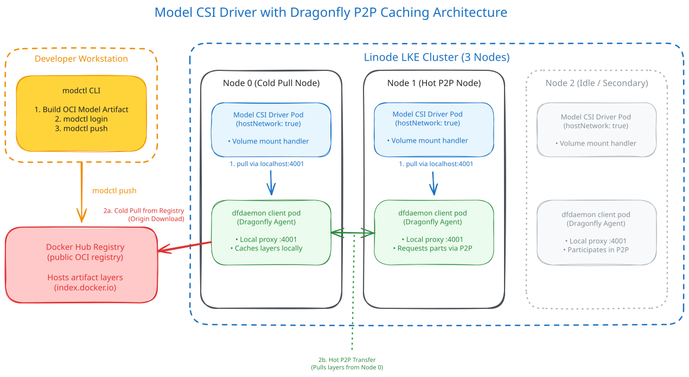

# Manual Model CSI Driver Test

Step-by-step guide to mount AI model artifacts as volumes in Kubernetes pods using the [Model CSI Driver](https://github.com/modelpack/model-csi-driver), and benchmark Dragonfly P2P caching across two nodes.

The Model CSI Driver is a Kubernetes CSI driver that handles OCI model artifacts built with [modctl](https://github.com/modelpack/modctl) (based on the [Model Spec](https://github.com/modelpack/model-spec)). It works on **any Kubernetes version** — no feature gate needed — making it portable to any cluster.

> **Why this approach?** Unlike the native ImageVolume feature (which requires k8s 1.31+ with a beta feature gate), the CSI driver runs as a DaemonSet and works on any cluster. You build the model artifact with `modctl`, push it to Docker Hub (public, no local registry needed), and mount it via a CSI volume. The CSI driver routes pulls through Dragonfly's proxy for P2P acceleration.

## How It Works



1. You build and push the model artifact to Docker Hub with `modctl`
2. The CSI driver on each node pulls the model via Dragonfly's proxy (`127.0.0.1:4001`)
3. dfdaemon fetches from Docker Hub (HTTPS, native) and caches pieces locally
4. On subsequent pulls, other nodes get pieces via P2P from the first node

## Prerequisites

- The LKE cluster is provisioned and Dragonfly is installed (run `./start.sh` first).
- `kubectl` and `helm` installed locally.
- [Go](https://go.dev/doc/install) installed (for `modctl`).
- A Docker Hub account with an access token (create one at https://hub.docker.com/settings/security).
- Kubeconfig available at `./kubeconfig.yaml`.

Set the kubeconfig path once:

```sh
export KUBECONFIG="$PWD/kubeconfig.yaml"
```

## Phase 1: Build and Push the Model Artifact

### 1.1 Install modctl

```sh
go install github.com/modelpack/modctl@main
# Ensure $GOPATH/bin is in your PATH
export PATH="$PATH:$(go env GOPATH)/bin"
modctl --help
```

### 1.2 Prepare model files

Create a workspace with model files. You can use real model files (`.gguf`, `.safetensors`) or create a sparse file for testing:

```sh
mkdir -p ~/model-build
cd ~/model-build

# Option A: Use a real model file (e.g. downloaded from HuggingFace)
# cp /path/to/model.gguf .

# Option B: Create a ~5GB sparse file for testing (uses no actual disk space)
truncate -s 5G model.gguf

# Create a config.json (required by modctl for model type detection)
cat > config.json << 'EOF'
{
  "model_type": "test",
  "architectures": ["test"],
  "hidden_size": 4096,
  "num_hidden_layers": 32,
  "num_attention_heads": 32,
  "vocab_size": 32000
}
EOF

# Create a tokenizer.json
cat > tokenizer.json << 'EOF'
{
  "model": {"type": "BPE", "vocab": {}, "merges": []}
}
EOF
```

### 1.3 Generate a Modelfile

`modctl modelfile generate` auto-detects model files and creates a `Modelfile`:

```sh
cd ~/model-build
modctl modelfile generate .
```

Output:
```
# Model name
NAME model-build

# Model family
FAMILY test

# Config files
CONFIG config.json
CONFIG tokenizer.json

# Model files
MODEL model.gguf
```

### 1.4 Build the artifact

```sh
cd ~/model-build
modctl build -t docker.io/<DOCKERHUB_USERNAME>/test-model:v1 -f Modelfile .
```

> Replace `<DOCKERHUB_USERNAME>` with your Docker Hub username.

This creates an OCI artifact with the model files as layers, packaged according to the Model Spec. The artifact is stored in the local modctl store (`~/.modctl`).

### 1.5 Login to Docker Hub and push

```sh
# Login (use an access token, not your password)
modctl login -u <DOCKERHUB_USERNAME> -p <DOCKERHUB_ACCESS_TOKEN> docker.io

# Push to Docker Hub
modctl push docker.io/<DOCKERHUB_USERNAME>/test-model:v1
```

> **Important:** Use a [Docker Hub access token](https://hub.docker.com/settings/security), not your password. The token needs `Read, Write, Delete` permissions.

### 1.6 Verify the push

```sh
# Inspect the artifact locally
modctl inspect docker.io/<DOCKERHUB_USERNAME>/test-model:v1

# Or check via Docker Hub API
curl -s "https://hub.docker.com/v2/repositories/<DOCKERHUB_USERNAME>/test-model/tags/" | jq '.results[].name'
```

### 1.7 Set the model image reference

```sh
export MODEL_IMAGE="docker.io/<DOCKERHUB_USERNAME>/test-model:v1"
echo "MODEL_IMAGE=$MODEL_IMAGE"
```

## Phase 2: Install the Model CSI Driver

### 2.1 Install via Helm

```sh
helm upgrade --install model-csi-driver \
    oci://ghcr.io/modelpack/charts/model-csi-driver \
    --namespace model-csi \
    --create-namespace \
    --set image.repository=ghcr.io/modelpack/model-csi-driver \
    --set image.tag=latest \
    --wait --timeout 5m
```

### 2.2 Verify the installation

```sh
kubectl -n model-csi get pods -o wide
```

You should see N `model-csi-driver-*` pods (one per node, DaemonSet), each with 2 containers (driver + registrar).

```sh
# Check the CSI driver is registered
kubectl get csidriver | grep model
# Expected: model.csi.modelpack.org
```

### 2.3 Configure Dragonfly P2P acceleration

By default, the CSI driver pulls directly from the registry. To route pulls through Dragonfly's HTTP proxy, configure `proxy_url` and enable `hostNetwork` on the CSI driver DaemonSet.

> **Why `proxy_url` instead of `dragonflyEndpoint`?** The CSI driver supports a `dragonfly_endpoint` setting for the dfdaemon Unix socket, but the Dragonfly client pod creates the socket inside its own mount namespace — it's not accessible from other pods via hostPath. Using `proxy_url: http://127.0.0.1:4001` (Dragonfly's HTTP proxy port) with `hostNetwork: true` is the working approach. With `hostNetwork: true`, the CSI driver shares the node's network namespace and can reach `127.0.0.1:4001` where dfdaemon listens.

The chart (v0.1.2) has a bug where `config.pullConfig` values are not rendered into the ConfigMap. You need to manually patch the ConfigMap and DaemonSet after install:

```sh
# 1. Patch the ConfigMap to add proxy_url
kubectl -n model-csi patch cm config --type=merge -p='{
  "data": {
    "config.yaml": "service_name: model.csi.modelpack.org\nroot_dir: /var/lib/model-csi\ncsi_endpoint: unix:///csi/csi.sock\npull_config:\n  proxy_url: http://127.0.0.1:4001\n  concurrency: 5\n  pull_layer_timeout_in_seconds: 300\n"
  }
}'

# 2. Patch the DaemonSet to use hostNetwork (so 127.0.0.1:4001 reaches dfdaemon)
kubectl -n model-csi patch ds model-csi-driver --type=json -p='[
  {"op": "add", "path": "/spec/template/spec/hostNetwork", "value": true}
]'

# 3. Restart pods to pick up the new config
kubectl -n model-csi delete pods -l app.kubernetes.io/name=model-csi-driver --timeout=60s

# 4. Verify
kubectl -n model-csi get pods -o wide
# Pods should show node IPs (not 10.x pod IPs) — confirms hostNetwork is active

CSI_POD=$(kubectl -n model-csi get pods -l app.kubernetes.io/name=model-csi-driver -o jsonpath='{.items[0].metadata.name}')
kubectl -n model-csi exec "$CSI_POD" -c model-csi-driver -- cat /etc/model-csi-driver/config.yaml
# Should show: proxy_url: http://127.0.0.1:4001
```

> **Note:** The CSI driver uses the volume attribute key `model.csi.modelpack.org/reference` (not `modelRef` as shown in the upstream getting-started doc). See the pod manifest in Phase 4 for the correct key.

### 2.4 Verify pre-flight checks

Run the same pre-flight checks as the [image pull test](MANUAL_IMAGE_PULL_TEST.md#phase-1-pre-flight-checks):
- Dragonfly pods running
- dfdaemon proxy listening on port 4001
- Cloud Firewall allows P2P traffic (ports 4000/4002/4005/4006)
- dfdaemon advertises private IPs (if the patch is applied)

Get two node names for the benchmark:

```sh
NODE_0=$(kubectl get nodes -o jsonpath='{.items[0].metadata.name}')
NODE_1=$(kubectl get nodes -o jsonpath='{.items[1].metadata.name}')
echo "NODE_0 (cold) = $NODE_0"
echo "NODE_1 (hot)  = $NODE_1"
```

## Phase 3: Purge Caches

### 3.1 Purge dfdaemon caches on both nodes

> **If you opened a new terminal**, re-set the variables first:
> ```sh
> export KUBECONFIG="$PWD/kubeconfig.yaml"
> NODE_0=$(kubectl get nodes -o jsonpath='{.items[0].metadata.name}')
> NODE_1=$(kubectl get nodes -o jsonpath='{.items[1].metadata.name}')
> export MODEL_IMAGE="docker.io/<DOCKERHUB_USERNAME>/test-model:v1"
> echo "NODE_0=$NODE_0  NODE_1=$NODE_1  MODEL_IMAGE=$MODEL_IMAGE"
> ```

```sh
for NODE in "$NODE_0" "$NODE_1"; do
  POD=$(kubectl -n dragonfly-system get pods -l component=client \
    -o jsonpath="{.items[?(@.spec.nodeName=='${NODE}')].metadata.name}")
  echo "Purging dfdaemon cache on $NODE (pod: $POD)"
  kubectl -n dragonfly-system exec "$POD" -c client -- \
    sh -c 'rm -rf /var/lib/dragonfly/content/tasks/* /var/lib/dragonfly/content/persistent-tasks/* 2>/dev/null; echo "tasks remaining: $(ls /var/lib/dragonfly/content/tasks/ 2>/dev/null | wc -l)"'
  kubectl -n dragonfly-system delete pod "$POD" --ignore-not-found --timeout=60s
done
```

Wait for new pods:

```sh
kubectl -n dragonfly-system get pods -l component=client -o wide
```

Wait until all show `1/1 Running`, then wait 10 more seconds.

### 3.2 Purge CSI driver cache (if re-running)

The CSI driver stores unpacked models in `/var/lib/model-csi` on each node. To ensure a clean cold pull, purge this directory:

```sh
for NODE in "$NODE_0" "$NODE_1"; do
  CSI_POD=$(kubectl -n model-csi get pods -l app.kubernetes.io/name=model-csi-driver \
    -o jsonpath="{.items[?(@.spec.nodeName=='${NODE}')].metadata.name}" 2>/dev/null)
  if [[ -n "$CSI_POD" ]]; then
    echo "Purging CSI cache on $NODE (pod: $CSI_POD)"
    kubectl -n model-csi exec "$CSI_POD" -c model-csi-driver -- \
      sh -c 'rm -rf /var/lib/model-csi/* 2>/dev/null || true'
  fi
done
```

## Phase 4: Cold Pull (Node 0)

### 4.1 Create a namespace

```sh
kubectl create namespace model-csi-test --dry-run=client -o yaml | kubectl apply -f -
```

### 4.2 Deploy a Pod with CSI model volume on NODE_0

> **If you opened a new terminal**, re-set the variables first:
> ```sh
> export KUBECONFIG="$PWD/kubeconfig.yaml"
> NODE_0=$(kubectl get nodes -o jsonpath='{.items[0].metadata.name}')
> NODE_1=$(kubectl get nodes -o jsonpath='{.items[1].metadata.name}')
> export MODEL_IMAGE="docker.io/<DOCKERHUB_USERNAME>/test-model:v1"
> echo "NODE_0=$NODE_0  NODE_1=$NODE_1  MODEL_IMAGE=$MODEL_IMAGE"
> ```

```sh
cat <<EOF | kubectl apply -f -
apiVersion: v1
kind: Pod
metadata:
  name: model-cold
  namespace: model-csi-test
spec:
  nodeSelector:
    kubernetes.io/hostname: ${NODE_0}
  tolerations:
    - operator: Exists
  containers:
    - name: reader
      image: docker.io/ubuntu:24.04
      command: ["sleep", "infinity"]
      volumeMounts:
        - name: model
          mountPath: /model
          readOnly: true
      resources:
        requests:
          cpu: 100m
          memory: 256Mi
        limits:
          cpu: 500m
          memory: 1Gi
  volumes:
    - name: model
      csi:
        driver: model.csi.modelpack.org
        volumeAttributes:
          model.csi.modelpack.org/reference: "${MODEL_IMAGE}"
EOF
```

### 4.3 Measure the pull time

The CSI driver pulls the model during pod creation. Measure from pod creation to `Running`:

```sh
# Record the start time
COLD_START=$(kubectl -n model-csi-test get pod model-cold -o jsonpath='{.metadata.creationTimestamp}' 2>/dev/null)
echo "Pod created at: $COLD_START"

# Wait for the pod to be Running
kubectl -n model-csi-test wait pod/model-cold --for=condition=Ready --timeout=30m

# Record the ready time
COLD_READY=$(kubectl -n model-csi-test get pod model-cold \
  -o jsonpath='{.status.containerStatuses[0].state.running.startedAt}' 2>/dev/null)
echo "Pod running at:  $COLD_READY"

# Calculate duration (macOS)
COLD_SECONDS=$(($(date -j -f "%Y-%m-%dT%H:%M:%SZ" "$COLD_READY" "+%s") - $(date -j -f "%Y-%m-%dT%H:%M:%SZ" "$COLD_START" "+%s")))
echo "Cold pull duration: ${COLD_SECONDS}s"
```

> **Linux note:** Replace `date -j -f` with `date -d`:
> ```sh
> COLD_SECONDS=$(($(date -d "$COLD_READY" "+%s") - $(date -d "$COLD_START" "+%s")))
> ```

### 4.4 Check the CSI driver logs for pull progress

```sh
CSI_POD=$(kubectl -n model-csi get pods -l app.kubernetes.io/name=model-csi-driver \
  -o jsonpath="{.items[?(@.spec.nodeName=='${NODE_0}')].metadata.name}")
kubectl -n model-csi logs "$CSI_POD" -c model-csi-driver --tail=30
```

Look for lines like:
```
publishing static inline volume: docker.io/<user>/test-model:v1
pull: starting pull operation for target docker.io/<user>/test-model:v1
pull: processing layers for target docker.io/<user>/test-model:v1 [count: 3]
```

The `Proxy:http://127.0.0.1:4001` in the log confirms the pull is routed through Dragonfly.

### 4.5 Verify model files are mounted

```sh
# List the model directory
kubectl -n model-csi-test exec model-cold -- ls -la /model/

# Count files and total size
kubectl -n model-csi-test exec model-cold -- sh -c 'find /model -type f | wc -l; du -sh /model'

# Show sample files (first 20)
kubectl -n model-csi-test exec model-cold -- sh -c 'find /model -type f | head -20'

# Check for model-specific files
kubectl -n model-csi-test exec model-cold -- sh -c 'find /model -name "*.gguf" -o -name "*.safetensors" -o -name "config.json" -o -name "tokenizer.json" | head -10'
```

Expected: model files are present at `/model/` — typically `.gguf` files, `config.json`, `tokenizer.json`, etc.

### 4.6 Keep the pod running (for P2P seeding)

Do NOT delete the cold pull pod — it seeds the P2P network for the hot pull:

```sh
kubectl -n model-csi-test get pod model-cold
# Should show 1/1 Running
```

## Phase 5: Hot Pull (Node 1)

### 5.1 Deploy the same pod on NODE_1

```sh
cat <<EOF | kubectl apply -f -
apiVersion: v1
kind: Pod
metadata:
  name: model-hot
  namespace: model-csi-test
spec:
  nodeSelector:
    kubernetes.io/hostname: ${NODE_1}
  tolerations:
    - operator: Exists
  containers:
    - name: reader
      image: docker.io/ubuntu:24.04
      command: ["sleep", "infinity"]
      volumeMounts:
        - name: model
          mountPath: /model
          readOnly: true
      resources:
        requests:
          cpu: 100m
          memory: 256Mi
        limits:
          cpu: 500m
          memory: 1Gi
  volumes:
    - name: model
      csi:
        driver: model.csi.modelpack.org
        volumeAttributes:
          model.csi.modelpack.org/reference: "${MODEL_IMAGE}"
EOF
```

### 5.2 Measure the pull time

```sh
HOT_START=$(kubectl -n model-csi-test get pod model-hot -o jsonpath='{.metadata.creationTimestamp}' 2>/dev/null)
echo "Pod created at: $HOT_START"

kubectl -n model-csi-test wait pod/model-hot --for=condition=Ready --timeout=30m

HOT_READY=$(kubectl -n model-csi-test get pod model-hot \
  -o jsonpath='{.status.containerStatuses[0].state.running.startedAt}' 2>/dev/null)
echo "Pod running at:  $HOT_READY"

HOT_SECONDS=$(($(date -j -f "%Y-%m-%dT%H:%M:%SZ" "$HOT_READY" "+%s") - $(date -j -f "%Y-%m-%dT%H:%M:%SZ" "$HOT_START" "+%s")))
echo "Hot pull duration: ${HOT_SECONDS}s"
```

> **Linux note:** Replace `date -j -f` with `date -d`.

### 5.3 Verify model files are mounted

```sh
kubectl -n model-csi-test exec model-hot -- ls -la /model/
kubectl -n model-csi-test exec model-hot -- sh -c 'find /model -type f | wc -l; du -sh /model'
kubectl -n model-csi-test exec model-hot -- sh -c 'find /model -type f | head -20'
```

### 5.4 Compare

```sh
echo ""
echo "=== Model CSI Driver Pull Results ==="
echo "Cold (back-to-source): ${COLD_SECONDS}s"
echo "Hot  (P2P):            ${HOT_SECONDS}s"
echo "Improvement:           $(( (COLD_SECONDS - HOT_SECONDS) * 100 / COLD_SECONDS ))%"
echo ""
echo "Model image: ${MODEL_IMAGE}"
```

## Phase 6: Verify P2P Was Used

### 6.1 Check dfdaemon logs on the hot node

```sh
DF_POD=$(kubectl -n dragonfly-system get pods -l component=client \
  -o jsonpath="{.items[?(@.spec.nodeName=='${NODE_1}')].metadata.name}")
echo "dfdaemon pod on $NODE_1: $DF_POD"

# Check piece sources
kubectl -n dragonfly-system logs "$DF_POD" -c client 2>&1 \
  | grep -oE "from (parent|local|back)" \
  | sort | uniq -c | sort -rn

# Check which peers served pieces
kubectl -n dragonfly-system logs "$DF_POD" -c client 2>&1 \
  | grep -oE 'from parent "[^"]*"' \
  | sort | uniq -c | sort -rn | head -5

# Check for transport errors
kubectl -n dragonfly-system logs "$DF_POD" -c client 2>&1 \
  | grep -iE "transport error|failed to connect|ConnectError" \
  | head -5
```

Expected: `from parent` entries with the cold node's private IP (`192.168.145.x`) and no transport errors.

### 6.2 Check CSI driver logs

```sh
CSI_POD_HOT=$(kubectl -n model-csi get pods -l app.kubernetes.io/name=model-csi-driver \
  -o jsonpath="{.items[?(@.spec.nodeName=='${NODE_1}')].metadata.name}")
kubectl -n model-csi logs "$CSI_POD_HOT" -c model-csi-driver --tail=30
```

Look for the `Proxy:http://127.0.0.1:4001` line confirming Dragonfly routing.

### 6.3 Extract per-layer dfdaemon download time

```sh
# Cold node (NODE_0)
COLD_DF_POD=$(kubectl -n dragonfly-system get pods -l component=client \
  -o jsonpath="{.items[?(@.spec.nodeName=='${NODE_0}')].metadata.name}")
kubectl -n dragonfly-system logs "$COLD_DF_POD" -c client 2>&1 \
  | grep "download task, cost" \
  | sed -E 's/.*cost: ([0-9.]+)s, size: ([0-9]+).*/  \1s  \2 bytes/'

# Hot node (NODE_1)
kubectl -n dragonfly-system logs "$DF_POD" -c client 2>&1 \
  | grep "download task, cost" \
  | sed -E 's/.*cost: ([0-9.]+)s, size: ([0-9]+).*/  \1s  \2 bytes/'
```

## Phase 7: Cleanup

### 7.1 Delete the pods

```sh
kubectl -n model-csi-test delete pod model-cold model-hot --ignore-not-found --timeout=30s
```

### 7.2 Delete the namespace

```sh
kubectl delete namespace model-csi-test --ignore-not-found --timeout=120s
```

### 7.3 Purge CSI driver cache (optional)

```sh
for NODE in "$NODE_0" "$NODE_1"; do
  CSI_POD=$(kubectl -n model-csi get pods -l app.kubernetes.io/name=model-csi-driver \
    -o jsonpath="{.items[?(@.spec.nodeName=='${NODE}')].metadata.name}" 2>/dev/null)
  if [[ -n "$CSI_POD" ]]; then
    kubectl -n model-csi exec "$CSI_POD" -c model-csi-driver -- \
      sh -c 'rm -rf /var/lib/model-csi/* 2>/dev/null || true'
  fi
done
```

### 7.4 Purge dfdaemon caches (optional)

```sh
for NODE in "$NODE_0" "$NODE_1"; do
  POD=$(kubectl -n dragonfly-system get pods -l component=client \
    -o jsonpath="{.items[?(@.spec.nodeName=='${NODE}')].metadata.name}")
  kubectl -n dragonfly-system exec "$POD" -c client -- \
    sh -c 'rm -rf /var/lib/dragonfly/content/tasks/* 2>/dev/null'
  kubectl -n dragonfly-system delete pod "$POD" --ignore-not-found --timeout=60s
done
```

### 7.5 Uninstall the CSI driver (optional)

```sh
helm uninstall model-csi-driver -n model-csi
kubectl delete namespace model-csi --ignore-not-found --timeout=120s
```

### 7.6 Remove the Docker Hub image (optional)

```sh
# Delete the repository on Docker Hub (via web UI or API)
# Or use the Docker Hub CLI
```

## Troubleshooting

### `failed to create codec for media type application/vnd.docker.ai.*: unsupported codec type`

**Cause:** You're trying to use a Docker Hub `ai/*` model image (e.g. `ai/ministral3:8B-Q4_K_M`). The CSI driver (v0.1.2) only supports OCI artifacts built with `modctl` (Model Spec format), not Docker Hub's native AI model format.

**Fix:** Build the model with `modctl` (Phase 1) and push to Docker Hub. Use `docker.io/<youruser>/test-model:v1` as the reference, not `docker.io/ai/...`.

### `check dragonfly endpoint: no such file or directory`

**Cause:** The dfdaemon Unix socket is not accessible from the CSI driver pod. This happens when `dragonfly_endpoint` is set in the config but the socket path doesn't exist in the CSI driver's mount namespace.

**Fix:** Use `proxy_url: http://127.0.0.1:4001` with `hostNetwork: true` instead (see Phase 2.3). Don't use `dragonfly_endpoint`.

### Pod stuck in `ContainerCreating`

**Check the CSI driver logs:**
```sh
CSI_POD=$(kubectl -n model-csi get pods -l app.kubernetes.io/name=model-csi-driver \
  -o jsonpath="{.items[?(@.spec.nodeName=='${NODE_0}')].metadata.name}")
kubectl -n model-csi logs "$CSI_POD" -c model-csi-driver --tail=50
```

**Common causes:**
- `unsupported codec type` — using Docker Hub `ai/*` images instead of `modctl`-built artifacts
- Large model image (5+ GB) — wait for the pull to complete (can take 5-10 minutes)
- Registry rate limiting — Docker Hub may rate-limit pulls
- Disk space — check `/var/lib/model-csi` has enough space
- `check dragonfly endpoint: no such file or directory` — use `proxy_url` instead of `dragonfly_endpoint`

### `pull access denied` or `repository does not exist`

**Cause:** The model image reference is wrong, or the image is private and the CSI driver has no credentials.

**Fix:**
- Check the image reference: `echo $MODEL_IMAGE`
- If the Docker Hub repo is private, configure registry auth in the CSI driver ConfigMap
- If the repo is public, ensure the reference includes `docker.io/` prefix

### CSI driver not registered

**Check:**
```sh
kubectl get csidriver | grep model
```

If empty, the CSI driver pod may not have started. Check:
```sh
kubectl -n model-csi get pods -o wide
kubectl -n model-csi describe pod <csi-driver-pod>
```

### Model files not visible at /model

**Check the volume mount:**
```sh
kubectl -n model-csi-test describe pod model-cold | grep -A10 "Volumes:"
kubectl -n model-csi-test describe pod model-cold | grep -A5 "Mounts:"
```

**Check the CSI driver logs for unpack errors:**
```sh
kubectl -n model-csi logs <csi-pod> -c model-csi-driver --tail=30
```

### `modctl push` fails with 403

**Cause:** Docker Hub authentication failed. You need a valid access token (not your password).

**Fix:** Create a new access token at https://hub.docker.com/settings/security and re-login:
```sh
modctl login -u <DOCKERHUB_USERNAME> -p <NEW_TOKEN> docker.io
```

### `modctl build` fails or hangs

**Cause:** Large model files (5+ GB) take time to compress and hash.

**Fix:** Be patient. For a 5 GB file, the build can take 1-2 minutes. If it hangs, check disk space in `~/.modctl`.

## Comparison: ImageVolume vs Model CSI Driver

| Feature | Native ImageVolume | Model CSI Driver |
|---------|-------------------|------------------|
| Kubernetes version | 1.31+ (feature gate) | Any version |
| Docker Hub `ai/*` model images | Not supported (manifest mismatch) | Not supported (unsupported codec) |
| `modctl`-built OCI artifacts | Supported | Supported |
| `docker build` OCI images | Supported | Not supported |
| Feature gate required | Yes (beta in 1.35) | No |
| CSI driver required | No | Yes (DaemonSet + hostNetwork) |
| P2P via Dragonfly | Automatic (containerd mirror) | Via `proxy_url` + `hostNetwork` patch |
| Local registry needed | Yes (for private images) | No (uses Docker Hub directly) |
| Portability | k8s 1.31+ only | Any k8s version |

> **When to use which?**
> - **ImageVolume** (`docker build`): Simplest, but requires k8s 1.31+. Good for testing on modern clusters.
> - **CSI Driver** (`modctl`): Portable to any k8s version. Requires a CSI driver DaemonSet and manual config patches. Good for production clusters running older k8s or managed clusters where feature gates can't be set.

## How to Read the Results

| Metric | What it measures | Expected cold | Expected hot |
|--------|-----------------|---------------|--------------|
| Pod creation → Running | Full pull time (model download + unpack + mount) | 3-10 min (5 GB model from Docker Hub) | 30s-2 min (P2P) |
| dfdaemon download cost | Per-layer P2P transfer time only | 30-120s per layer (from Docker Hub) | 1-5s per layer (from P2P peer) |
| Improvement % | `(cold - hot) / cold * 100` | — | 60-90% |

For a 5.5 GB model artifact:
- **Cold pull:** ~3-5 minutes (downloading 5.5 GB from Docker Hub at ~100-200 MB/s)
- **Hot P2P pull:** ~30-60 seconds (serving from cold node NVMe at ~3 GB/s over private network)
- **Expected improvement:** 70-90%
