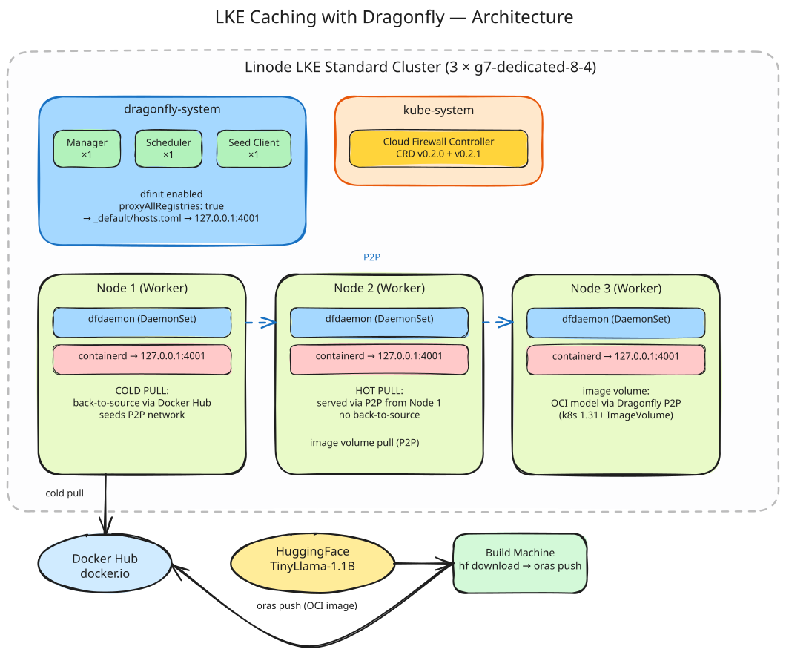

# LKE Caching with Dragonfly

Provision an LKE Standard cluster with Dragonfly P2P image caching and validate two use cases: **Docker image pull** (cold vs hot) and **model caching** (HuggingFace model packaged as OCI image, mounted via native Kubernetes `image` volume source).

## Architecture



### Components

| Component | Version | Purpose |
|-----------|---------|---------|
| LKE Standard | k8s `1.35` | Managed Kubernetes cluster (3 × `g7-dedicated-8-4`) |
| Cloud Firewall Controller | CRD `0.2.0` + Controller `0.2.1` | PoC — validates controller runs on LKE Standard |
| Dragonfly | Chart `1.7.0` (app `2.5.0`) | P2P image & model caching |
| Dragonfly dfinit | — | Writes containerd `_default/hosts.toml` on every node |
| `proxyAllRegistries` | `true` | All registries route through `127.0.0.1:4001` |

### Dragonfly Topology

- **1 Manager** — metadata storage, task management
- **1 Scheduler** — P2P scheduling, peer selection
- **1 Seed Client** — back-to-source fetch, seeds the P2P network
- **3 dfdaemon DaemonSet pods** — one per node, transparent containerd proxy

### Data Flow

1. **Cold pull (Node 1):** `containerd → 127.0.0.1:4001 (dfdaemon) → Dragonfly scheduler → Docker Hub`. Image is seeded into the P2P network.
2. **Hot pull (Node 2):** `containerd → 127.0.0.1:4001 (dfdaemon) → P2P peers (Node 1)`. Layers served from intra-cluster NVMe — no back-to-source fetch.
3. **Model caching:** HuggingFace model → ORAS-packaged OCI image → pushed to Docker Hub → mounted in a Pod via native `image` volume source → pulled through Dragonfly P2P.

## Prerequisites

### CLI Tools

| Tool | Install | Used by |
|------|---------|---------|
| `tofu` (OpenTofu) | `brew install opentofu` | Infrastructure provisioning |
| `helm` | `brew install helm` | Chart installation |
| `kubectl` | `brew install kubectl` | Cluster interaction |
| `jq` | `brew install jq` | JSON parsing (benchmark) |
| `oras` | `brew install oras` | OCI model packaging (Validation 2) |
| `hf` (huggingface-cli) | `pip install huggingface_hub` | Model download (Validation 2) |

### Environment Variables

| Variable | When | Purpose |
|----------|------|---------|
| `LINODE_TOKEN` | Always | Linode API access |
| `DOCKERHUB_USERNAME` | Validation 2 | Docker Hub namespace for model push |
| `DOCKERHUB_PASSWORD` | Validation 2 | Docker Hub access token for ORAS login |
| `HF_TOKEN` | Validation 2 (optional) | HuggingFace token for gated models / rate limits |

## Quick Start

### 1. Bootstrap the cluster

```sh
export LINODE_TOKEN="your-linode-api-token"
./start.sh
```

This provisions the LKE cluster, installs the Cloud Firewall Controller, and installs Dragonfly with dfinit. The script:
- Runs `tofu init && tofu apply`
- Extracts kubeconfig to `./kubeconfig.yaml`
- Installs Cloud Firewall Controller (CRD + controller)
- Installs Dragonfly (first install with `restartContainerRuntime: true`)
- Patches `restartContainerRuntime` to `false` for future upgrades

### 2. Troubleshoot the cluster

```sh
export KUBECONFIG="$PWD/kubeconfig.yaml"
```

```sh
# Cluster nodes
kubectl get nodes -o wide

# Cloud Firewall Controller
kubectl -n kube-system get pods | grep cloud-firewall

# Dragonfly components
kubectl -n dragonfly-system get pods -o wide

# Verify dfinit mirror config on a node
kubectl debug node/$(kubectl get nodes -o jsonpath='{.items[0].metadata.name}') \
  -- cat /etc/containerd/certs.d/_default/hosts.toml

# Check dfinit logs
kubectl -n dragonfly-system logs ds/dragonfly-client -c dfinit

# Check dfdaemon proxy is listening
kubectl -n dragonfly-system logs ds/dragonfly-client -c dfdaemon | tail -20
```

### 3. Open the Dragonfly Manager web UI

The manager ships a built-in console for inspecting peers, schedulers, seed
clients, and task stats. Access it via port-forward (the chart disables ingress
by default):

```sh
export KUBECONFIG="$PWD/kubeconfig.yaml"
kubectl -n dragonfly-system port-forward svc/dragonfly-manager 8080:8080
```

Then open **http://localhost:8080** in your browser. Sign in with the default
credentials seeded by the chart:

| Field    | Value      |
|----------|------------|
| Username | `root`     |
| Password | `dragonfly`|

## Shutdown

```sh
export LINODE_TOKEN="your-linode-api-token"
./shutdown.sh
```

This destroys the LKE cluster and all associated resources, and removes the local kubeconfig.
