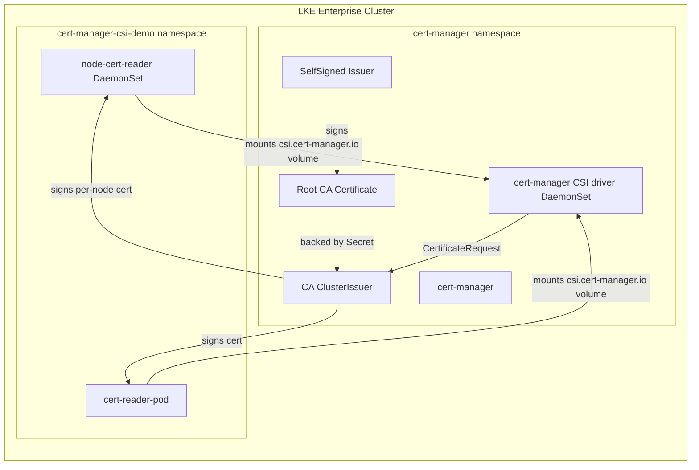

# LKE Enterprise + cert-manager CSI Driver

Provision an LKE Enterprise (LKEE) cluster and use the [cert-manager CSI driver](https://cert-manager.io/docs/projects/csi-driver/) to issue a short-lived, per-node client certificate that is mounted directly into a pod. No `Certificate` resources or `Secret` objects are needed for the per-node certs — the driver requests a certificate on demand when a pod mounts its CSI volume.

## Architecture



The root CA is created once as a self-signed `Certificate` (stored in the `root-ca` Secret) and exposed through a `ClusterIssuer` of kind `CA`. The CSI driver uses that issuer to sign the per-node CSRs.

## Components

- **LKE Enterprise cluster** — `tier = "enterprise"`, latest enterprise Kubernetes version (`v1.34.6+lke2` by default; query with `lin lke tiered-versions-list enterprise --text`).
- **Control plane ACL** — managed via the LKE `control_plane` ACL block, driven by `control_plane_ipv4_whitelist_cidrs` (default `0.0.0.0/0`).
- **cert-manager** — installed via Helm (`v1.21.1`), CRDs enabled.
- **cert-manager CSI driver** — installed via Helm (`v0.16.0`).
- **Root CA** — self-signed bootstrap issuer → root CA `Certificate` → CA `ClusterIssuer` (`root-ca-issuer`), applied via `kubectl`.
- **node-cert-reader DaemonSet** — one pod per worker node (via `nodeSelector: pool: worker`). Each pod mounts a `csi.cert-manager.io` volume and reads/verifies its own certificate.
- **cert-reader-pod** — a standalone pod that mounts the same CSI volume and reads the certificate, demonstrating the "pod reads the certificate from the node" pattern.

## Quick Start

```bash
export LINODE_TOKEN="..."

cd lke_cert_manager_csi
bash start.sh
source .runtime.env
```

`start.sh` provisions the cluster, installs cert-manager and the CSI driver via Helm, creates the root CA, applies the DaemonSet and reader pod, and prints each node's certificate details.

## Configuration

Override defaults before running `start.sh`:

```bash
export CERT_DURATION="30m"   # per-node certificate validity
```

Cluster sizing, region, Kubernetes version, and the control-plane ACL are controlled in `variables.tf` or `terraform.tfvars`.

## How the Per-Node Certificate Works

The cert-manager CSI driver issues a **unique, ephemeral certificate per pod** — not per node. To get one certificate per node, the `node-cert-reader` DaemonSet runs one pod on each worker node, and each pod requests its own certificate through the CSI volume. Key properties:

- The private key is generated on the node and **never leaves it** (stored in memory, not written to disk).
- No `Certificate` resource or `Secret` is created for the per-node certs.
- The certificate is destroyed when the pod terminates.
- `csi.cert-manager.io/duration` controls the TTL (default `30m`); renewal happens automatically at one third of the duration.
- `csi.cert-manager.io/key-usages: client auth` makes these client certificates suitable for mTLS.

## Production Considerations

- **Restrict the ACL.** The default `0.0.0.0/0` opens the control plane to the internet. Set `control_plane_ipv4_whitelist_cidrs` to your egress CIDRs before production.
- **Root CA protection.** The `root-ca` Secret holds the CA private key. Restrict access to the `cert-manager` namespace and back up the Secret for disaster recovery. Rotate the CA by re-issuing the root `Certificate` and re-signing node certs.
- **Short-lived certs.** The `30m` default is intentionally short for a PoC. Choose a duration that balances security (short) against renewal churn (long). The CSI driver renews at one third of the duration.
- **High availability.** The cluster uses `high_availability = true` for the control plane. For production, run 3+ worker nodes and add a `PodDisruptionBudget` for the DaemonSet.
- **mTLS.** These client certs are signed by your root CA, so any service that trusts the root CA can verify node identity. Wire the CA bundle into your services' trust stores.

## Cleanup

```bash
bash shutdown.sh
```

This deletes the demo namespace and destroys the LKE cluster, cert-manager, and CSI driver.
