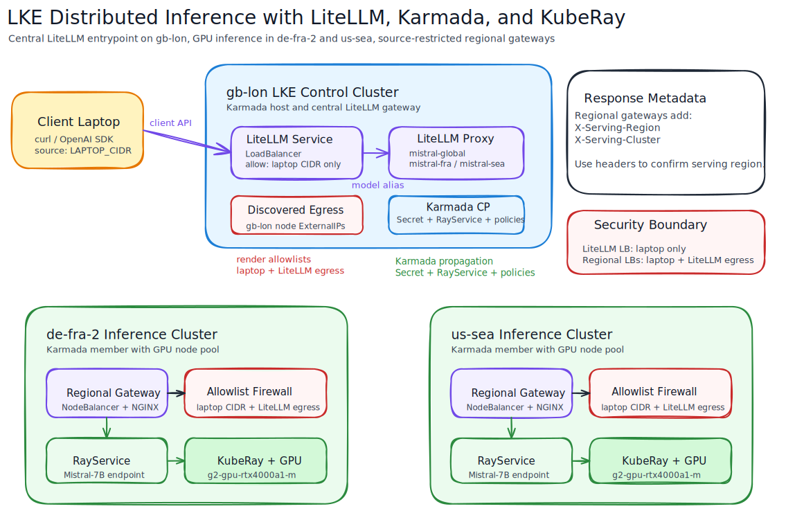

# LKE Distributed Inference with Karmada + KubeRay

This demo provisions three **LKE Standard** clusters and deploys a multi-cluster inference stack for **Mistral-7B-v0.3**.

- Region 1: `gb-lon` (Karmada control-plane host — no GPU)
- Region 2: `de-fra-2` cluster 1 (Karmada member — GPU inference)
- Region 3: `de-fra-2` cluster 2 (Karmada member — GPU inference)
- Per Karmada host cluster (gb-lon):
  - `3 x g6-standard-4` (standard pool only)
- Per inference cluster (de-fra-2 x2):
  - `3 x g6-standard-4`
  - `1 x g2-gpu-rtx4000a1-m`

The goal is to demonstrate cluster provisioning with OpenTofu and manual multi-cluster model serving through Karmada + KubeRay.

## Architecture overview



The diagram illustrates the following flow:
1. **Client Requests**: Originating from the user's laptop, hitting a conceptual Global Load Balancer.
2. **Traffic Routing**: The Global LB routes traffic to regional **Secure Gateways** (NodeBalancers) in `de-fra-2`.
3. **Multi-Cluster Orchestration**: **Karmada** (hosted in `gb-lon`) propagates KubeRay resources and inference configurations to member clusters.
4. **GPU Inference**: **KubeRay** manages Ray Clusters on GPU-enabled nodes, serving **Mistral-7B-v0.3**.


## Quick start

```bash
export LINODE_TOKEN="<your-linode-token>"
cp terraform.tfvars.example terraform.tfvars

./start.sh
```

After provisioning finishes, continue with [MANUAL_DEPLOYMENT.md](MANUAL_DEPLOYMENT.md) for:

- Karmada bootstrap and cluster join
- KubeRay installation on both clusters through Karmada
- Linode Cloud Firewall controller installation for the NodeBalancer gateway
- RayService deployment for Mistral-7B-v0.3
- NodeBalancer exposure with laptop IP allowlisting and static API key

## Teardown

```bash
./shutdown.sh
```
