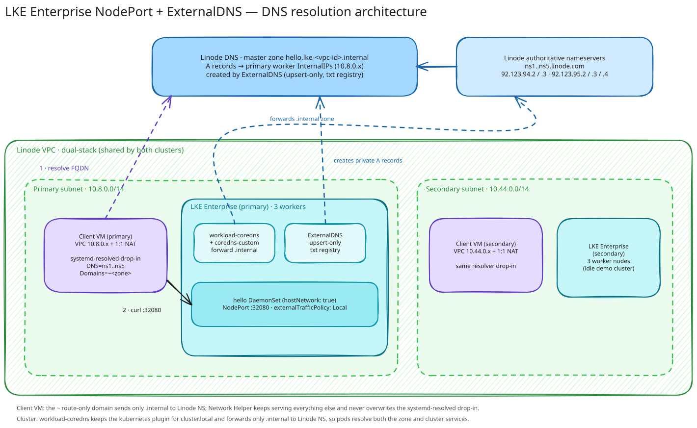

# LKE Enterprise NodePort with ExternalDNS

This demo creates two dual-stack LKE Enterprise clusters in separate subnets of the same VPC, with one client VM in each subnet. A host-networked hello DaemonSet is exposed on NodePort `32080` in the primary cluster. ExternalDNS publishes the primary worker nodes' private VPC addresses in Linode DNS, allowing the primary client to call the service by FQDN.



## Architecture

- OpenTofu creates one dual-stack VPC with a primary subnet and a secondary `10.44.0.0/14` subnet, then creates one Enterprise cluster in each subnet.
- OpenTofu creates a unique `lke-<vpc-id>.internal` master zone in Linode DNS and removes it during teardown.
- Each subnet has a client VM whose VPC IPv4 address is allocated automatically. Automatic 1:1 NAT provides a public address for administration; service traffic stays on the VPC.
- One hello pod runs per worker with `hostNetwork: true` and `dnsPolicy: ClusterFirstWithHostNet`.
- The `NodePort` Service uses `externalTrafficPolicy: Local` and the ExternalDNS `access: private` annotation.
- ExternalDNS creates an A record per Kubernetes node `InternalIP` in Linode DNS.
- Both LKE node pools use a shared Cloud Firewall that permits all IPv4 traffic from the private `10.0.0.0/8` VPC allocation.

## DNS resolution

The `.internal` zone is served by Linode's **authoritative** nameservers. The default resolvers on a Linode — the per-region recursive resolvers (`172.236.0.x`) that Network Helper writes into `/etc/systemd/network/05-eth0.network` — do **not** answer for `.internal` zones and return `NXDOMAIN`. Linode's authoritative nameservers (`ns1.linode.com` … `ns5.linode.com`) are publicly reachable, recursive, and authoritative for Linode-hosted zones, so both the client VM and the cluster are pointed at them for this zone only.

- The client VM gets a `systemd-resolved` drop-in at `/etc/systemd/resolved.conf.d/linode-internal.conf` with `DNS=<ns1..5 IPv4 addresses>` and `Domains=~<dns_zone>`. The `~` prefix makes it a **route-only domain**, so only `*.internal` queries go to Linode's authoritative nameservers while Network Helper's regional resolvers keep handling everything else.
- In the cluster, OpenTofu writes a `coredns-custom` ConfigMap with an `internal.server` block that forwards the `.internal` zone to the same nameservers. LKE Enterprise runs CoreDNS as the Helm-managed `workload-coredns` deployment, whose Corefile imports `custom/*.server` from the optional `coredns-custom` ConfigMap. This keeps the `kubernetes` plugin authoritative for `cluster.local` while adding `.internal` forwarding, and it applies to every pod — not just the hello DaemonSet.
- `hello.yaml.tpl` keeps `dnsPolicy: ClusterFirstWithHostNet`, so pods retain cluster DNS.

> **Network Helper interaction.** Network Helper regenerates `/etc/systemd/network/05-eth0.network` on every boot and would overwrite any change made to it. The `systemd-resolved` drop-in is a separate file that Network Helper does not manage, so it survives reboots — Network Helper does not need to be disabled. Editing `/etc/resolv.conf` directly does not work either, because it is a symlink to the `systemd-resolved` stub.

> **Why not `dnsPolicy: None` on the pod?** Pointing a pod directly at Linode's nameservers would resolve `.internal` but lose cluster DNS, so `*.svc.cluster.local` lookups would fail. Listing both external and cluster nameservers in `dnsConfig.nameservers` is not a reliable workaround: glibc treats `NXDOMAIN` from the first server as final and does not fall through. The CoreDNS forward keeps both working.


## Prerequisites

- OpenTofu, Linode CLI, `jq`, `kubectl`, Helm, `envsubst`, and SSH
- A Linode API token in `LINODE_TOKEN` with LKE, Linodes, VPC, Firewall, and Domains access

## Deploy

Export credentials and deployment settings:

```bash
export LINODE_TOKEN='...'
export TF_VAR_ssh_allowed_ipv4_cidrs='["203.0.113.10/32"]'
./start.sh
```

`start.sh` queries the Linode API for the latest available Enterprise Kubernetes version and creates both clusters and clients. It then configures the primary cluster, installs ExternalDNS chart `1.22.0` (app `0.22.0`), deploys the service, waits for the A records, and calls `http://<fqdn>:32080/` from the primary client VM.

Before installing ExternalDNS, `start.sh` applies `configs/coredns-custom.yaml.tpl` and restarts the `workload-coredns` deployment so pods can resolve the `.internal` zone (see [DNS resolution](#dns-resolution)). `configs/hello.yaml.tpl` is rendered with `envsubst` and applied afterwards.

The generated kubeconfigs are `kubeconfig-primary.yaml` and `kubeconfig-secondary.yaml`. The startup workflow uses the primary kubeconfig for the ExternalDNS and hello deployments.

Rerun the client acceptance test with:

```bash
./scripts/test-client.sh
```

Destroy all billable resources:

```bash
./shutdown.sh
```

## Production Considerations

- **Availability:** Three workers provide multiple DNS A records and one local endpoint per node. NodePort plus DNS round-robin has no active health-based target removal; use a private NodeBalancer or health-aware DNS for production failover.
- **Security:** The DNS records contain private addresses but Linode DNS is publicly queryable, and the authoritative nameservers used for resolution expose those answers to anyone. Use a private DNS resolver if address disclosure is unacceptable. Restrict the control-plane and SSH CIDRs instead of using broad ranges. The hello namespace permits the Pod Security `privileged` profile because `hostNetwork` is forbidden by Restricted; the container itself remains non-root, read-only, and capability-free.
- **DNS dependencies:** Resolution of the `.internal` zone depends on Linode's authoritative nameservers and on the fixed IPv4 addresses in `var.linode_nameservers`. There is no wildcard NS delegation for `.internal`; the zone name is injected via `${dns_zone}`. If these addresses change, update the variable and re-apply. In production, run a private resolver (for example CoreDNS or Unbound inside the VPC) so clients and pods do not depend on public authoritative nameservers.
- **Credentials:** The API token is stored in a Kubernetes Secret and never written to this repository. Use an external secret manager and a narrowly scoped token in production.
- **Disaster recovery:** Keep a backup of the Terraform state file and your Kubernetes manifests, and test cluster recreation in another supported region.
- **Cost:** The default creates six LKE worker Linodes and two client Linodes.
