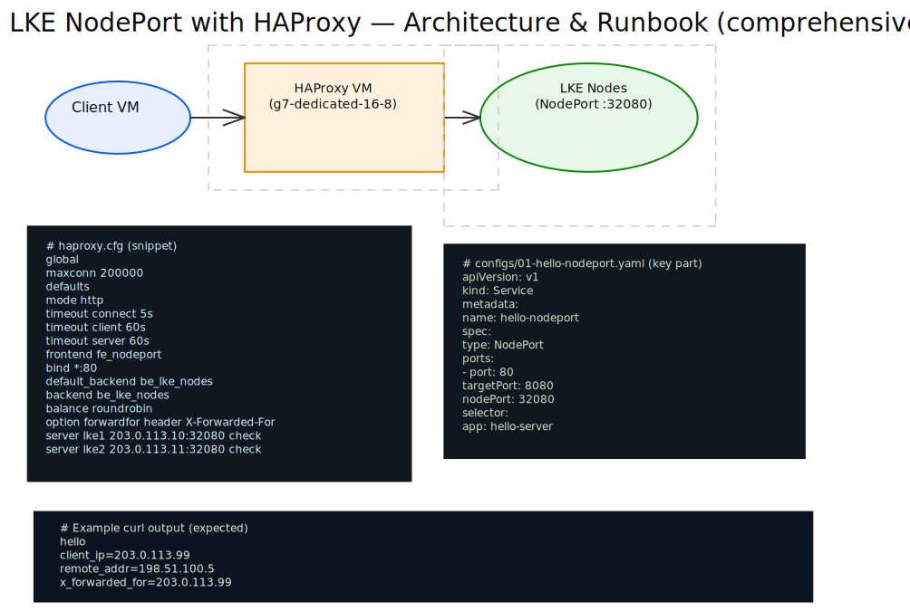

# LKE NodePort with HAProxy Proxy VM

This demo provisions:
- 1 client VM
- 1 small LKE cluster
- 1 proxy VM running HAProxy (`g7-dedicated-16-8`)

The Kubernetes workload returns:
- `hello`
- the client IP inferred from `X-Forwarded-For` (set by HAProxy)
- connection metadata (`remote_addr`, `x_forwarded_for`)

## Architecture



## Requirements

- OpenTofu >= 1.8.0
- `kubectl`
- Linode API token with Linodes Read/Write

## Usage

### Phase 1: Provision infrastructure

```bash
export LINODE_TOKEN='your-token-here'
./start.sh
```

### Phase 2: Deploy workload and configure proxy

Follow [MANUAL_DEPLOYMENT.md](MANUAL_DEPLOYMENT.md).

### Teardown

```bash
./shutdown.sh
```

## Open Questions Answered

### 1) How many connections should we handle?

It depends on request size, keep-alive behavior, and TLS (not used here).

Treat these as planning estimates. Run `hey` or `wrk` and increase concurrency gradually to measure your exact ceiling.

### 2) Is HAProxy better than NGINX here?

For this use case, yes:
- Better fit for high connection counts and L4/L7 load balancing.
- Strong runtime observability and mature balancing options.
- Easy `X-Forwarded-For` handling for client-IP propagation to the app layer.

### 3) SSL termination at proxy level needed?

Not required for this demo. Traffic stays HTTP end-to-end. If later needed, HAProxy can terminate TLS at the edge without changing backend NodePort design.
