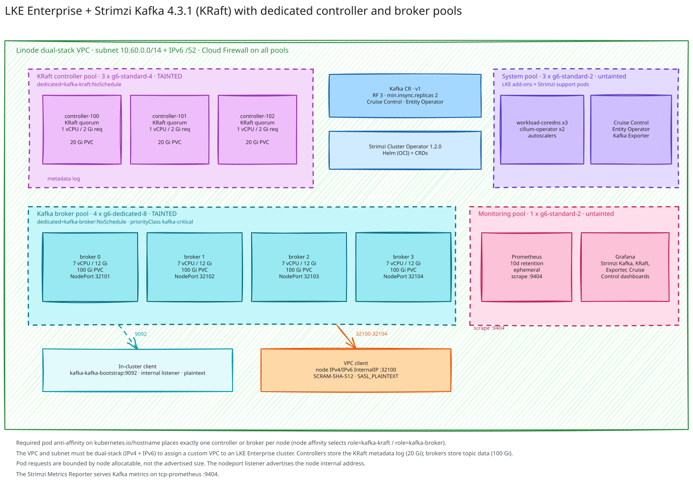

# LKE Enterprise with Strimzi Kafka in KRaft Mode

This demo runs Apache Kafka 4.3.1 in KRaft mode on LKE Enterprise, managed by the Strimzi Kafka Operator 1.2.0. KRaft controllers and Kafka brokers run in separate, dedicated node pools so that quorum traffic and broker I/O never compete for the same nodes. Brokers and controllers are pinned one-per-node, storage is SSD-backed Linode Block Storage, and two listeners are exposed: an in-cluster `internal` listener and a `nodeport` listener reachable from the VPC. Prometheus and Grafana run on their own node pool so observability never distorts the nodes under test.



## Architecture

- OpenTofu creates a four-pool LKE Enterprise cluster on a dedicated **dual-stack** VPC subnet and attaches a shared Cloud Firewall to all node pools.
- A **KRaft controller pool** of 3 × `g6-standard-4` (4 vCPU / 8 GB) nodes runs the controller quorum, tainted `dedicated=kafka-kraft:NoSchedule`.
- A **broker pool** of 4 × `g6-dedicated-8` (8 vCPU / 16 GB) nodes runs the brokers, tainted `dedicated=kafka-broker:NoSchedule`.
- A **system pool** of 3 × `g6-standard-2` (2 vCPU / 4 GB) nodes is untainted and hosts LKE add-ons and Strimzi's support components.
- A **monitoring pool** of 1 × `g6-standard-2` (2 vCPU / 4 GB) node runs Prometheus, Grafana, and kube-state-metrics.
- Kafka pools use Kubernetes required pod anti-affinity, so exactly one Kafka pod runs per node — no broker/controller colocation.
- Each Kafka pod gets a 100 GB broker volume or 20 GB controller volume on the `linode-block-storage-retain` StorageClass.
- Strimzi is installed with its CRDs first, then the Cluster Operator, then the `KafkaNodePool`, `Kafka`, `KafkaTopic`, and `KafkaUser` resources.
- Two listeners: `internal` (ClusterIP, plaintext, port 9092) for in-cluster clients, and `external` (`nodeport`, port 9094) for VPC clients.
- Cruise Control is enabled for rebalancing, and topics default to replication factor 3 with `min.insync.replicas=2`.
- Kafka runs on Java 21, which is the Strimzi 1.2.0 default.
- Metrics are exposed through the Strimzi Metrics Reporter on port 9404 and scraped by Prometheus into Strimzi's Kafka, KRaft, Kafka Exporter, and Cruise Control dashboards.

## Node reservation and isolation

The Kafka pools are **tainted** so nothing except Kafka can be scheduled onto them. This prevents noisy neighbours from competing for the CPU, memory, and page cache that a broker depends on.

| Pool | Taint | Who runs there |
| --- | --- | --- |
| `broker` | `dedicated=kafka-broker:NoSchedule` | Kafka brokers only |
| `kraft` | `dedicated=kafka-kraft:NoSchedule` | KRaft controllers only |
| `system` | none | LKE add-ons and Strimzi support components |
| `monitoring` | none | Prometheus, Grafana, kube-state-metrics |

Isolation is a two-part change:

1. **Taints** on the Kafka pools repel everything by default.
2. **Tolerations** on `KafkaNodePool.template.pod` (and the perf client) let Kafka back through. `Kafka.spec` templates pin Cruise Control, the Entity Operator, and Kafka Exporter to the `system` pool instead of co-locating them with brokers.

Kafka pods also carry `priorityClassName: kafka-critical` (value `1000000`). That is above normal workloads (`0`) so Kafka preempts them instead of being preempted, but below the system-critical range (`2000000000`) so Kafka can never evict a cluster add-on.

**Why a separate system pool is required.** LKE-managed add-ons (`workload-coredns`, `cilium-operator`, the autoscalers) do not tolerate custom taints, and several use *required* hostname anti-affinity: `workload-coredns` runs 3 replicas and `cilium-operator` 2. If the Kafka pools were tainted without an untainted home, those pods would go `Pending` on their next restart and **cluster DNS would break**. The system pool provides that home, which is why `system_node_count` is validated to be at least 3.

One exception is unavoidable: `konnectivity-agent` tolerates **all** taints (`operator: Exists`) because it is LKE's API-server tunnel and must be able to run on every node. It has no resource requests, so its footprint is negligible.

Taints use `NoSchedule`, not `NoExecute`: existing non-tolerating pods are not evicted, they simply stop being scheduled there. After enabling taints, restart the co-located pods (or run `kubectl rollout restart`) so they migrate to the system pool.

## Dual-stack networking

The VPC and its subnet allocate an IPv6 prefix (`/48` for the VPC, `/52` for the subnet) in addition to IPv4, and the cluster is created with `stack_type = "ipv4-ipv6"`. A dual-stack VPC is **required** to assign a custom VPC to an LKE Enterprise cluster; a VPC created without an IPv6 range cannot be attached and the cluster creation fails.

The IPv4 subnet must be a `/13` or `/14` — LKE rejects other subnet sizes with `[subnet_id] Subnet IPv4 prefix length must be /13 or /14`. The demo uses `10.60.0.0/14`. `var.vpc_ipv4_cidr` validates this at plan time.

The IPv6 subnet range is added to the Cloud Firewall so intra-VPC traffic and the NodePort listener are reachable over both families. The control-plane ACL also accepts IPv6 (`var.control_plane_allowed_ipv6_cidrs`).

Because the cluster nodes carry both an IPv4 and an IPv6 internal address, Strimzi's `nodeport` listener may advertise either family for a given node (it uses the node's first `InternalIP`). The client bootstrap address therefore has to handle both forms; IPv6 literals must be wrapped in brackets, for example `[fd00::1]:32100`. The smoke test detects the family of the advertised address and formats the bootstrap server accordingly.

## Node pools

| Pool | Role label | Type | Node vCPU / RAM | Node allocatable | Pod requests (== limits) | Nodes | Storage |
| --- | --- | --- | --- | --- | --- | --- | --- |
| `kraft` | `kafka-kraft` | `g6-standard-4` | 4 / 8 GB | ~3.9 vCPU / 5.9 GiB | 1 vCPU / 2 GiB | 3 | 20 Gi each |
| `broker` | `kafka-broker` | `g6-dedicated-8` | 8 / 16 GB | ~7.9 vCPU / 12.9 GiB | 7 vCPU / 12 GiB | 4 | 100 Gi each |
| system | `system` | `g6-standard-2` | 2 / 4 GB | ~1.9 vCPU / 2.9 GiB | add-ons | 3 | none |
| monitoring | `monitoring` | `g6-standard-2` | 2 / 4 GB | ~1.9 vCPU / 2.9 GiB | Prometheus/Grafana | 1 | none (ephemeral) |

Only dedicated Linode instances offer exactly 8 vCPU / 16 GB. The shared `g6-standard-8` has 8 vCPU / 32 GB, and `g6-standard-6` has 6 vCPU / 16 GB, which is why the broker pool defaults to `g6-dedicated-8`.

**Pod resources are sized to the node's *allocatable* capacity, not its advertised size.** The kubelet and system daemons reserve CPU and memory, so a "4 vCPU / 8 GB" node only schedules about 3.9 vCPU / 5.9 GiB of pods, and an "8 vCPU / 16 GB" node only about 7.9 vCPU / 12.9 GiB. Requesting the full advertised size leaves the pod permanently `Pending` with `Insufficient memory`/`Insufficient cpu`. The broker request is capped at 7 vCPU / 12 GiB to leave headroom for Strimzi's supporting workloads (Cluster Operator, Cruise Control, Entity Operator), which the scheduler may place on any node. Broker `requests` equal `limits` across the pool so Cruise Control's CPU capacity is accurate.

Controllers only persist the KRaft metadata log, so their volumes and requests are smaller than the brokers'.

## Listeners

| Name | Type | Port | TLS | Authentication | Reachable from |
| --- | --- | --- | --- | --- | --- |
| `internal` | `internal` (ClusterIP) | 9092 | no | none | In-cluster clients |
| `external` | `nodeport` | 9094 | no | SCRAM-SHA-512 | The VPC |

The nodeport listener advertises the node **InternalIP** (`preferredNodePortAddressType: InternalIP`) and the Cloud Firewall restricts the node ports to `var.broker_nodeport_allowed_ipv4_cidrs` (the VPC CIDR by default). This keeps the listener off the public internet.

Node ports are pinned so clients and firewall rules are deterministic:

| Endpoint | NodePort |
| --- | --- |
| Bootstrap | 32100 |
| Broker 0 | 32101 |
| Broker 1 | 32102 |
| Broker 2 | 32103 |
| Broker 3 | 32104 |

Broker node IDs are pinned with `strimzi.io/next-node-ids: "[0-3]"`, so the NodePort assignments stay stable across recreations.

## Replication

The `Kafka` resource sets cluster-wide defaults:

- `default.replication.factor: 3`
- `min.insync.replicas: 2`
- `offsets.topic.replication.factor: 3`
- `transaction.state.log.replication.factor: 3`
- `transaction.state.log.min.isr: 2`

The `demo-orders` topic is created with 6 partitions and replication factor 3. With 4 brokers and RF 3, one broker can fail without losing a partition's quorum.

## Prerequisites

- OpenTofu, Linode CLI, `jq`, `kubectl`, Helm, and `envsubst`
- A Linode API token in `LINODE_TOKEN` with LKE, VPC, Firewall, and Linodes permissions

## Deploy

Export credentials and restrict cluster access:

```bash
export LINODE_TOKEN='...'
export TF_VAR_control_plane_allowed_ipv4_cidrs='["203.0.113.10/32"]'
./start.sh
```

`start.sh` queries the Linode API for the latest LKE Enterprise Kubernetes version, creates the cluster and VPC, installs the Strimzi CRDs and Cluster Operator, creates the node pools and Kafka cluster, waits for readiness, and runs the smoke test.

The Strimzi CRDs are applied explicitly with `kubectl apply` and the script waits for `condition=established` before installing the operator. The Helm install therefore uses `--skip-crds`: Helm 4 defaults to server-side apply for new releases, and without this flag it fails with `conflict with "kubectl-client-side-apply" ... .spec.versions` because the CRDs are already owned by `kubectl`. This also matches Strimzi's guidance, since Helm never upgrades CRDs from a chart's `crds/` directory.

Rerun the smoke test independently:

```bash
./scripts/smoke-test.sh
```

Set `SKIP_MONITORING=true ./start.sh` to skip the observability stack for a faster iteration loop.

Destroy all billable resources:

```bash
./shutdown.sh
```

## Monitoring

`start.sh` installs `kube-prometheus-stack` 91.5.0 (app v0.94.0) into the `monitoring` namespace, then applies Strimzi's scrape configuration, alert rules, and Grafana dashboards.

```bash
./scripts/install-monitoring.sh          # idempotent; safe to re-run
```

Access the UIs through port-forwards:

```bash
kubectl -n monitoring port-forward svc/kube-prometheus-stack-prometheus 9090:9090
kubectl -n monitoring port-forward svc/kube-prometheus-stack-grafana 3000:80
```

Grafana is `admin` / `prom-operator`. Four Strimzi dashboards are preloaded: **Strimzi Kafka**, **Strimzi KRaft**, **Strimzi Kafka Exporter**, and **Strimzi Cruise Control**.

How metrics are wired:

- `Kafka.spec.kafka.metricsConfig` uses the **Strimzi Metrics Reporter**, which is GA in 1.2.0 and needs no feature gate. It serves Prometheus-format metrics on port **9404** (`tcp-prometheus`) without the JMX exporter's relabeling rules. Enabling it on an existing cluster triggers a rolling restart.
- `Kafka.spec.kafkaExporter` provides consumer-group lag metrics for the Kafka Exporter dashboard.
- Cruise Control does **not** support the Strimzi Metrics Reporter, so `Kafka.spec.cruiseControl.metricsConfig` uses `jmxPrometheusExporter` with the `cruise-control-metrics` ConfigMap.
- Strimzi does not create any Prometheus Operator resources. The `PodMonitor` and `PrometheusRule` objects under `configs/50-monitoring/` are applied to the cluster, so the `monitoring.coreos.com` CRDs must exist first — which is why the stack installs before them.
- The chart's `podMonitorSelectorNilUsesHelmValues` is set to **false**. Its default of `true` rewrites an empty `podMonitorSelector` to `release: kube-prometheus-stack`, which would silently skip the Strimzi PodMonitors labeled `app: strimzi`.

Prometheus uses ephemeral storage (metrics are only needed for the duration of a test). To persist them, add a `storageSpec` with a `linode-block-storage-retain` PVC to `configs/50-monitoring/kube-prometheus-stack-values.yaml`.

## Stress testing

`scripts/stress-test.sh` runs a phased test and writes a report to `stress-results/`. It creates its own `stress-test` topic and `kafka-perf-client` pod, and removes both on exit — including on failure.

```bash
./scripts/stress-test.sh          # all phases
PHASE=1 ./scripts/stress-test.sh  # one phase (0-5)
```

| Phase | What it does | What to look for |
| --- | --- | --- |
| 0 | Preflight: Kafka Ready, stress topic, load generator, metrics scraping | All PASS |
| 1 | Producer/consumer throughput at 1 KiB and 10 KiB records | ~80k rec/s and ~95 MB/s at 1 KiB on this sizing |
| 2 | Sustained parallel produce, measuring broker CPU against the 7-core quota | Cores used vs cap, CFS throttle count |
| 3 | Write-heavy load to grow the page cache | `memory.current` vs the 12 GiB limit |
| 4 | `dd` with `O_DIRECT` on a broker PVC | ~550 MB/s direct write on Linode Block Storage |
| 5 | Delete a broker, wait for ISR recovery, verify replicas | 24/24 partitions back in ISR, `max lag is 0`, offsets unchanged |

Interpreting phase 2: the brokers have a hard 7-core CFS quota (`cpu.max = 700000 100000`). A single 2-CPU client pod on the 4-core KRaft node cannot generate enough load to reach that ceiling — the test reports actual utilization (about 17–21% here) and warns that the generator is the bottleneck. To genuinely saturate, raise the perf client's CPU limit or run more client replicas; only then will `nr_throttled` increase.

Phase 4 writes 5 GiB to a broker's data volume and deletes it immediately. Phase 5 deletes `kafka-broker-0`; with RF 3 and `min.insync.replicas=2` the cluster stays available and no data is lost.

## Connecting from a client

The NodePort listener uses SASL/PLAIN over SCRAM, without TLS. Build a client properties file from the `demo-user` Secret:

```bash
KUBECONFIG=./kubeconfig kubectl -n kafka get secret demo-user \
  -o jsonpath='{.data.password}' | base64 -d
```

```properties
security.protocol=SASL_PLAINTEXT
sasl.mechanism=SCRAM-SHA-512
sasl.jaas.config=org.apache.kafka.common.security.scram.ScramLoginModule required username="demo-user" password="<password>";
```

```bash
kafka-topics.sh --bootstrap-server <node-internal-ip>:32100 \
  --command-config client.properties --list
```

## Production Considerations

- **Security:** The nodeport listener transmits SCRAM credentials unencrypted (`tls: false`). This is acceptable only because it advertises the VPC InternalIP and the Cloud Firewall restricts the ports to the VPC. Enable TLS on the listener before exposing Kafka outside the VPC. No topic authorization is configured, so every authenticated user has full access; add `spec.kafka.authorization` and per-user ACLs for multi-tenant use.
- **Authentication:** Strimzi 1.2.0 has no native SASL/PLAIN listener or user type. The supported mechanisms are `tls`, `scram-sha-512`, and `custom`. This demo uses SCRAM-SHA-512. Real PLAIN requires a `custom` listener with a hand-written `PlainLoginModule` JAAS configuration and manually managed credentials.
- **Availability:** Three controllers form a quorum and four brokers tolerate one broker failure at RF 3. The default `PodDisruptionBudget` keeps Strimzi from taking down more than one broker at a time during a drain. Use `kubectl drain --disable-eviction` or the Strimzi Drain Cleaner so brokers roll one at a time.
- **Storage:** `linode-block-storage-retain` is used so broker data survives PVC deletion. Linode Block Storage volumes are `ReadWriteOnce`; Kafka's replication handles node failure rather than shared storage. For large clusters, consider tiered storage or JBOD across multiple volumes to exceed single-volume throughput.
- **Networking:** The VPC and subnet are dual-stack, which is required for custom VPC assignment. IPv6 is a superset of the IPv4 connectivity this demo uses; nothing in the Kafka configuration depends on IPv6 specifically, but the nodeport listener may advertise an IPv6 node address. If you pin the external listener to IPv4 only, set `preferredNodePortAddressType: ExternalIP`/`InternalIP` and verify the chosen family matches your client bootstrap configuration.
- **Cost:** Default sizing is 3 × `g6-standard-4` (KRaft) + 4 × `g6-dedicated-8` (brokers) + 3 × `g6-standard-2` (system) + 1 × `g6-standard-2` (monitoring) for the workers, plus LKE Enterprise control-plane fees, seven Block Storage volumes, and egress. Using `g6-standard-6` for brokers reduces spend at the cost of CPU. The broker pool is deliberately request-limited to the node's allocatable capacity (7 vCPU / 12 GiB); sizing pods to the advertised node size would never schedule.
- **Noisy neighbours:** Kafka nodes are tainted and reserved. Do not remove the `taint` blocks or the matching `tolerations` together — a taint without a toleration leaves Kafka pods `Pending`, and a toleration without a taint re-opens the nodes to arbitrary workloads. The system pool must stay untainted and at least 3 nodes for CoreDNS to schedule.
- **Observability:** Prometheus and Grafana run on a dedicated pool so scrape and TSDB activity never competes with, or distorts measurements of, the Kafka nodes. Prometheus is ephemeral by design; production deployments should use persistent storage and longer retention, and enable Alertmanager routing (the Strimzi alert rules are already loaded but notifications are not configured).
- **Stress testing:** Phase 4 writes to a live broker data volume and phase 5 deletes a broker. Both are safe with RF 3 but should be run against a non-production cluster. Always let the script's cleanup run so the topic, perf pod, and scratch file do not leak.
- **Disaster recovery:** The cluster is reproducible from this repository. Back up Terraform state and commit the manifests. Test cluster recreation in another region and verify that the retained volumes are reattached with the same Kafka node IDs.
- **Upgrades:** Strimzi 1.2.0 supports Kubernetes 1.30–1.36. Upgrade the Cluster Operator first, then the Kafka version. Because CRDs are bundled in the Helm chart and Helm does not upgrade `crds/`, re-apply `strimzi-crds-<version>.yaml` during upgrades. When re-applying CRDs with `kubectl` and then upgrading the release with Helm 4, keep `--skip-crds` so Helm does not fight `kubectl` over field ownership of the CRDs.
