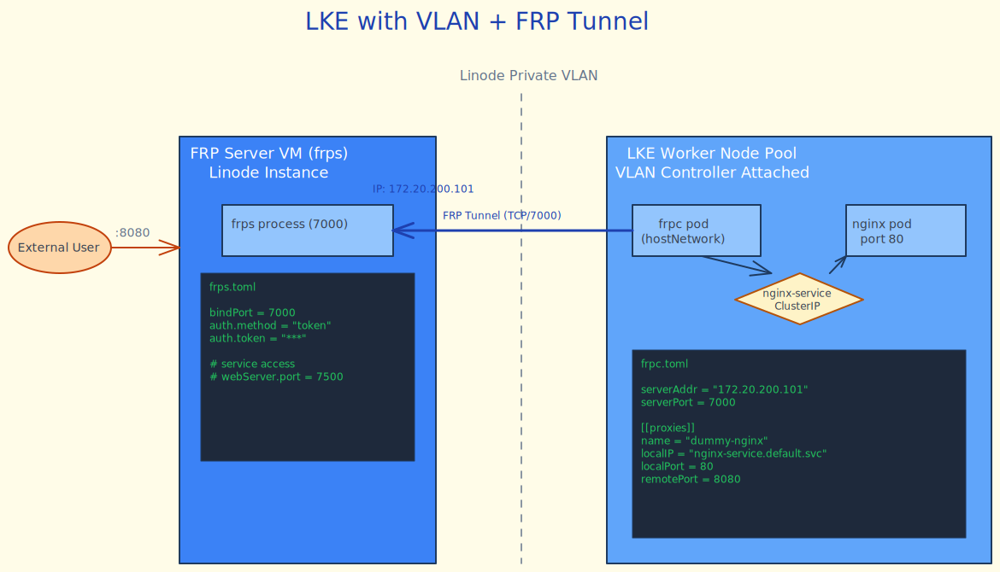

# LKE with VLAN + FRP Tunnel

Demonstrates exposing an internal Kubernetes workload via [frp](https://github.com/fatedier/frp) (Fast Reverse Proxy) over a private VLAN, using the [lke-vlan-controller](https://github.com/ram-pi/linode-charts/tree/main/charts/lke-vlan-controller) to attach a VLAN interface to every LKE node.

## Architecture



**Traffic flow:**
1. `frpc` pod (using `hostNetwork: true` so it can use the node's VLAN interface; a normal pod interface would stay on the cluster overlay and not reach the VLAN directly) connects to `frps` at `172.20.200.101:7000` over the VLAN
2. `frpc` tunnels the `dummy-nginx` ClusterIP service (port 80) to `frps` remote port 8080
3. Verifying the tunnel: `curl http://127.0.0.1:8080` on the frps VM returns the nginx welcome page

**Proxy routing options** (see [MANUAL_DEPLOYMENT.md](MANUAL_DEPLOYMENT.md) for details):
- **TCP proxies** (default in this example): one service per remote port (~0–5µs overhead, best for low-latency / non-HTTP)
- **HTTP proxies** with hostname routing: multiple services per shared port (~10–50µs overhead, best for web services / microservices)

## Requirements

- [OpenTofu](https://opentofu.org/) >= 1.8.0
- Linode API token with **Linodes Read/Write** scope
- The VLAN is created automatically when the frps VM is provisioned (Linode creates the VLAN on first use)

## Usage

### Phase 1: Provision infrastructure

```bash
export LINODE_TOKEN='your-token-here'
./start.sh
```

This provisions the LKE cluster, frps VM, VLAN networking, and Cloud Firewall. It does **not** install Helm charts or workloads. Estimated time: ~5 minutes.

### Phase 2: Install charts and workloads

After infrastructure is ready, follow [MANUAL_DEPLOYMENT.md](MANUAL_DEPLOYMENT.md) to:
- Install `cloud-firewall-crd`, `cloud-firewall-controller`, and `lke-vlan-controller` charts
- Deploy the dummy nginx service and frpc workload
- Verify the end-to-end FRP tunnel

### Teardown

```bash
./shutdown.sh
```

## Variables

| Variable | Default | Description |
|---|---|---|
| `linode_token` | — | Linode API token (sensitive, required) |
| `region` | `it-mil` | Linode region |
| `instance_type` | `g6-nanode-1` | frps VM instance type |
| `lke_node_type` | `g6-standard-2` | LKE worker node type |
| `lke_node_count` | `2` | Number of LKE worker nodes |
| `k8s_version` | `1.32` | Kubernetes version |
| `vlan_label` | `frp-vlan` | VLAN label |
| `vlan_cidr` | `172.20.200.0/24` | VLAN CIDR (avoid 192.168.0.0/16) |
| `frp_server_vlan_ip` | `172.20.200.101/24` | Static VLAN IP for frps VM |
| `frp_bind_port` | `7000` | frp control channel port |
| `frp_remote_port` | `8080` | Port exposed on frps for the tunneled service |
| `frp_version` | `0.68.0` | frp binary version to install |
| `ipv4_whitelist_cidrs` | `["0.0.0.0/0"]` | CIDRs for SSH + LKE ACL |

## Outputs

| Output | Sensitive | Description |
|---|---|---|
| `ssh_command` | No | SSH command to the frps VM |
| `frp_server_public_ip` | No | Public IP of the frps VM |
| `frp_server_vlan_ip` | No | VLAN IP of the frps VM (plain, no prefix) |
| `frp_admin_ui_endpoint` | No | FRP admin UI URL (directly accessible, no SSH tunnel) |
| `frp_token` | **Yes** | Shared frp auth token |
| `lke_kubeconfig` | **Yes** | LKE cluster kubeconfig |
| `vlan_label` | No | VLAN label (used when installing lke-vlan-controller) |
| `vlan_cidr` | No | VLAN CIDR (used when installing lke-vlan-controller) |
| `verify_commands` | No | Infra verification commands (pre-workload) |

## Production Considerations

- **TLS mutual auth**: Enable `transport.tls.enable = true` on both frps and frpc with CA-signed certificates to prevent MITM attacks on the VLAN.
- **Token management**: Replace `random_password` with a secret manager (e.g. Vault, Linode Object Storage-backed external secrets) to rotate the frp auth token without redeployment.
- **Network policy**: Add Kubernetes `NetworkPolicy` to restrict which pods can communicate with the frpc deployment.
- **frpc HA**: Run multiple frpc replicas with `loadBalancer.group` in frpc.toml for redundancy.
- **VLAN CIDR sizing**: Ensure `vlan_cidr` doesn't overlap with any existing VLANs in the region. Use `172.20.200.0/24` or similar RFC 1918 range outside `192.168.0.0/16` (Linode Private IP range).
- **LKE node pool**: For production, consider autoscaling and dedicated node types for the frpc workload.
- **Firewall**: The `frp_remote_port` firewall rule currently allows access from `ipv4_whitelist_cidrs`. In production, restrict this to internal consumers only.
