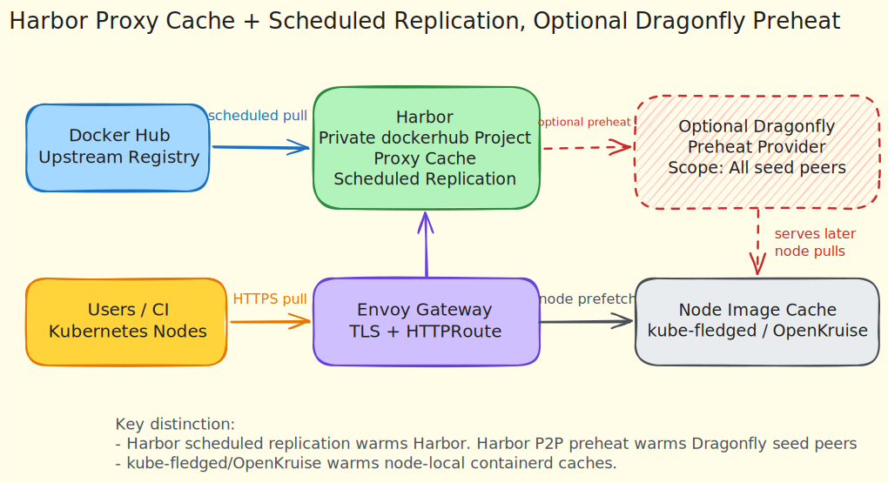

# Manual Deployment: Harbor Proxy Cache

This runbook describes a separate Harbor-based image caching approach for LKE.

It does not replace the Dragonfly + kube-fledged path. This is a different architecture using Harbor as a private Docker Hub proxy cache and replication target.

## Architecture



```text
LKE public LoadBalancer
  -> Envoy Gateway
  -> Gateway API Gateway
  -> Let's Encrypt HTTP-01 validation through cert-manager
  -> HTTPS termination at Envoy
  -> HTTPRoute
  -> Harbor ClusterIP service
  -> Harbor private Docker Hub proxy-cache project
```

Harbor is not exposed directly with `type: LoadBalancer`. Envoy Gateway owns the public LoadBalancer and routes traffic to Harbor internally.

The public hostname is generated from the Envoy Gateway LoadBalancer IP:

```text
harbor.<GATEWAY_LOAD_BALANCER_IP>.sslip.io
```

## Versions

The setup script pins these versions:

```text
Envoy Gateway chart: v1.8.0
cert-manager chart: v1.20.0
Harbor chart: 1.19.1
Harbor app: 2.15.1
```

Check for newer releases before reusing this runbook:

```sh
helm search repo harbor/harbor --versions
helm show chart oci://quay.io/jetstack/charts/cert-manager --version v1.20.0
helm show chart oci://docker.io/envoyproxy/gateway-helm --version v1.8.0
```

## Important Notes

LKE LoadBalancer services expose public IPs. This approach uses a public LoadBalancer for Envoy Gateway, with a valid public Let's Encrypt certificate.

Harbor runs as an internal `ClusterIP` service behind Envoy Gateway:

```yaml
expose:
  type: clusterIP
  tls:
    enabled: false
```

The Harbor values use `updateStrategy.type: Recreate` because Linode Block Storage volumes are `ReadWriteOnce`. This avoids registry/jobservice multi-attach conflicts during Helm upgrades. The tradeoff is short Harbor downtime during upgrades.

For a production deployment, add external PostgreSQL, external Redis, object storage for registry blobs, backups, retention policies, monitoring, and stricter access controls. The included values are production-oriented for a demo, not a fully HA Harbor architecture.

## 1. Run The Setup Script

The script installs only the platform components:

- Envoy Gateway
- cert-manager with Gateway API support
- Harbor as `ClusterIP`
- Gateway API `Gateway`
- Gateway API `HTTPRoute`
- Let's Encrypt `ClusterIssuer`
- Valid TLS certificate for the generated `sslip.io` hostname

It does not configure Harbor projects, proxy cache endpoints, robot accounts, or replication rules.

Run:

```sh
./scripts/setup-harbor-envoy.sh \
  --email you@example.com \
  --admin-password 'change-this-password'
```

Optional staging mode for testing ACME without production rate limits:

```sh
./scripts/setup-harbor-envoy.sh \
  --email you@example.com \
  --admin-password 'change-this-password' \
  --letsencrypt-staging
```

The `--email` value is required by Let's Encrypt for ACME account registration, expiry notices, and rate-limit/abuse contact. It is not used by Harbor.

The script writes local state to:

```text
.harbor.env
```

The file contains the generated hostname, Gateway IP, Harbor internal secret key, and ACME endpoint. It is ignored by git.

Load it when needed:

```sh
source .harbor.env
printf '%s\n' "${HARBOR_HOST}"
```

## 2. Verify Component Status

Check Envoy Gateway:

```sh
kubectl --kubeconfig ./kubeconfig.yaml -n envoy-gateway-system get pods
kubectl --kubeconfig ./kubeconfig.yaml -n harbor get gateway harbor-gateway
```

Check cert-manager:

```sh
kubectl --kubeconfig ./kubeconfig.yaml -n cert-manager get pods
kubectl --kubeconfig ./kubeconfig.yaml get clusterissuer letsencrypt-harbor
kubectl --kubeconfig ./kubeconfig.yaml -n harbor get certificate harbor-tls
```

Check Harbor:

```sh
kubectl --kubeconfig ./kubeconfig.yaml -n harbor get pods
kubectl --kubeconfig ./kubeconfig.yaml -n harbor get svc
```

Verify the public endpoint:

```sh
source .harbor.env
curl -I "https://${HARBOR_HOST}"
```

After `Certificate/harbor-tls` becomes ready, Envoy Gateway and the LKE LoadBalancer may still need a short time before port `443` accepts traffic. The setup script retries HTTPS verification before failing and prints Gateway, Certificate, and Envoy diagnostics if the endpoint does not become reachable.

## 3. Log In To Harbor

Open:

```text
https://harbor.<GATEWAY_LOAD_BALANCER_IP>.sslip.io
```

or use the generated value:

```sh
source .harbor.env
open "https://${HARBOR_HOST}"
```

Log in as:

```text
username: admin
password: value passed with --admin-password
```

Harbor only applies `harborAdminPassword` during the first database bootstrap. Later Helm upgrades do not reset the admin password if the admin user already exists.

If you need to reset the admin password during early testing, use the clean reset flow in the cleanup section and reinstall Harbor with the desired password.

## 4. Create Docker Hub Registry Endpoint

In the Harbor UI:

```text
Administration -> Registries -> New Endpoint
```

Use:

```text
Provider: Docker Hub
Name: docker-hub
Endpoint URL: https://hub.docker.com
Access ID: optional Docker Hub username
Access Secret: optional Docker Hub token/password
```

Use Docker Hub credentials for higher pull limits. Do not commit credentials to this repository.

## 5. Create Private Proxy-Cache Project

In the Harbor UI:

```text
Projects -> New Project
```

Use:

```text
Project Name: dockerhub
Access Level: Private
Proxy Cache: enabled
Endpoint: docker-hub
```

With project `dockerhub`, Docker Hub images are referenced through Harbor like this:

```text
harbor.<GATEWAY_LOAD_BALANCER_IP>.sslip.io/dockerhub/library/nginx:1.27
harbor.<GATEWAY_LOAD_BALANCER_IP>.sslip.io/dockerhub/nvidia/cuda:12.4.0-runtime-ubuntu22.04
```

The first pull causes Harbor to fetch the image from Docker Hub. Later pulls are served from Harbor's cache.

## 6. Create Pull Credentials

Because the `dockerhub` project is private, Kubernetes needs pull credentials.

Recommended UI path:

```text
Projects -> dockerhub -> Robot Accounts -> New Robot Account
```

Grant pull-only access to the `dockerhub` project.

Create an image pull secret:

```sh
source .harbor.env

kubectl --kubeconfig ./kubeconfig.yaml -n default create secret docker-registry harbor-pull \
  --docker-server="${HARBOR_HOST}" \
  --docker-username='robot$dockerhub+<robot-account-name>' \
  --docker-password="<robot-account-token>"
```

Harbor project robot accounts must use the full generated username format:

```text
robot$<project-name>+<robot-account-name>
```

Example for project `dockerhub` and robot name `lkee-gb-lon`:

```text
robot$dockerhub+lkee-gb-lon
```

Use single quotes for `--docker-username` so the shell does not expand `$dockerhub`.

Validate credentials with Docker before creating Kubernetes workloads:

```sh
source .harbor.env

export HARBOR_USER='robot$dockerhub+<robot-account-name>'
export HARBOR_TOKEN='<robot-account-token>'

echo "$HARBOR_TOKEN" | docker login "$HARBOR_HOST" -u "$HARBOR_USER" --password-stdin
docker pull "$HARBOR_HOST/dockerhub/library/nginx:1.27"
```

Use it in workloads:

```yaml
imagePullSecrets:
  - name: harbor-pull
```

## 7. Pull Through Harbor Explicitly

Example workload:

```yaml
apiVersion: apps/v1
kind: Deployment
metadata:
  name: nginx-from-harbor
spec:
  replicas: 1
  selector:
    matchLabels:
      app: nginx-from-harbor
  template:
    metadata:
      labels:
        app: nginx-from-harbor
    spec:
      imagePullSecrets:
        - name: harbor-pull
      containers:
        - name: nginx
          image: harbor.<GATEWAY_LOAD_BALANCER_IP>.sslip.io/dockerhub/library/nginx:1.27
          resources:
            requests:
              cpu: 50m
              memory: 64Mi
            limits:
              cpu: 250m
              memory: 256Mi
```

Replace the hostname with `${HARBOR_HOST}` from `.harbor.env`.

## 8. Configure Scheduled Replication For Prefetching

Harbor proxy cache and Harbor replication solve different parts of the problem:

- Proxy cache fetches content on first pull through Harbor.
- Scheduled replication proactively copies selected repositories and tags from Docker Hub into Harbor.

For prefetching, configure scheduled replication for known upstream repositories.

In the Harbor UI:

```text
Administration -> Replications -> New Replication Rule
```

Use a pull-based rule:

```text
Name: dockerhub-prefetch-nginx
Replication mode: Pull-based
Source registry: docker-hub
Source resource filter: library/nginx
Destination namespace: dockerhub
Trigger Mode: Scheduled
Schedule: as required for the demo
```

Add tag filters if needed, for example:

```text
1.27*
latest
```

Repeat for each repository you want Harbor to prefetch, for example:

```text
library/python
nvidia/cuda
```

Scheduled replication is not a universal “copy every new Docker Hub image” mechanism. It works best for curated repositories and predictable tag patterns.

## 9. Optional: Attach Dragonfly As Harbor Preheat Provider

Harbor P2P Preheat warms Dragonfly, not Kubernetes node image caches.

Flow:

```text
Harbor artifact
  -> Harbor preheat policy
  -> Dragonfly manager
  -> Dragonfly seed peer / P2P cache
```

This is different from kube-fledged or OpenKruise:

```text
kube-fledged/OpenKruise
  -> node containerd image cache
```

Use Harbor Preheat when Harbor is the image source and Dragonfly is the P2P distribution layer.

Harbor Preheat does not pull images onto every Kubernetes node. It asks Dragonfly to prefetch the selected artifact data into the Dragonfly distribution/cache layer. Nodes benefit from this only when their image pulls go through Dragonfly.

Useful path:

```text
containerd
  -> local Dragonfly proxy
  -> Dragonfly P2P network
  -> Harbor
```

Less useful path:

```text
containerd
  -> Harbor directly
```

If workloads pull directly from Harbor without Dragonfly in the pull path, Harbor preheat does not warm node-local containerd caches.

### Provider Endpoint

Harbor runs inside the cluster, so it can reach Dragonfly by Kubernetes service DNS.

Use the Dragonfly manager REST service:

```text
http://dragonfly-manager.dragonfly-system.svc.cluster.local:8080
```

In Harbor UI:

```text
Administration -> Distributions -> New Instance
```

Use:

```text
Provider: Dragonfly
Name: dragonfly
Endpoint: http://dragonfly-manager.dragonfly-system.svc.cluster.local:8080
Auth Mode: NONE
Enable: checked
```

Click `TEST CONNECTION`, then save.

### Preheat Scope

Dragonfly preheat scope controls where Dragonfly places the preheated content.

Available scopes:

```text
All peers
All seed peers
Single seed peer
```

Recommended for this demo:

```text
All seed peers
```

Reason:

- `All seed peers` warms the stable Dragonfly seed layer without trying to push content to every node-level peer.
- It keeps node-local caches demand-driven while still giving the cluster a warm P2P source.
- It avoids excessive disk and network usage compared to `All peers`.
- It is more resilient than `Single seed peer` because more than one seed can serve future pulls.

Use `All peers` only when the goal is aggressive warming across the whole Dragonfly peer population and you can tolerate higher network/disk usage.

Use `Single seed peer` only for a small test or when you deliberately want minimal preheat blast radius.

### Create A Preheat Policy

In Harbor UI:

```text
Projects -> dockerhub -> P2P Preheat -> New Policy
```

Example:

```text
Name: preheat-nginx
Provider: dragonfly
Repository: library/nginx
Tag filter: 1.27*
Scope: All seed peers
Trigger: Manual or Event-based
```

Repeat for curated repositories:

```text
library/python
nvidia/cuda
```

Preheat scope should be curated. Do not try to preheat all Docker Hub content. Use known repositories and tag patterns used by this demo.

### How This Compares To Node Prefetching

Harbor Preheat and node prefetching can be combined, but they are not equivalent.

```text
Harbor Preheat
  -> warms Dragonfly seed/P2P cache
```

```text
kube-fledged/OpenKruise
  -> warms each node's containerd image cache
```

For fastest first workload startup on every node, use kube-fledged or OpenKruise after Harbor/Dragonfly is warm.

For lower registry pressure and faster P2P distribution during later pulls, use Harbor Preheat with Dragonfly.

## 10. Prefetch Nodes With Kube-Fledged

If kube-fledged is installed, point `ImageCache` at Harbor image references and include the Harbor pull secret.

Example shape:

```yaml
apiVersion: kubefledged.io/v1alpha2
kind: ImageCache
metadata:
  name: node-image-cache
  namespace: kube-fledged
spec:
  cacheSpec:
    - images:
        - harbor.<GATEWAY_LOAD_BALANCER_IP>.sslip.io/dockerhub/library/python:3.11-slim
        - harbor.<GATEWAY_LOAD_BALANCER_IP>.sslip.io/dockerhub/nvidia/cuda:12.4.0-runtime-ubuntu22.04
      imagePullSecrets:
        - name: harbor-pull
```

Apply and watch status:

```sh
kubectl --kubeconfig ./kubeconfig.yaml apply -f configs/imagecache.yaml
kubectl --kubeconfig ./kubeconfig.yaml -n kube-fledged get imagecache node-image-cache -o yaml
```

## 11. Prefetch Nodes With OpenKruise

If replacing kube-fledged in this separate Harbor approach, use OpenKruise `ImagePullJob` or `ImageListPullJob` and point it at Harbor image references.

Example:

```yaml
apiVersion: apps.kruise.io/v1beta1
kind: ImageListPullJob
metadata:
  name: prefetch-harbor-images
  namespace: Default
spec:
  images:
    - harbor.<GATEWAY_LOAD_BALANCER_IP>.sslip.io/dockerhub/library/python:3.11-slim
    - harbor.<GATEWAY_LOAD_BALANCER_IP>.sslip.io/dockerhub/nvidia/cuda:12.4.0-runtime-ubuntu22.04
  selector:
    matchLabels:
      kubernetes.io/os: linux
  parallelism: 4
  imagePullPolicy: IfNotPresent
  completionPolicy:
    type: Always
    activeDeadlineSeconds: 1800
    ttlSecondsAfterFinished: 600
  pullPolicy:
    backoffLimit: 3
    timeoutSeconds: 600
```

Use the Harbor pull secret according to the OpenKruise image pull secret configuration supported by the installed version.

## 12. Operational Checks

Check cached artifacts in the UI:

```text
Projects -> dockerhub -> Repositories
```

Check replication executions:

```text
Administration -> Replications -> Executions
```

Check node images:

```sh
kubectl --kubeconfig ./kubeconfig.yaml debug node/<node-name> --image=alpine:3.22 -- \
  chroot /host crictl --runtime-endpoint unix:///run/containerd/containerd.sock images
```

## 13. Troubleshooting Harbor Pulls with Dragonfly Enabled

If a pod fails with an event similar to:

```text
HEAD request to http://127.0.0.1:4001/... ?ns=harbor...: 401 Unauthorized
```

then containerd is still routing Harbor pulls through the Dragonfly proxy.

### A) Confirm workload and secret wiring

```sh
kubectl --kubeconfig ./kubeconfig.yaml -n default get deploy nginx-from-harbor -o yaml
kubectl --kubeconfig ./kubeconfig.yaml -n default get secret harbor-pull -o json \
  | jq -r '.data[".dockerconfigjson"] | @base64d'
```

### B) Confirm kubelet event path

```sh
kubectl --kubeconfig ./kubeconfig.yaml -n default describe pod -l app=nginx-from-harbor
```

If events show `http://127.0.0.1:4001` for Harbor pulls, continue with C.

### C) Check node mirror files

```sh
for n in $(kubectl --kubeconfig ./kubeconfig.yaml get nodes -o jsonpath='{range .items[*]}{.metadata.name}{"\n"}{end}'); do
  echo "=== $n ==="
  kubectl --kubeconfig ./kubeconfig.yaml debug node/$n --image=alpine:3.22 --quiet -- chroot /host sh -lc '\
    [ -f /etc/containerd/certs.d/_default/hosts.toml ] && { echo "_default present"; cat /etc/containerd/certs.d/_default/hosts.toml; } || echo "_default absent"; \
    [ -f /etc/containerd/certs.d/docker.io/hosts.toml ] && { echo "-- docker.io --"; cat /etc/containerd/certs.d/docker.io/hosts.toml; }'
done
```

With `proxyAllRegistries: false`, `_default/hosts.toml` should not force catch-all proxying.

### D) Remove stale `_default` fallback and restart containerd

This can happen when switching from `proxyAllRegistries: true` to `false`.

```sh
for n in $(kubectl --kubeconfig ./kubeconfig.yaml get nodes -o jsonpath='{range .items[*]}{.metadata.name}{"\n"}{end}'); do
  echo "=== fixing $n ==="
  kubectl --kubeconfig ./kubeconfig.yaml debug node/$n --image=alpine:3.22 --quiet -- chroot /host sh -lc '\
    rm -f /etc/containerd/certs.d/_default/hosts.toml; \
    systemctl restart containerd; \
    sleep 2; \
    [ -f /etc/containerd/certs.d/_default/hosts.toml ] && echo "_default still present" || echo "_default removed"; \
    systemctl is-active containerd'
done
```

Recreate the failing pod and verify pull succeeds.

## 14. Production Hardening

For a real production Harbor deployment, add:

- External PostgreSQL.
- External Redis.
- Object storage for registry blobs.
- Backups for database and object storage.
- Restricted LoadBalancer source ranges or firewall rules where possible.
- Pull-only robot accounts.
- Retention policies and garbage collection schedules.
- Quotas on proxy-cache projects.
- Monitoring for registry storage growth, replication failures, and cert-manager failures.
- High availability for Harbor components where supported by the chart and storage backend.

## 15. Cleanup And Reset

Default uninstall keeps Harbor data PVCs and `.harbor.env`:

```sh
./scripts/uninstall-harbor-envoy.sh
```

Use this when you want to remove the Harbor exposure components but preserve the registry database and cached artifacts.

For a full reset, including Harbor database, registry storage, job logs, Redis data, Trivy data, retained PVs, and `.harbor.env`:

```sh
./scripts/uninstall-harbor-envoy.sh --delete-data
```

For non-interactive cleanup:

```sh
./scripts/uninstall-harbor-envoy.sh --delete-data --yes
```

Keep shared components if needed:

```sh
./scripts/uninstall-harbor-envoy.sh --keep-cert-manager --keep-envoy
```

Review Harbor PVCs before deleting data:

```sh
kubectl --kubeconfig ./kubeconfig.yaml -n harbor get pvc
```

Use the full reset flow if the Harbor admin password is unknown during initial testing. Harbor ignores new `harborAdminPassword` values after the admin password has already been stored in the database.
