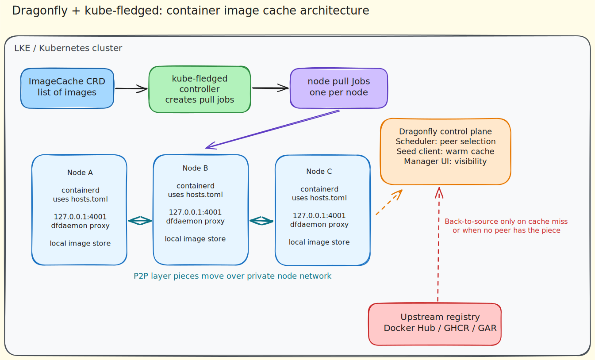

# LKE with Dragonfly and kube-fledged Prefetch

This example provisions an LKE cluster and demonstrates node-local image prefetch backed by Dragonfly for P2P layer distribution and kube-fledged for per-node cache warming.

## Problem Statement

Large container images are expensive to pull repeatedly across a cluster. Without a cache strategy, each node downloads the same layers from upstream registries, which increases startup time, internet egress, and exposure to registry throttling.

This demo reduces that duplication by combining:

- Dragonfly for peer-to-peer layer sharing across nodes
- kube-fledged for controlled image prefetch into containerd on every node

## Architecture



At a high level:

- kube-fledged reads an `ImageCache` and creates pull jobs per node
- each node pulls through the local Dragonfly dfdaemon proxy
- Dragonfly serves cached layers from peers when possible
- upstream registries are only used on cache miss or when no peer has the needed content

## Quick Start

Set your Linode token and provision the cluster:

```sh
export LINODE_TOKEN="your-linode-api-token"
./start.sh
export KUBECONFIG="$(pwd)/kubeconfig.yaml"
kubectl get nodes
```

Then follow [MANUAL_DEPLOYMENT_DRAGONFLY.md](./MANUAL_DEPLOYMENT_DRAGONFLY.md).

## Optional Extension (WIP)

If you want to extend the same cache path to OCI-packed model artifacts, image-volume validation, or the LKE Enterprise Model CSI Driver warmup path, use [MANUAL_DEPLOYMENT_OCI_MODEL_VOLUME.md](./MANUAL_DEPLOYMENT_OCI_MODEL_VOLUME.md).

## What This Demo Focuses On

- LKE cluster provisioning with OpenTofu
- Dragonfly deployment with production-oriented Helm values
- kube-fledged image prefetching with explicit refresh control
- peer-aware image distribution for large image workloads


## Cleanup

```sh
./shutdown.sh
```
