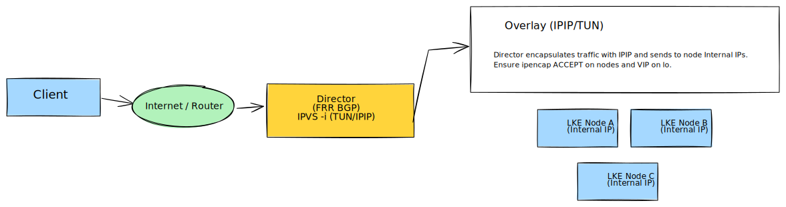
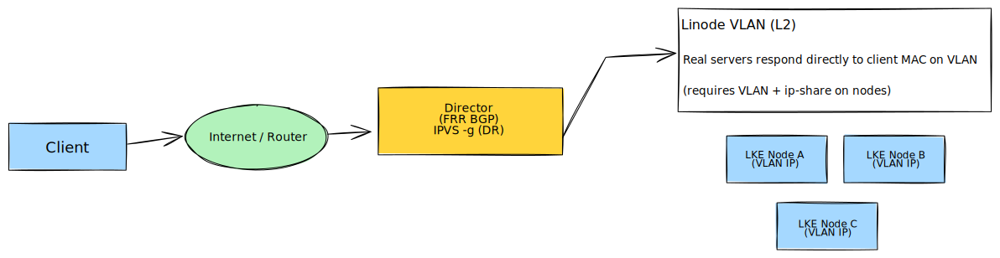

# LVS TUN/DR with LKE NodePort

This demo provisions:
- 1 VM acting as the **LVS Director** (Tunneling Mode, Direct Routing)
- 1 LKE cluster running **traefik/whoami** exposed via **NodePort**

Manual phase configures:
1. FRR on the LVS director node only
2. VIP sharing to LKE nodes for LVS TUN behavior via IPIP encapsulation

FRR profile used in this demo:
- shared IP: director primary public IPv4
- role: primary
- DC_ID: 27 (`it-mil`)

## Architecture





## Requirements

- OpenTofu >= 1.8.0
- Linode API token with Linodes Read/Write
- kubectl
- helm
- jq

## Usage

### Phase 1: Provision infrastructure

```bash
export LINODE_TOKEN='your-token-here'
./start.sh
```

### Phase 2: Manual configuration

Follow [MANUAL_DEPLOYMENT.md](MANUAL_DEPLOYMENT.md) for Tunnelling Mode.
Follow [MANUAL_DEPLOYMENT.md](MANUAL_DEPLOYMENT_DR.md) for Direct Routing Mode.

### Teardown

```bash
./shutdown.sh
```

## Notes

- This is a proof-of-concept for LVS Tunneling/Direct Routing style traffic flow and VIP sharing over a routed Layer 2/3 network.
- For production, add hardening around authentication, firewall scope, observability, and failure automation.
