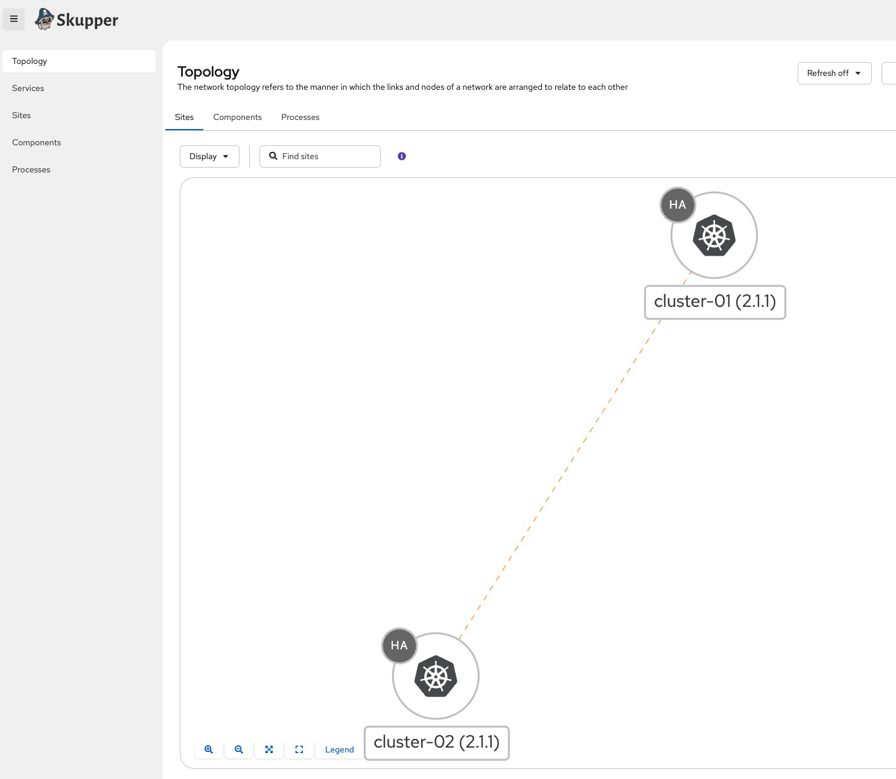

# Multi-Cluster Service Discovery with Skupper

This example demonstrates multi-cluster service discovery using Skupper v2 to connect two LKE clusters and enable cross-cluster service communication.

## Overview

Skupper is the upstream open-source project for [Red Hat Service Interconnect](https://www.redhat.com/en/technologies/cloud-computing/service-interconnect). It creates a Virtual Application Network that securely connects services across Kubernetes clusters without exposing them to the public internet. This setup includes:

- **Cluster-01**: Runs a curl container for testing connectivity
- **Cluster-02**: Runs a podinfo application exposed via ClusterIP service
- **Skupper**: Creates a secure layer 7 tunnel allowing cluster-01 to discover and access cluster-02 services

## Prerequisites

- Terraform installed
- `kubectl` installed
- `skupper` CLI installed ([installation guide](https://skupper.io/install/))
- `helm` installed (for Skupper console)
- Linode API token configured
- Valid Linode account with LKE access

## Setup

### 1. Provision LKE Clusters

```bash
./start.sh
```

This creates two LKE clusters and generates kubeconfig files:
- `kubeconfig-cluster-01`
- `kubeconfig-cluster-02`

### 2. Run Skupper Setup

The setup script automates the entire configuration:

```bash
chmod +x skupper-setup.sh
./skupper-setup.sh
```

The script performs the following:
1. Deploys curl pod to cluster-01 and podinfo service to cluster-02
2. Installs Skupper CRDs on both clusters
3. Creates Skupper sites on both clusters with HA enabled
4. Issues a token from cluster-01 and redeems it on cluster-02 to establish the link
5. Creates a Skupper listener for podinfo on cluster-01
6. Creates a Skupper connector from cluster-02 to the podinfo service
7. Installs the Skupper Network Observer console on cluster-01
8. Tests connectivity by curling podinfo from the curl pod

### 3. Verify Connectivity

Check that the curl pod can reach podinfo across clusters:

```bash
CURL_POD=$(kubectl --kubeconfig kubeconfig-cluster-01 -n private get pods -l app=curl -o jsonpath='{.items[0].metadata.name}')
kubectl --kubeconfig kubeconfig-cluster-01 -n private exec $CURL_POD -- curl -fsS http://podinfo:9898
```

Expected output: JSON response from podinfo application.

### 4. Access Skupper Console (Optional)

Port-forward to access the Skupper Network Observer:

```bash
kubectl --kubeconfig kubeconfig-cluster-01 -n private port-forward svc/skupper-network-observer 8080:8080
```

Open http://localhost:8080 in your browser to visualize the application network topology.

Skupper includes the Network Observer UI for visualizing the application topology. This demo installs it via the official Helm chart so you can monitor services and links in real time.




## Architecture


## Key Skupper Commands

```bash
# Check site status
skupper site status --kubeconfig kubeconfig-cluster-01 -n private

# Check link status
skupper link status --kubeconfig kubeconfig-cluster-01 -n private

# List listeners
skupper listener list --kubeconfig kubeconfig-cluster-01 -n private

# List connectors
skupper connector list --kubeconfig kubeconfig-cluster-02 -n private
```

## Cleanup

Remove all resources:

```bash
./shutdown.sh
```

## Troubleshooting

**Pods not starting**: Check resource availability and logs
```bash
kubectl --kubeconfig kubeconfig-cluster-01 get pods -n private
kubectl --kubeconfig kubeconfig-cluster-01 logs <pod-name> -n private
```

**Link not established**: Verify token redemption
```bash
skupper link status --kubeconfig kubeconfig-cluster-02 -n private
```

**Service not accessible**: Check listener/connector configuration
```bash
skupper listener list --kubeconfig kubeconfig-cluster-01 -n private
skupper connector list --kubeconfig kubeconfig-cluster-02 -n private
```

## Room for Improvements

This example demonstrates the basic setup of Skupper for multi-cluster service discovery. Consider these enhancements for production environments:

### Forward Proxy for Egress Traffic
- Deploy a forward proxy (e.g., Squid, HAProxy) to route and inspect all egress traffic from the clusters
- Configure Skupper to route through the proxy for better visibility and control
- Implement proxy authentication and access logging for audit trails

### Firewall Rules and Network Security
- Configure Linode Cloud Firewall rules to allow only Skupper-required traffic between clusters
- Restrict traffic to specific ports used by Skupper (typically 8081, 8443)
- Implement Network Policies in Kubernetes to isolate Skupper components
- Use IP allowlisting to permit traffic only from known cluster node pools

## References

- [Skupper Documentation](https://skupper.io/docs/)
- [Skupper v2 Release](https://skupper.io/releases/v2/)
- [Linode Kubernetes Engine](https://www.linode.com/products/kubernetes/)
