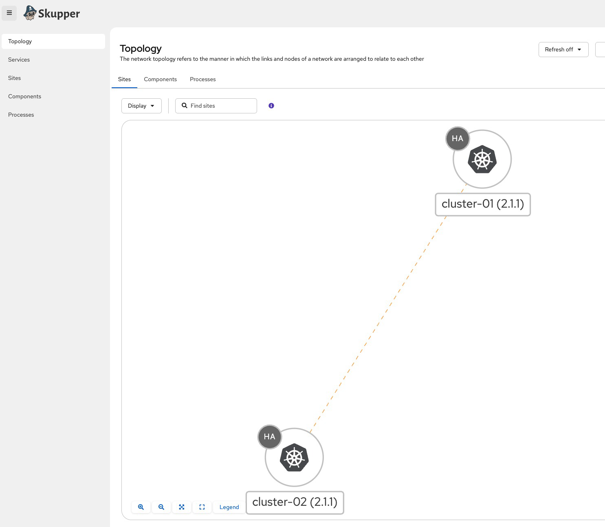

# Multi-Cluster Service Discovery with Skupper and External PostgreSQL

This example demonstrates multi-cluster service discovery using Skupper v2 to connect two LKE clusters and expose an external PostgreSQL VM to applications running in cluster-01.

## Overview

Skupper is the upstream open-source project for [Red Hat Service Interconnect](https://www.redhat.com/en/technologies/cloud-computing/service-interconnect). It creates a Virtual Application Network that securely connects services across Kubernetes clusters without exposing them to the public internet. This setup includes:

- **Cluster-01**: Runs a psql-capable client pod for PostgreSQL tests
- **Cluster-02**: Runs podinfo and the Skupper connector to an external PostgreSQL VM
- **External VM**: Runs PostgreSQL with SSL enabled (self-signed certificate)
- **Skupper**: Creates encrypted inter-site links and proxies service traffic

## Prerequisites

- Terraform installed
- `kubectl` installed
- `skupper` CLI installed ([installation guide](https://skupper.io/install/))
- `helm` installed (for Skupper console)
- Linode API token configured
- Valid Linode account with LKE access

## Setup

### 1. Provision LKE Clusters

```bash
./start.sh
```

This creates two LKE clusters, one PostgreSQL VM, and generates kubeconfig files:
- `kubeconfig-cluster-01`
- `kubeconfig-cluster-02`

It also writes the PostgreSQL CA/server certificate to:
- `certs/postgresql-ca.crt`

### 2. Run Skupper Setup

The setup script automates the entire configuration:

```bash
chmod +x skupper-setup.sh
./skupper-setup.sh
```

The script performs the following:
1. Deploys a psql client pod to cluster-01 and podinfo service to cluster-02
2. Installs Skupper CRDs on both clusters
3. Creates Skupper sites on both clusters with HA enabled
4. Issues a token from cluster-01 and redeems it on cluster-02 to establish the link
5. Creates a Skupper listener for podinfo on cluster-01
6. Creates a Skupper listener for `postgresql-db:5432` on cluster-01
7. Creates a Skupper connector from cluster-02 to the external PostgreSQL VM
8. Installs the Skupper Network Observer console on cluster-01
9. Tests PostgreSQL SSL connectivity with `psql` from cluster-01
10. Captures and compares certificate fingerprints to inspect TLS behavior

### 3. Verify Connectivity

Check that the psql client pod can reach PostgreSQL across clusters:

```bash
PG_POD=$(kubectl --kubeconfig kubeconfig-cluster-01 -n private get pods -l app=pg-client -o jsonpath='{.items[0].metadata.name}')
PGPASSWORD="$(tofu output -raw postgres_db_password)" \
kubectl --kubeconfig kubeconfig-cluster-01 -n private exec $PG_POD -- \
	psql "host=postgresql-db port=5432 dbname=$(tofu output -raw postgres_db_name) user=$(tofu output -raw postgres_db_user) sslmode=require" \
	-c 'select now();'
```

Expected output: a successful SQL result over an SSL-enabled PostgreSQL connection.

To inspect which certificate is presented through Skupper:

```bash
kubectl --kubeconfig kubeconfig-cluster-01 -n private exec $PG_POD -- sh -lc \
	"echo | openssl s_client -starttls postgres -connect postgresql-db:5432 -showcerts 2>/tmp/pg-ssl.log | \
	 awk '/-----BEGIN CERTIFICATE-----/,/-----END CERTIFICATE-----/' > /tmp/pg-through-skupper.crt && \
	 openssl x509 -in /tmp/pg-through-skupper.crt -noout -subject -issuer -fingerprint -sha256"

openssl x509 -in certs/postgresql-ca.crt -noout -fingerprint -sha256
```

If the fingerprints match, TLS is end-to-end to PostgreSQL. If they differ, TLS is being terminated/re-issued somewhere on the path.

## TLS Behavior Notes

- In this setup, Skupper is used as a TCP service bridge for PostgreSQL.
- PostgreSQL TLS negotiation still happens at the PostgreSQL protocol layer.
- Certificate fingerprint comparison is the practical way to confirm whether traffic is passed through transparently or TLS is terminated/re-encrypted.
- Skupper's inter-site link encryption is separate from PostgreSQL's own TLS session.

### 4. Access Skupper Console (Optional)

Port-forward to access the Skupper Network Observer:

```bash
kubectl --kubeconfig kubeconfig-cluster-01 -n private port-forward svc/skupper-network-observer 8080:8080
```

Open http://localhost:8080 in your browser to visualize the application network topology.

Skupper includes the Network Observer UI for visualizing the application topology. This demo installs it via the official Helm chart so you can monitor services and links in real time.




## Architecture


## Key Skupper Commands

```bash
# Check site status
skupper site status --kubeconfig kubeconfig-cluster-01 -n private

# Check link status
skupper link status --kubeconfig kubeconfig-cluster-01 -n private

# List listeners
skupper listener list --kubeconfig kubeconfig-cluster-01 -n private

# List connectors
skupper connector list --kubeconfig kubeconfig-cluster-02 -n private
```

## Cleanup

Remove all resources:

```bash
./shutdown.sh
```

## Troubleshooting

**Pods not starting**: Check resource availability and logs
```bash
kubectl --kubeconfig kubeconfig-cluster-01 get pods -n private
kubectl --kubeconfig kubeconfig-cluster-01 logs <pod-name> -n private
```

**Link not established**: Verify token redemption
```bash
skupper link status --kubeconfig kubeconfig-cluster-02 -n private
```

**Service not accessible**: Check listener/connector configuration
```bash
skupper listener list --kubeconfig kubeconfig-cluster-01 -n private
skupper connector list --kubeconfig kubeconfig-cluster-02 -n private
```

**PostgreSQL SSL verify errors**: self-signed certificates require explicit trust
```bash
tofu output -raw postgres_ca_cert_path
# Use sslmode=verify-ca with sslrootcert pointing to that certificate
```

**PostgreSQL service fails to start with `Permission denied` on server key**: recreate the VM after updating cloud-init
```bash
tofu taint linode_instance.postgres_vm
tofu apply -auto-approve
```

This demo now stores PostgreSQL TLS files under `/var/lib/postgresql/` with `postgres:postgres` ownership so the service account can read the private key.

## Room for Improvements

This example demonstrates the basic setup of Skupper for multi-cluster service discovery. Consider these enhancements for production environments:

### Forward Proxy for Egress Traffic
- Deploy a forward proxy (e.g., Squid, HAProxy) to route and inspect all egress traffic from the clusters
- Configure Skupper to route through the proxy for better visibility and control
- Implement proxy authentication and access logging for audit trails

### Firewall Rules and Network Security
- Configure Linode Cloud Firewall rules to allow only Skupper-required traffic between clusters
- Restrict traffic to specific ports used by Skupper (typically 8081, 8443)
- Implement Network Policies in Kubernetes to isolate Skupper components
- Use IP allowlisting to permit traffic only from known cluster node pools

## References

- [Skupper Documentation](https://skupper.io/docs/)
- [Skupper v2 Release](https://skupper.io/releases/v2/)
- [Linode Kubernetes Engine](https://www.linode.com/products/kubernetes/)
