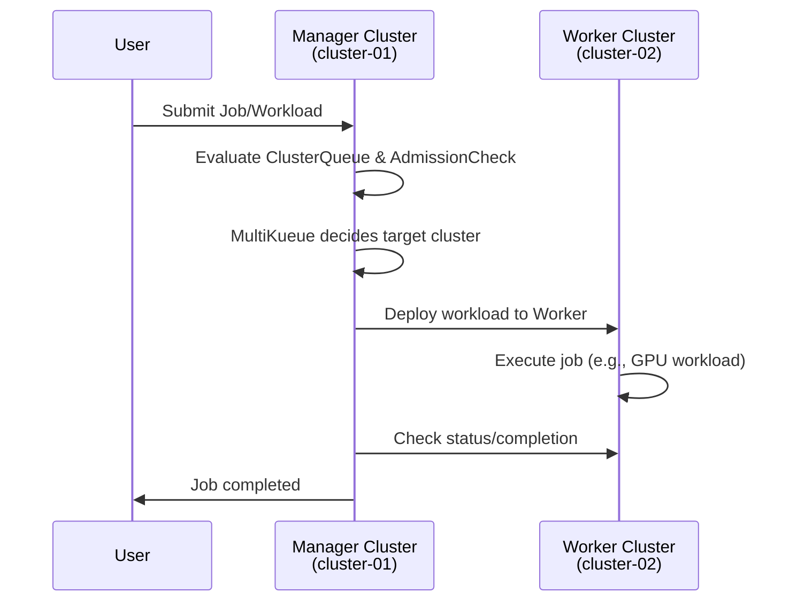

# MultiKueue on LKE

This demonstration showcases Kueue's MultiKueue feature, which enables workload distribution across multiple Kubernetes clusters. The setup uses two Linode Kubernetes Engine (LKE) clusters to demonstrate how a manager cluster can orchestrate and distribute workloads to a worker cluster.

## Architecture Overview

### Infrastructure Components

The demo environment consists of:

1. **Manager Cluster (cluster-01)** - Central control plane that manages workload distribution and scheduling decisions
2. **Worker Cluster (cluster-02)** - Execution cluster where actual workloads run

### Architecture Diagram


### Workflow Sequence



## What This Demo Demonstrates

This proof of concept showcases:

- **Centralized Workload Management**: Submit jobs to a manager cluster that orchestrates execution on remote worker clusters
- **Cross-Cluster Job Distribution**: Manager cluster schedules jobs but worker cluster executes them
- **Resource Abstraction**: Users interact with a single API surface while workloads run on distributed infrastructure
- **Admission Control**: MultiKueue admission checks determine cluster eligibility and routing
- **Status Synchronization**: Real-time status updates propagate from worker back to manager
- **GPU Workload Support**: Example includes GPU job scheduling across clusters

### Key Benefits

- **Resource Isolation**: Keep compute-intensive workloads separate from control plane
- **Multi-Tenant Scenarios**: Different teams can submit to manager while workloads execute on isolated clusters
- **Unified Interface**: Single kubectl context for job submission regardless of execution location
- **Quota Management**: Centralized resource quota enforcement across multiple clusters

## Prerequisites

- Linode account with API token configured
- Two LKE clusters provisioned (or use `./start.sh` to create them)
- `kubectl` CLI installed
- `helm` CLI installed
- Bash shell environment

## Setup Instructions

Most files in `configs/` and the kubeconfig creation script in `scripts/` are provided by the upstream MultiKueue examples. The Grafana dashboards used here are also sourced from DCGM example content and packaged for convenience.

### 1. Provision Infrastructure

```bash
# Start the infrastructure (provisions both LKE clusters)
./start.sh
```

This creates two LKE clusters and generates kubeconfig files:
- `kubeconfig-cluster-01` (Manager)
- `kubeconfig-cluster-02` (Worker)

### 2. Install Kueue on Both Clusters

```bash
# Install Kueue on Manager Cluster
helm upgrade --install kueue oci://registry.k8s.io/kueue/charts/kueue \
    --version=0.16.0 \
    --namespace kueue-system \
    --create-namespace \
    -f "configs/kueue-values.yaml" \
    --wait --timeout 300s \
    --kubeconfig=./kubeconfig-cluster-01

# Install Kueue on Worker Cluster
helm upgrade --install kueue oci://registry.k8s.io/kueue/charts/kueue \
    --version=0.16.0 \
    --namespace kueue-system \
    --create-namespace \
    -f "configs/kueue-values.yaml" \
    --wait --timeout 300s \
    --kubeconfig=./kubeconfig-cluster-02
```

### 3. Configure Worker Cluster Resources

```bash
# Apply worker queue configuration (ClusterQueue, ResourceFlavor, etc.)
kubectl apply -f configs/worker-queue-setup.yaml --kubeconfig=./kubeconfig-cluster-02
```

### 4. Create MultiKueue Connection Secret

```bash
# Generate a kubeconfig for MultiKueue with appropriate permissions
KUBECONFIG=./kubeconfig-cluster-02 ./scripts/create-multikueue-kubeconfig.sh scripts/multikueue-kubeconfig

# Create the secret on Manager Cluster containing worker cluster credentials
kubectl create secret generic worker1-secret \
    -n kueue-system \
    --kubeconfig=./kubeconfig-cluster-01 \
    --from-file=kubeconfig=scripts/multikueue-kubeconfig
```

### 5. Configure Manager Cluster for MultiKueue

```bash
# Apply manager configuration (MultiKueueCluster, MultiKueueConfig, AdmissionCheck)
kubectl apply -f configs/multikueue-setup.yaml --kubeconfig=./kubeconfig-cluster-01

# Verify connection to worker cluster
kubectl describe multikueuecluster multikueue-test-worker1 --kubeconfig kubeconfig-cluster-01
```

**Note**: If the connection fails, you may need to add the manager cluster node IPs to the worker cluster's Control Plane ACLs in the Linode Cloud Manager.

### 6. Submit a Test Job

```bash
# Create a sample GPU job on the manager cluster
kubectl apply -f configs/debug-gpu-job.yaml --kubeconfig kubeconfig-cluster-01
```

### 7. Verify Job Execution

```bash
# Check job status on manager (should show as created)
kubectl get jobs --kubeconfig kubeconfig-cluster-01
kubectl get workloads --kubeconfig kubeconfig-cluster-01

# Check actual job execution on worker (should show as running/completed)
kubectl get jobs --kubeconfig kubeconfig-cluster-02
```

## Key Concepts

### ClusterQueue
Defines resource quotas and admission policies. In MultiKueue, the manager's ClusterQueue references remote clusters for execution.

### ResourceFlavor
Represents available compute resources (CPU, memory, GPU). Worker clusters expose their resources through ResourceFlavors.

### AdmissionCheck
MultiKueue uses admission checks (type `multikueue.x-k8s.io/MultiKueueCluster`) to determine which remote cluster should execute a workload.

### MultiKueueCluster
Custom resource representing a remote worker cluster. Contains connection details and status.

### Workload
Kueue's representation of a Job. The manager creates a workload object, and MultiKueue propagates it to the worker.

## Monitoring and Troubleshooting

### Restart Kueue Controller

```bash
kubectl rollout restart deployment kueue-controller-manager -n kueue-system --kubeconfig kubeconfig-cluster-01
```

### Verify Component Health

```bash
# Check ClusterQueue status
kubectl get clusterqueues cluster-queue -o jsonpath="{range .status.conditions[?(@.type == \"Active\")]}CQ - Active: {@.status} Reason: {@.reason} Message: {@.message}{'\n'}{end}"

# Check AdmissionCheck status
kubectl get admissionchecks sample-multikueue -o jsonpath="{range .status.conditions[?(@.type == \"Active\")]}AC - Active: {@.status} Reason: {@.reason} Message: {@.message}{'\n'}{end}"

# Check MultiKueueCluster connection status
kubectl get multikueuecluster multikueue-test-worker1 -o jsonpath="{range .status.conditions[?(@.type == \"Active\")]}MC - Active: {@.status} Reason: {@.reason} Message: {@.message}{'\n'}{end}"
```

### Common Issues

**Job Not Scheduling**: Verify ClusterQueue has capacity and AdmissionCheck is active.

**Connection Issues**: Ensure worker cluster control plane allows connections from manager cluster nodes. Check Linode firewall rules and Control Plane ACLs.

**Job Stuck Pending**: Check worker cluster has sufficient resources matching the job's requests.

### View Kueue Logs

```bash
# Manager cluster logs
kubectl logs -n kueue-system -l control-plane=controller-manager --kubeconfig kubeconfig-cluster-01

# Worker cluster logs
kubectl logs -n kueue-system -l control-plane=controller-manager --kubeconfig kubeconfig-cluster-02
```

## Cleanup

```bash
# Destroy all infrastructure
./shutdown.sh
```

## Monitoring with Grafana Dashboards

To set up Grafana dashboards for NVIDIA DCGM (GPU monitoring), run the automated setup script:

```bash
./scripts/setup_grafana_dashboards.sh
```

This script installs and configures Grafana dashboards for visualizing GPU metrics and cluster performance.

## Additional Resources

- [Kueue Documentation](https://kueue.sigs.k8s.io/)
- [MultiKueue Guide](https://kueue.sigs.k8s.io/docs/concepts/multikueue/)
- [Linode Kubernetes Engine](https://www.linode.com/products/kubernetes/)
