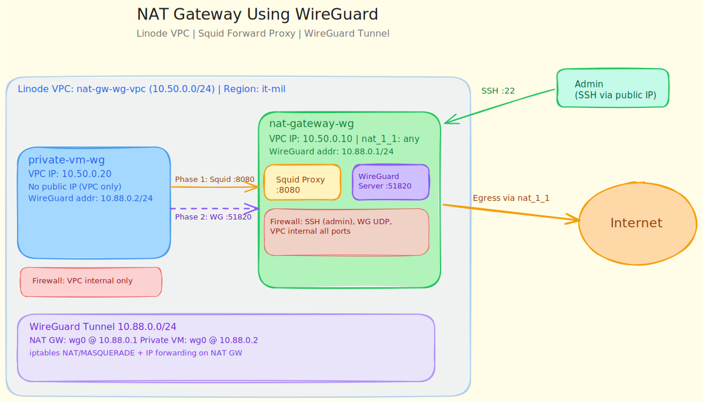

# NAT Gateway Using WireGuard

## Overview

This example deploys two Linode VMs in one VPC subnet, each with exactly one VPC interface:

- `nat-gateway-wg`: has VPC IPv4 + `nat_1_1 = "any"` (publicly reachable through 1:1 NAT)
- `private-vm-wg`: has only VPC IPv4 (no `nat_1_1`, no public interface)

The public VM is used for both roles:

- forward proxy for bootstrap egress (`apt`/`curl`) from the private VM
- WireGuard server for tunnel-based egress after bootstrap

This is a staged design:

1. The public VM uses `nat_1_1` to reach the internet.
2. The public VM exposes a VPC-only forward proxy so the private VM can install packages.
3. The public VM also runs the WireGuard server.
4. The private VM installs WireGuard through the proxy and then moves its traffic into the WireGuard tunnel.

## Architecture



## Topology

- VPC CIDR: `10.50.0.0/24`
- NAT gateway VPC IP: `10.50.0.10`
- Private VM VPC IP: `10.50.0.20`
- WireGuard tunnel CIDR: `10.88.0.0/24`
- Forward proxy: `http://10.50.0.10:8080`

Traffic flow:

1. Bootstrap package traffic from the private VM goes to `10.50.0.10:8080`.
2. Squid on the public VM fetches packages from the internet using the VM's `nat_1_1` egress.
3. After WireGuard is installed, the private VM connects to endpoint `10.50.0.10:51820` over the VPC.
4. Outbound traffic from the private VM is then NATed by the public VM through the WireGuard server host.

## Prerequisites

- `LINODE_TOKEN` exported in your shell
- OpenTofu installed (`tofu`)

## Deploy

```bash
cd nat_gw_using_wireguard
./start.sh
```

Or manually:

```bash
tofu init
tofu apply -auto-approve
```

Useful outputs after deploy:

```bash
tofu output -raw topology_summary
tofu output -raw ssh_nat_gateway
tofu output -raw ssh_private_via_jump
tofu output -raw wireguard_bootstrap_commands
```

## Validate Interface Requirements

After apply:

```bash
tofu output -raw topology_summary
```

You should see:

- NAT gateway: public access enabled via `nat_1_1`
- NAT gateway bootstrap roles: forward proxy + WireGuard server
- Private VM: public access disabled

The intended interface model is:

- `nat-gateway-wg`: one VPC interface, public reachability through `nat_1_1`
- `private-vm-wg`: one VPC interface only, no public reachability

## Configure Proxy Bootstrap and WireGuard

A full command bundle is produced as output:

```bash
tofu output -raw wireguard_bootstrap_commands
```

That bundle does this in order:

1. Copies the setup scripts to the public VM and private VM.
2. Configures Squid on the public VM, bound to `10.50.0.10:8080` and restricted to the VPC CIDR.
3. Configures WireGuard on the public VM.
4. Copies the generated WireGuard client profile to the private VM.
5. Installs WireGuard on the private VM through the forward proxy and then brings the tunnel up.

You can also run the same flow manually.

### Step 1: Configure the Forward Proxy on the Public VM

```bash
ssh -i /tmp/id_rsa_nat_gw_wg root@<nat-gateway-public-ip>
chmod +x /root/setup_forward_proxy.sh
/root/setup_forward_proxy.sh --listen-ip 10.50.0.10 --allow-cidr 10.50.0.0/24 --port 8080
```

### Step 2: Configure WireGuard on the Public VM

```bash
ssh -i /tmp/id_rsa_nat_gw_wg root@<nat-gateway-public-ip>
chmod +x /root/setup_wireguard_nat_gateway.sh
/root/setup_wireguard_nat_gateway.sh \
	--wg-subnet 10.88.0.0/24 \
	--server-address 10.88.0.1/24 \
	--peer-address 10.88.0.2/24 \
	--peer-allowed-ip 10.88.0.2/32 \
	--endpoint 10.50.0.10
```

### Step 3: Copy the Generated Client Profile to the Private VM

```bash
scp -i /tmp/id_rsa_nat_gw_wg root@<nat-gateway-public-ip>:/root/wg0-client1.conf /tmp/wg0-client1.conf
scp -i /tmp/id_rsa_nat_gw_wg \
	-o ProxyCommand='ssh -i /tmp/id_rsa_nat_gw_wg -o IdentitiesOnly=yes -W %h:%p root@<nat-gateway-public-ip>' \
	/tmp/wg0-client1.conf root@10.50.0.20:/root/wg0.conf
```

### Step 4: Install WireGuard on the Private VM Through the Proxy

```bash
ssh -i /tmp/id_rsa_nat_gw_wg \
	-o IdentitiesOnly=yes \
	-o ProxyCommand='ssh -i /tmp/id_rsa_nat_gw_wg -o IdentitiesOnly=yes -W %h:%p root@<nat-gateway-public-ip>' \
	root@10.50.0.20

chmod +x /root/setup_wireguard_client.sh
/root/setup_wireguard_client.sh --config /root/wg0.conf --apt-proxy http://10.50.0.10:8080
```

### Validation

On the public VM:

```bash
systemctl status squid --no-pager
systemctl status wg-quick@wg0 --no-pager
wg show wg0
```

On the private VM:

```bash
wg show wg0
ip route
curl -4 ifconfig.me
```

If the tunnel is active, the returned public IP should be the public IP associated with `nat-gateway-wg`.

You can also run the automated verification script locally from the example directory:

```bash
./scripts/verify_proxy_and_wireguard.sh
```

If your SSH key is in a different location:

```bash
./scripts/verify_proxy_and_wireguard.sh --key-path /path/to/private/key
```

The verification script checks:

1. Squid is active on the public VM.
2. The private VM can use the forward proxy for HTTP and HTTPS traffic.
3. WireGuard is active on both VMs.
4. The private VM egress public IP matches the NAT gateway public IP.

## Bootstrap Caveat

A private-only VPC VM does not have public internet access by default, including during `cloud-init`.

Because of that, this example does not rely on package installation in `cloud-init` for the private VM. Instead, it uses the public VM as an application-layer forward proxy for bootstrap, then moves to WireGuard for tunnel-based egress.

For this topology, the WireGuard client should use the NAT gateway's private VPC IP (`10.50.0.10`) as the endpoint because both hosts already share the same VPC.

## Forward Proxy vs NAT Gateway

Both patterns provide outbound internet access from private networks, but they solve different problems.

| Aspect | Forward Proxy | NAT Gateway |
|---|---|---|
| OSI layer | Application layer (L7) | Network layer (L3/L4) |
| Client changes required | Yes. Each tool/app must be proxy-aware or configured | Usually no app changes |
| Typical use in this repo | Bootstrap package access (`apt`, `curl`) | General outbound traffic after bootstrap |
| Protocol coverage | Primarily HTTP/HTTPS (and CONNECT) | Broad IP traffic |
| Traffic policy control | Strong per-request control possible | Coarser network policy control |
| Performance profile | Extra app/proxy handling overhead | Lower per-request overhead; still NAT/conntrack cost |
| Operational complexity | App-by-app proxy config | Route/NAT/firewall management |

How to decide:

1. Use a forward proxy when you only need controlled bootstrap egress for package managers and HTTP clients.
2. Use a NAT gateway when you need transparent outbound connectivity for most workloads without changing application configs.
3. Use both (recommended for this example) when you need safe bootstrap first, then broader tunnel-based egress.

How this demo applies that decision:

1. Forward proxy on `10.50.0.10:8080` is used first so the private VM can install required packages.
2. WireGuard NAT gateway is enabled next for ongoing private VM egress through the gateway.

## Script Reference

- `scripts/setup_forward_proxy.sh`: installs and configures Squid on the public VM, bound to the gateway's VPC IP and restricted to the VPC CIDR.
- `scripts/setup_wireguard_nat_gateway.sh`: configures the public VM as the WireGuard server and enables NAT/forwarding.
- `scripts/setup_wireguard_client.sh`: installs WireGuard on the private VM through the configured proxy, writes the client config, and starts `wg-quick`.
- `scripts/verify_proxy_and_wireguard.sh`: runs end-to-end validation of the proxy bootstrap path, WireGuard tunnel state, and final egress IP.
- `start.sh`: deploys infrastructure and prints the command bundle and connection details.
- `shutdown.sh`: destroys the example resources and cleans local state files.

## Access

- SSH NAT gateway:

```bash
tofu output -raw ssh_nat_gateway
```

- SSH private VM through jump host:

```bash
tofu output -raw ssh_private_via_jump
```

## Teardown

```bash
./shutdown.sh
```

## Security Notes

- The forward proxy is intentionally limited to the VPC CIDR. Do not widen this without a specific reason.
- The proxy is for bootstrap and package egress, not for exposing a general-purpose open proxy.
- The root password outputs are marked sensitive in Terraform, but `start.sh` still prints them explicitly. Treat terminal history and logs accordingly.
- In a production design, consider separating the proxy and VPN roles or hardening the shared gateway further.

## Known Limitations & Drawbacks of WireGuard as NAT Gateway

While WireGuard is lightweight and performant, using it as a NAT gateway for private VMs has trade-offs:

1. **Overhead vs. Direct NAT**: WireGuard adds encryption/decryption overhead on every packet. For high-throughput workloads, direct iptables-based NAT (without encryption) will be faster.
2. **Key Rotation Complexity**: WireGuard keys are long-lived. Rotating them requires tunnel downtime or careful orchestration with zero-downtime key updates.
3. **Split Tunnel Challenges**: If clients need access to both the tunnel and direct paths, split-tunnel configuration adds complexity and debugging burden.
4. **Stateful Inspection Limitation**: WireGuard doesn't provide deep packet inspection or application-layer filtering. For compliance-heavy workloads, a stateful firewall appliance may be required.
5. **Bandwidth Billing**: Encrypted packets are slightly larger than plaintext; depending on billing, this may increase egress costs at scale.
6. **Connection Tracking**: Kernel connection tracking (`conntrack`) under high connection rates can become a bottleneck. Monitor it in production.
7. **Forward Proxy Scope**: The bootstrap proxy only helps proxy-aware tools such as `apt` and `curl`; it is not a full replacement for network-layer NAT.

## Production Considerations

For production usage, this PoC requires additional controls:

- **High availability**: deploy at least two NAT gateway nodes and health-based failover.
- **Disaster recovery**: keep script/config backup and document re-provision playbooks.
- **Security hardening**: restrict both WireGuard and proxy source CIDRs, rotate keys regularly, and enforce least-privilege firewall rules.
- **Observability**: ship `wg`, Squid, route, and iptables metrics/logs to centralized monitoring.
- **Capacity planning**: validate throughput, connection tracking limits, and CPU usage under expected load.
- **Alternative for high throughput**: consider iptables-only NAT if bandwidth is the main bottleneck.
