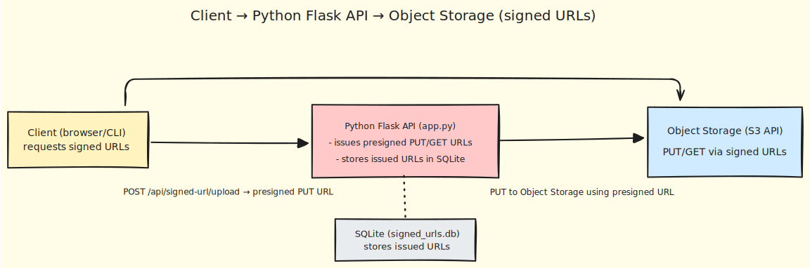

# Object Storage Signed URLs Demo

Provision a Linode Object Storage bucket and a scoped read/write access key with OpenTofu, then run a local Flask API that issues presigned upload and read URLs.

This demo focuses on practical signed URL workflows:
- Generate presigned `PUT` URL for upload
- Generate presigned `GET` URL for download
- Download directly from the signed read URL (no proxy required)
- Persist issued signed URLs in SQLite and query them via API

## What This Use Case Demonstrates

- Linode Object Storage bucket provisioning with OpenTofu
- Programmatic Object Storage key creation scoped to a single bucket
- S3-compatible presigned URL generation using `boto3`
- Lightweight URL issuance registry (`signed_urls.db`) with cleanup loop
- API endpoints for health checks, URL issuance, and URL listing
- End-to-end manual validation with curl and jq

## Architecture



## Prerequisites

- `LINODE_TOKEN` exported in your shell
- OpenTofu `>= 1.8.0`
- Python 3.10+
- `uv`
- `jq`

## Quick Start

```bash
export LINODE_TOKEN='your-token-here'
./start.sh
source ./.runtime.env
uv run app.py
```

Then, when the API is running:

1. Create upload signed URL (`POST /api/signed-url/upload`)
2. Upload a file with `curl -X PUT "$UPLOAD_SIGNED_URL" --upload-file ...`
3. Create read signed URL (`POST /api/signed-url/read`)
4. Download directly:

```bash
curl "$READ_SIGNED_URL" --output downloaded-sample.txt
```

5. Inspect issued URLs:

```bash
curl -s http://127.0.0.1:5000/api/signed-urls | jq
curl -s "http://127.0.0.1:5000/api/signed-urls?active=true" | jq
```

For the full sequence, see `MANUAL_DEPLOYMENT.md`.

## TLS and CORS Notes

- Linode Object Storage endpoints expose HTTPS and terminate TLS at the Object Storage service. Requests sent to signed URLs are encrypted in transit.
- This demo's Flask server runs locally over HTTP by default (`http://127.0.0.1:5000`). For production, terminate TLS in front of the API (for example, reverse proxy or ingress) and enforce HTTPS.
- If your browser frontend calls signed Object Storage URLs directly, configure bucket CORS to allow your frontend origin, methods (`GET`, `PUT`, `HEAD`), and required headers.
- If your frontend and Flask API are on different origins, configure API CORS on Flask too. Bucket CORS and API CORS are separate controls.

Minimal bucket CORS example:

```json
[
  {
    "AllowedOrigins": ["https://app.example.com"],
    "AllowedMethods": ["GET", "PUT", "HEAD"],
    "AllowedHeaders": ["*"],
    "ExposeHeaders": ["ETag"],
    "MaxAgeSeconds": 3600
  }
]
```

## Why Multipart Upload Matters

Multipart upload is important for large files because it improves reliability and throughput:

- Retries are cheaper: only failed parts are retried, not the full object.
- Better performance: parts can upload in parallel.
- Better resilience: less likely to fail on unstable networks.

When to use multipart:

- Use multipart for large files (typically anything above 8-16 MiB, and especially 100 MiB+).
- Use single-part upload for small files to keep the flow simple.

## API Endpoints

- `GET /health`
- `POST /api/signed-url/upload`
- `POST /api/signed-url/read`
- `GET /api/signed-urls`
- `POST /api/download` (legacy helper endpoint, optional)

## Cleanup

```bash
./shutdown.sh
```

## Production Considerations

This is a proof-of-concept. For production, you should add:

- **Security**
  - Least-privilege Object Storage keys
  - Secret management (do not expose access keys in shell history)
  - TLS termination and authenticated API access
  - Rate limiting and input validation hardening

- **High Availability**
  - Run the API behind a load balancer with multiple instances
  - Move SQLite to managed durable storage (or managed DB)
  - Health checks and rolling deployments

- **Disaster Recovery**
  - Backup and restore strategy for URL audit metadata
  - Object Storage lifecycle/versioning policies
  - Documented recovery runbooks and periodic drills

- **Observability**
  - Structured logging, metrics, and alerting
  - Signed URL issuance audit trail retention policy
