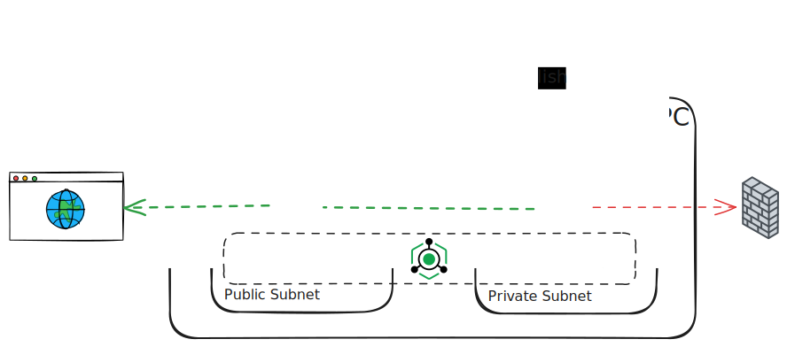

# Private VM with NAT Gateway Demo

This demo showcases how to create a secure private VM infrastructure on Linode using VPC subnets, with a public VM acting as a NAT gateway to provide internet access to the private VM.

## Architecture Overview

The infrastructure consists of:

- **1 VPC** with **2 subnets**:
  - **Public Subnet** (`10.10.1.0/24`) - Contains the public VM with internet access
  - **Private Subnet** (`10.10.2.0/24`) - Contains the private VM with no direct internet access
- **1 VLAN** (`192.168.100.0/24`) - Provides direct Layer 2 connectivity between VMs
- **2 Linode instances**:
  - **Public VM** - Acts as a NAT gateway and SSH bastion host
  - **Private VM** - Isolated VM accessible only via LISH or through the VPC



## Key Features

### NAT Gateway Setup

The **public VM** is configured as a NAT gateway using:
- IP forwarding enabled via `sysctl`
- `iptables MASQUERADE` rules for both VPC and VLAN subnets
- Cloud-init automation for NAT configuration on boot

This allows the **private VM** to:
- Access the internet for updates and package installation
- Remain completely isolated from direct external access
- Communicate with the public VM over the VPC and VLAN

### SSH Access Patterns

#### Public VM
- **Direct SSH access** from your IP address (configured via firewall)
- Command: `ssh -i ssh-keys/id_rsa root@<public-ip>`

#### Private VM
- **No direct SSH access** from the internet (more secure)
- **Access via LISH** (Linode Interactive Shell Host)

### What is LISH?

**LISH** (Linode Interactive Shell Host) is Linode's out-of-band console access system. It provides:

- **Direct console access** to your Linode instance, even when networking is broken
- **SSH-based connection** to Linode's console infrastructure
- **Independent of your instance's network configuration** - works even if VPC/firewall blocks all traffic
- **Useful for**:
  - Accessing private instances without public IPs
  - Troubleshooting network issues
  - Emergency access when SSH is not available
  - Secure access to fully isolated VMs

LISH connects you directly to the instance's console, similar to having physical keyboard access to a server.

## Prerequisites

- OpenTofu installed (v1.8.0 or later)
- A Linode API token with read/write permissions

## Getting Started

1. **Set your Linode API token:**
   ```bash
   export LINODE_TOKEN='your-token-here'
   ```

2. **Run the demo:**
   ```bash
   ./start.sh
   ```

   The script will:
   - Initialize and apply OpenTofu configuration
   - Wait 90 seconds for cloud-init and NAT gateway setup
   - Display connection commands

3. **Access the VMs:**

   **Public VM (via SSH):**
   ```bash
   ssh -i ssh-keys/id_rsa root@<public-ip>
   ```

   **Private VM (via LISH):**
   ```bash
   ssh -t <username>@lish-<region>.linode.com <instance-label>
   ```

4. **Test internet connectivity from the private VM:**
   ```bash
   # From LISH console
   ping -c 4 8.8.8.8
   curl -I https://www.google.com
   ```

## Firewall Configuration

### Public VM Firewall
- Allows SSH (port 22) from your IP address
- Allows all traffic from VPC CIDR (`10.0.0.0/8`)
- Drops all other inbound traffic

### Private VM Firewall
- Allows all traffic from VPC CIDR (`10.0.0.0/8`)
- Drops all external traffic (no public interface)

## Cloud-Init Configuration

The demo uses two cloud-init scripts:

1. **`nat_gateway_user_data.yaml`** - Configures the public VM as NAT gateway
   - Enables IP forwarding
   - Sets up iptables MASQUERADE rules
   - Disables SSH password authentication

2. **`nat_routing_user_data.yaml`** - Configures the private VM routing
   - Sets default route through the NAT gateway
   - Configures network routing for internet access
   - Disables SSH password authentication

## Project Structure

```
.
├── compute.tf                       # VM instances configuration
├── network.tf                       # VPC, subnets, and firewall rules
├── nat_gateway.tf                   # NAT gateway StackScript (legacy)
├── variables.tf                     # OpenTofu variables
├── outputs.tf                       # SSH and LISH commands output
├── providers.tf                     # OpenTofu provider configuration
├── ssh.tf                           # SSH key generation
├── main.tf                          # Main configuration and data sources
├── start.sh                         # Automated setup script
├── shutdown.sh                      # Cleanup script
└── scripts/
    ├── nat_gateway_user_data.yaml   # Cloud-init for public VM
    └── nat_routing_user_data.yaml   # Cloud-init for private VM
```

## Cleanup

To destroy all resources and clean up:

```bash
./shutdown.sh
```

This will:
- Destroy all OpenTofu-managed resources
- Remove all OpenTofu state files and directories
- Remove generated SSH keys
- Prompt for confirmation before proceeding

## Use Cases

This architecture is ideal for:

- **Secure backend services** - Run databases or application servers without direct internet exposure
- **Compliance requirements** - Meet security standards requiring network isolation
- **Bastion/Jump host patterns** - Control access through a single entry point
- **Cost optimization** - Reduce the number of public IPs needed
- **Defense in depth** - Add an additional security layer to critical infrastructure
