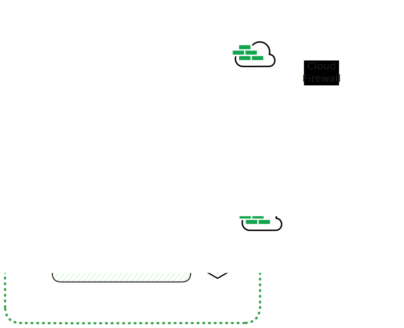

# Secure LKE Cluster

Production-ready Linode Kubernetes Engine (LKE) cluster with enhanced security features including VPC networking, Cloud Firewall integration, and High Availability control plane.

## Architecture



## Features

- **High Availability Control Plane**: LKE-e cluster with HA control plane for production workloads
- **VPC Networking**: Dedicated VPC for network
- **Cloud Firewall Integration**:
  - Automatic firewall controller deployment via Helm
  - IP-based access control (restricts access to your IP)
  - VPC-internal traffic allowed (10.0.0.0/8)
- **Auto-scaling**: Node pool configured with 3-6 nodes autoscaler
- **Dedicated Compute**: g6-dedicated-4 instances for consistent performance
- **Control Plane ACL**: Access control list for Kubernetes API server
- **Hardening Script**: Post-deployment security hardening automation, keep worker nodes safe

## Prerequisites

- **Linode API Token** with read/write permissions
- **OpenTofu** v1.8.0+ or Terraform
- **kubectl** for cluster management
- **helm** for managing Kubernetes applications
- **linode-cli** for troubleshooting

## Quick Start

### Deploy the Cluster

```bash
export LINODE_TOKEN='your-token-here'
./start.sh
```

This will:
1. Initialize OpenTofu/Terraform
2. Create VPC and Cloud Firewall rules
3. Deploy LKE cluster with HA control plane
4. Install Cloud Firewall CRD and controller via Helm
5. Save kubeconfig to `kubeconfig` file

### Access the Cluster

```bash
export KUBECONFIG=$(pwd)/kubeconfig
kubectl get nodes
```

### Apply Security Hardening

```bash
./scripts/hardening.sh
```

This script performs additional security configurations and validations.

### Deploy Sample Applications

```bash
kubectl apply -f config/echo-ip.dpl.yaml
kubectl apply -f config/podinfo.dpl.yaml
```

### Destroy Resources

```bash
./shutdown.sh
```

## Configuration

### Network

- **VPC**: Dedicated VPC in the specified region (default: it-mil)
- **Firewall Rules**:
  - Inbound TCP/UDP/ICMP from your IP (auto-detected)
  - Inbound TCP/UDP from VPC range (10.0.0.0/8)
  - Outbound: Allow all

### Compute

- **Cluster**: LKE with High Availability control plane
- **Node Pool**: g6-dedicated-4 instances
- **Autoscaler**: Min 3, Max 6 nodes
- **Kubernetes Version**: 1.34 (latest)

### Security

- **Control Plane ACL**: Enabled (currently set to 0.0.0.0/0 - update in `compute.tf` for production)
- **Cloud Firewall Controller**: Automatically deployed via Terraform

## Project Structure

```
secure_lke/
├── main.tf           # Main configuration and locals
├── providers.tf      # Provider configurations (Linode, Helm, Kubernetes)
├── compute.tf        # LKE cluster definition
├── network.tf        # VPC and Cloud Firewall rules
├── outputs.tf        # Outputs including kubeconfig
├── start.sh          # Deployment script
├── shutdown.sh       # Cleanup script
├── config/           # Kubernetes manifests
│   ├── echo-ip.dpl.yaml
│   └── podinfo.dpl.yaml
└── scripts/
    └── hardening.sh  # Security hardening script
```

## Outputs

- `lke_kubeconfig` - Kubernetes configuration for cluster access (saved to `kubeconfig` file)

## Security Considerations

1. **Control Plane ACL**: Currently set to `0.0.0.0/0` for accessibility. In production, restrict to specific IPs:
   ```hcl
   addresses {
     ipv4 = ["${local.my_ip}", "10.0.0.0/8"]
   }
   ```

2. **Cloud Firewall**: Automatically restricts access to your detected IP address

3. **High Availability**: HA control plane provides redundancy for production workloads

4. **VPC Support**: All nodes run in a dedicated VPC

## Resources

- [Linode LKE Documentation](https://www.linode.com/docs/products/compute/kubernetes/)
- [Cloud Firewall Controller](https://github.com/linode/cloud-firewall-controller)
- [LKE High Availability](https://www.linode.com/docs/products/compute/kubernetes/guides/high-availability-control-plane/)
