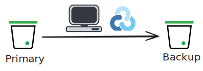

# Static Website with Linode Object Storage

This project deploys a static website using Linode Object Storage with automatic backup synchronization.

## Prerequisites

Before running this project, you need:

1. **Linode API Token**: Export it as an environment variable:
   ```bash
   export LINODE_TOKEN='your-token-here'
   ```

2. **Required Tools**:
   - [OpenTofu](https://opentofu.org/) or Terraform
   - [s3cmd](https://s3tools.org/s3cmd) - S3 command-line tool
   - [rclone](https://rclone.org/) - Cloud storage sync tool

### Installing Required Tools

**macOS** (using Homebrew):
```bash
brew install s3cmd rclone
```

**Linux** (Ubuntu/Debian):
```bash
sudo apt-get install s3cmd rclone
```

## Project Structure

- `main.tf` - Main Terraform configuration for Object Storage buckets and objects
- `backup.tf` - Backup bucket configuration
- `outputs.tf` - Outputs for website endpoints and management commands
- `website/` - Static website files (index.html, 404.html)
- `rclone.conf` - Auto-generated rclone configuration (created during deployment)

## Usage

### Deploy the Website

Run the start script to deploy everything:

```bash
./start.sh
```

This script will:
1. Initialize OpenTofu
2. Plan the infrastructure
3. Apply the changes
4. Generate rclone configuration
5. Sync the primary bucket to the backup bucket
6. Display website endpoints

### Destroy Resources

To tear down all resources:

```bash
./shutdown.sh
```

This will destroy all Linode resources and clean up Terraform state files.

## What Gets Deployed



- **Primary Object Storage Bucket**: Hosts your website files
- **Backup Object Storage Bucket**: Synchronized copy of your website
- **Object Storage Keys**: Access credentials for bucket management
- **Website Objects**: index.html and 404.html uploaded to both buckets

## Testing

After deployment, test your website using the curl commands displayed at the end of the deployment, or run:

```bash
tofu output -raw website_endpoint
```

## Notes

- The website is configured with public-read ACL through bucket policies
- Automatic backup synchronization runs during deployment
- Website configuration (index/error pages) is set up automatically by Terraform
