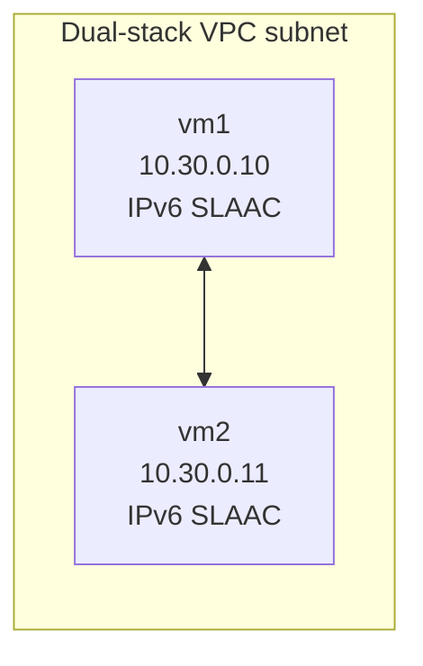

# VPC Dual Stack

Small Linode demo that builds one dual-stack VPC subnet and two VMs, then validates IPv4 and IPv6 ping between them.

## Architecture



## Notes

- This use case uses only the VPC interface with `nat_1_1 = "any"`.
- In this environment, combining explicit `public` + `vpc` interfaces caused IPv6 route selection issues for east-west traffic.
- Subnet IPv6 is allocated by Linode (`ipv6.range = "auto"`), and VM VPC IPv6 addresses are assigned from that allocated subnet range.

## Run

```bash
export LINODE_TOKEN='your-token'
./start.sh
```

Optional SSH user-key path:

- Set `authorized_users` in [terraform.tfvars](terraform.tfvars) to inject your Linode-account SSH keys.

## Cleanup

```bash
./shutdown.sh
```
