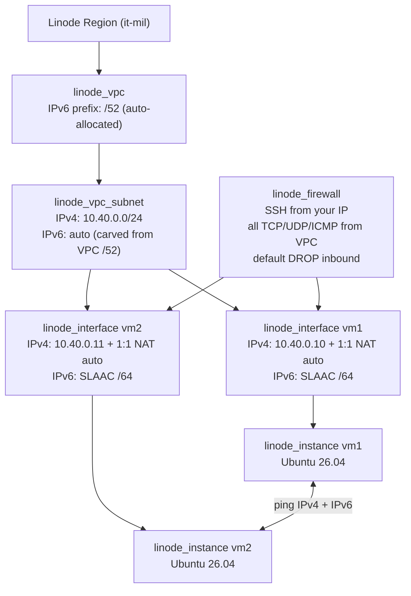

# VPC with Dual-Stack (IPv4 + IPv6) Support

OpenTofu/Terraform project that provisions a Linode VPC with a dual-stack subnet
(IPv4 CIDR + Linode-allocated IPv6 range) and two VMs attached to it through the
new `linode_interface` resource (`interface_generation = "linode"`), used to
verify IPv4 and IPv6 connectivity inside the VPC.

## Architecture



- **`linode_vpc`** — requests an IPv6 prefix length (`/52` by default). Linode
  chooses the actual GUA range and exposes it as `allocated_range`.
- **`linode_vpc_subnet`** — explicit IPv4 CIDR plus `range = "auto"` so Linode
  carves the subnet IPv6 range from the parent VPC prefix.
- **`linode_interface`** — one dual-stack VPC interface per VM. IPv4 uses
  `nat_1_1_address = "auto"`, which allocates a public IPv4 and 1:1 NATs it to
  the VPC address, so no separate public interface is needed for SSH. IPv6 uses
  SLAAC (`range = "auto"`), kept private by default (`is_public = false`).
- **Disk + config** — with `interface_generation = "linode"`, the instance is
  created without an image; the boot disk and `linode_instance_config` are
  declared explicitly and the config `depends_on` the interface so it boots with
  networking attached.
- **SSH** — an ED25519 keypair is generated by Terraform and written to `/tmp`.
  No root password is set anywhere; access is key-only.
- **cloud-init** — [scripts/cloud-init.yaml.tpl](vpc-ipv6-ipv4-dual/scripts/cloud-init.yaml.tpl)
  sets the hostname and installs `iputils-ping`.
- IPv6 VPC attributes are only available on the **v4beta** API, so the provider
  is pinned to `api_version = "v4beta"`.

> The SLAAC IPv6 address is derived on the host from the interface MAC, so it
> cannot be known by Terraform. `start.sh` reads it back over SSH before running
> the IPv6 ping tests.

## Usage

```bash
export LINODE_TOKEN='your-token-here'
./start.sh
```

`start.sh` applies the config, waits for SSH on both VMs, prints their interface
layout, runs bidirectional IPv4 and IPv6 pings across the VPC, and echoes the
ready-to-use SSH commands.

To change the number of VMs, edit the `vms` map in [main.tf](vpc-ipv6-ipv4-dual/main.tf)
(the value is the host offset inside `subnet_ipv4_cidr`).

Tear down:

```bash
./shutdown.sh
```

## Configuration

| Variable | Default | Description |
| --- | --- | --- |
| `region` | `it-mil` | Region must support VPC IPv6 |
| `label_prefix` | `vpc-ipv6-ipv4-dual` | Label prefix for all resources |
| `vpc_ipv6_prefix` | `/52` | Prefix length requested for the VPC |
| `subnet_ipv4_cidr` | `10.40.0.0/24` | Subnet IPv4 CIDR |
| `subnet_ipv6_range` | `auto` | Subnet IPv6 range, or `auto` |
| `instance_type` | `g6-nanode-1` | Linode plan |
| `image` | `linode/ubuntu26.04` | Latest Ubuntu image |
| `vpc_interface_ipv6_public` | `false` | Make the VPC IPv6 config publicly routable |
| `ssh_allowed_ipv4_cidrs` | `[]` | Extra CIDRs allowed to SSH |
| `authorized_users` | `[]` | Linode users whose keys are installed |

## Production Considerations

- **High availability / DR**: a VPC is region-scoped. Multi-region resilience
  requires a VPC per region plus an interconnect strategy (VPN, WireGuard, or
  public-transit with strict firewalling) and non-overlapping IPv4 CIDRs. This
  demo runs a single VM with no redundancy.
- **Security**: Linode Cloud Firewall does not cover VLAN interfaces. Here it is
  attached directly to the VPC interface with a default-deny inbound policy and
  SSH restricted to your detected public IP. If you set
  `vpc_interface_ipv6_public = true`, add explicit IPv6 inbound rules — global
  IPv6 addresses are routable and must not be treated as private.
- **SSH access**: root login by key only. In production, use a non-root user,
  disable root login, and front access with a bastion or Linode Interconnect.
- **Address planning**: pin `subnet_ipv6_range` instead of `auto` when firewall
  rules, DNS, or peering need stable prefixes.
- **State management**: state is local here. Use a remote backend with locking
  for shared/production environments.
- **Secrets**: `LINODE_TOKEN` is read from the environment only; never commit it.
  The generated private key lives in `/tmp` and is removed by `shutdown.sh`.

## References

- [linode_vpc resource](https://registry.terraform.io/providers/linode/linode/latest/docs/resources/vpc)
- [linode_vpc_subnet resource](https://registry.terraform.io/providers/linode/linode/latest/docs/resources/vpc_subnet)
- [linode_interface resource](https://registry.terraform.io/providers/linode/linode/latest/docs/resources/interface)
